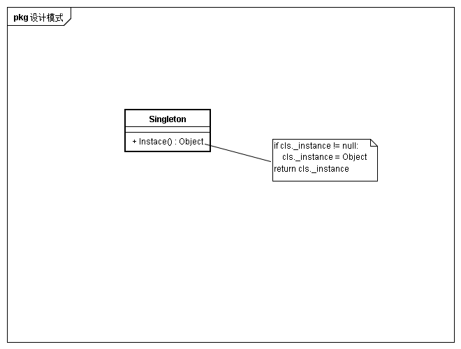

## 意图
一个类仅有一个实例，并提供一个访问它的全局访问点

## 动机
对于某些类在全局需要唯一性

## 适用性
* 当类只能有一个实例，且客户可以从一个众所周知的访问的访问
* 当唯一实例是应该通过子类化进行扩展，且client无需改变代码就能使用一个扩展实例时

## 结构

## 参与者
* Singleton
创建类唯一实例，并提供访问点

## 协作
客户只能通过Singleton实例访问全局唯一实例

## 效果
* 对唯一实例的授权访问
* 缩小名空间
对全局变量的改进，避免存储唯一实例的全局变量污染名空间
* 允许操作和表示的精化
* 允许可变数目的实力
* 比操作类更灵活
虽然可以使用类操作，但是难以改变设计以运行一个类有多个实例，且难以多态的重定义非类操作

## 实现
* 保证唯一实例
* 创建Singleton类的子类