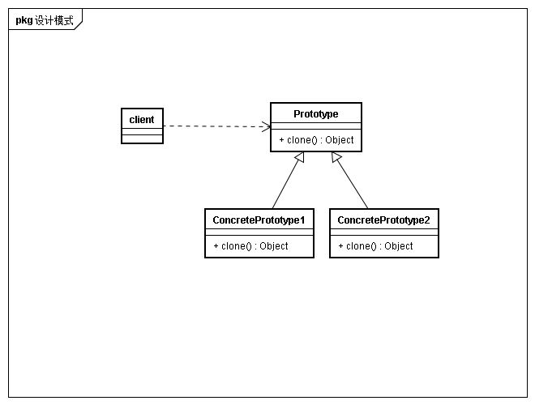

## 意图
通过实例指定创建对象的种类，并通过拷贝这些原型创建新对象

## 动机
创建新对象代价较大，通过拷贝已有对象(原型)可以降低创建对象带来的代价。
例如创建一个对象需要高延时的网络IO

## 适用性
* 要实例化的类是在运行时刻指定时
* 为了避免创建一个与产品类层次平行的工厂类层次时（暂时没理解）
* 当一个类实例只能有几个不同状态组合中的一种，克隆可能比用合适的状态手工实例化更方便一些(人以上最主要的思想就是创建对象的代价大不大的问题，毕竟如果是第三种为了方便的话可以考虑buidler模式固化组合算法)

## 结构

## 协作
客户请求原型克隆自身

## 效果
* 运行时刻增加和删除产品
* 改变值以指定新对象
* 改变结构以指定新对象
许多应用由部件和子部件创建对象，例如电路设计中由子电路构造电路。通过复合电路的克隆与修改部分子电路形成不同电路结构(个人感觉其实和改变值以指定新对象没多大区别,毕竟组成部分可以认为是一个嵌套的值)
* 减少子类构造
例如不需要创建工厂模式中的Creator子类完成产品的创建
* 动态配置应用

## 实现
* 原型管理器
原型数目不固定时，保持原型注册表，客户程序不会管理原型，而是向注册便表请求原型，所以成注册表为原型管理器
* 实现克隆操作
* 初始化克隆对象
某些客户会希望的到克隆后，可以定制的修改对象某些状态，此时需要通过初始化克隆对象完成

## 相关模式与思考
我曾迷惑与原型模式和构造器有什么不同？因为如果仅从结构图上看，将相应方法和类名字替换，两者很类似 
个人认为原型模式侧重点在于对象创建的代价大小与动态加载，而builder侧重于创建对象的复杂度。
例如builder创建对象的算法很复杂，但是代价不大，那么直接使用builder就可以完成操作。
但如果builder算法创建对象同样需要较大的代价，那么此时可以考虑通过原型实现创建代价的减少。
甚至client向原型注册表请求原型时，如果算法复杂度较大，也许也可以通过builder完成原型请求与复制