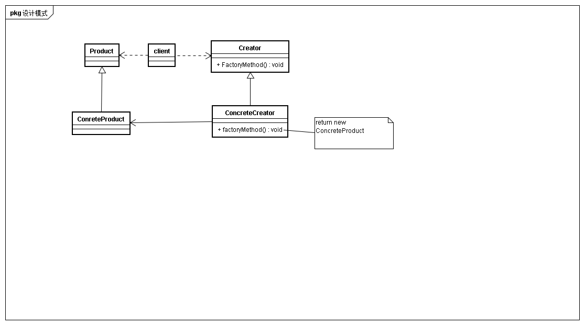

## 意图
定义一个用于创建对象的接口，让子类决定实例化哪一个类，使得**一个类的实例化延迟到子类**

## 动机
* 用于隔离类对象的使用者和具体类型之间的耦合关系。面对一个经常变化的具体类型紧耦合会导致软件的脆弱性
* 通过面向对象的手法，将所要创建的具体对象工作延迟到子类，从而实现一种扩展策略，较好的解决了紧耦合关系
* 解决"单个对象”的需求变化，缺点在于创建方法/参数相同

## 适用性
* 当一个类不知道它所必须创建的对象的类的时候
* 当一个类希望它的子类来制定它所创建的对象的时候
* 当类创建对象的职责委托给多个帮助子类中的某一个，并且希望将哪一个帮助子类是代理者这一信息局部化的时候

## 结构

## 参与者
* Product
定义该工厂方法所创建的对象的接口，即产品接口

* ConcreteProduct
实现Product接口，实现类

* Creator
声明工厂方法，工厂方法返回一个Product类型对象

* ConCreteCreator
重定义工厂方法，返回ConcreteProduct

## 协作
Creator依赖于子类定义工厂方法，并返回适当的ConcreteProduct

## 效果
* 为子类挂钩
给子类一个挂钩以提供对象的扩展版本

* 连接平行的类层次
工厂方法并不只是被Creator调用，客户可以使用一些有用的工厂方法，尤其是在平行类层次下 
例如对于图形图形的交互操作，如伸展，旋转等。client可以通过工厂方法创建出对应图形的操作类。

## 实现
* 参数化工厂方法
工厂方法可以创建多种产品，工厂方法通过接受不同的参数标识，选择对应的产品类。常用的有简单工厂模式 
在简单工厂模式中往往不会出现多个ConcreteProduct，往往通过一个工厂完成多种产品的创建

* 多个ConcreteFactory
通过多个ConcreteProduct来完成多种产品的创建，每种产品对应一个ConcreteProduct。而这里又有两种情况。
第一种Creator是一个具体实现类，为工厂方法提供了缺省实现，第二种则Creator仅仅是一个抽象类，需要在其子类实现工厂方法

## 相关模式与思考
比较工厂的结构图，我们可以发现工厂和抽象工厂很类似。实际上抽象工厂就是一种特殊的工厂。 
区别在于工厂更注重于**将类的实例化延迟到子类**，在设计模式一书中工厂模式结构图中并存存在client参与者。
而抽象工厂更注重于提供一系列相关产品的创建，以及产品分层。 
工厂往往只能创建具体产品例如上衣，裤子，而抽象工厂则是提供了创建一套相关产品的能力，例如休闲服，运动服(包含上衣，裤子等)。抽象工厂使得产品划分具有层次
所以个人理解中抽象工厂创建的产品就是一个工厂。

