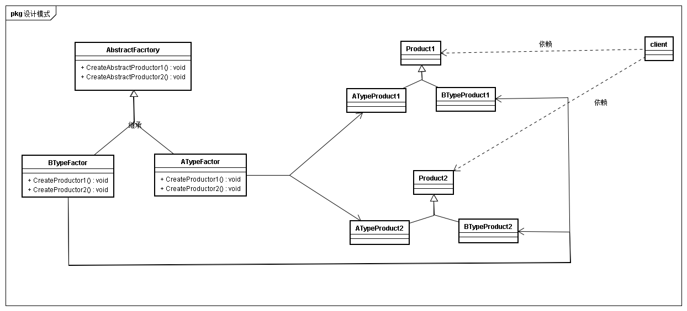

## 意图
创建一系列相关或相互依赖的接口，而无需指定它们的具体类

## 动机
固定的对象使用行为，不同的对象具体实现。  
例如穿一套衣服，这套衣服都有上衣、裤子和鞋子。但是每套衣服有不同的风格，例如商务或休闲。通过抽象工厂直接选择商务或休闲。这里抽象工厂作为创建一套衣系的创建提供了抽象

## 使用性
* 一个系统要独立于产品的创建、组合和表示时
* 一个系统要由多个产品系列中的一个来配置时
* 强调一系列相关产品对象的设计以便进行联合使用时
* 提供产品类库，只想显示他们的接口而不是实现时

## 结构

## 参与者
* AbstractFactory
* ConcreteFactorey
* AbstractProductor
* ConcreteProductor
* clinet

## 协作
* 将产品对象的创建延迟到ConcreteFactory
* 即抽象工厂创建工厂，工厂创建具体产品

## 效果
* 分离具体类  
客户通过操作抽象接口操纵实例
* 易于交换
* 有利于产品一致性
* 难以支持新种类的产品  
难以扩展抽象工厂以生产新种类的产品，因为AbstractFactory接口定义了可以被创建的产品集合，扩展新种类的产品需要扩展该工厂接口，涉及AbstractFactory子类的改变。  
例如新增风格的衣服中增加一项帽子，那么抽象工厂为了支持该风格衣服,需要调整其他子类

## 实现

* 工厂使用单例模式
抽象工厂一般每一系只需要一个工厂，以此可以考虑将工厂作为单例模式、
* 产品的创建由工厂完成
抽象工厂仅负责创建工厂
* 定义可扩展的工厂
一种不安全但更灵活的方式是创建对象的操作增加参数，参数指定对象的种类。个人理解为通过参数灵活变更抽象工厂的接口行为

