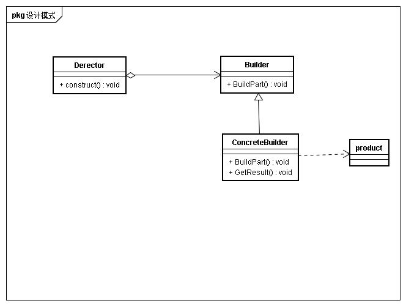
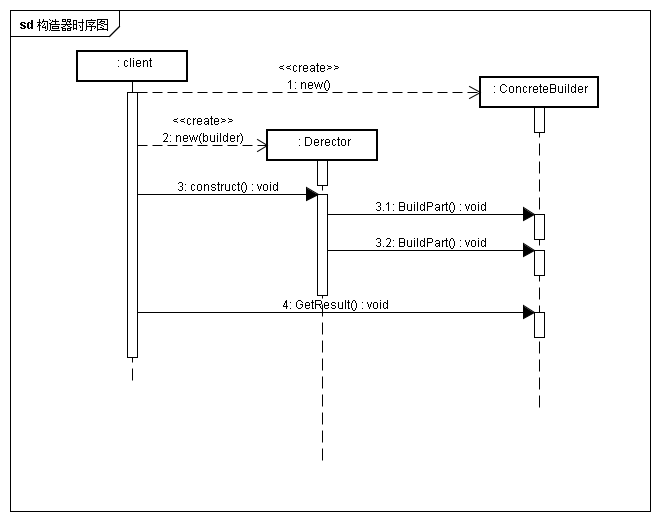

## 意图
将复杂对象的构建与它的表示分离，使得同样的构建过程可以创建不同的表示

## 动机
面临一个复杂对象的创建，各个部分的子对象用一定的算法构成，由于需求的变化，使得复杂对象的各个部分经常面临距离的变化，但是将他们组合再一起的算法却是相对稳定的

## 适用性
* 创建复杂对象的算法独立于该对象的组成部分以及它们的装配方式时
* 创建过程必须允许构造对象有不同的表示时

## 结构

个人理解中Derector代表的是构造过程中复杂而稳定的组合算法，而每个ConcreteBuilder为变化的复杂对象，他们通过继承Builder完成对具体对象实例化过程的延迟，从而支持Derector的多态。

## 参与者
* Builder
为构造器创建各个组件指定抽象接口
* ConCreteBuilder
* - 实现具体构造器接口
* - 提供检索产品接口
* Director
构造一个使用Builder接口的对象，主要是构造过程中的稳定算法
* Product
表示被床架你的复杂对象，同时包含定义的各个组件

## 协作

## 效果
* 可以改变产品的内部表示
* 将构造代码和表示代码分离
* 对构造过程进行更精密的控制

## 实现
* 装配和构造接口
* 为和product没有抽象类
通常情况下，由具体生成器生成产品，他们间的表示差异很大，以致于存在公共父类没有太大意义。

## 思考
* builder与抽象工厂有什么不同
个人理解，生成器更多的是对复杂对象生成时的组合算法的稳定，而抽象工厂更多是的为了提供以系列产品的工厂，builer注重装配与构造，而抽象工厂更多是注重提供一套产品的构造能力。 
对比类图，可以发现builder图的切掉Derector类后和抽象工厂图其实很像，builder类对应AbstractFactory类，ConcreteBuilder对应ConcreteFactory，但是两者的返回会有区别，builder更多是一个整体产品中的一个组件产品，而factory是生成产品的工厂。builer最终提供的是一个可使用对象，而AbstractFactory提供的是工厂，仍然需要从工厂中创建产品。 
如果使用AbstractFactory类替换Builder图的builer类部分，那么AbstractFactory中的clinet就类似于builer中的Derector。但是注意在builder中的Derector不会依赖于具体的product，而是依赖于Builer类提供的接口。builer模式client面向的对象是builer，而factory面向的对象是factory以及facrtory创建的产品。