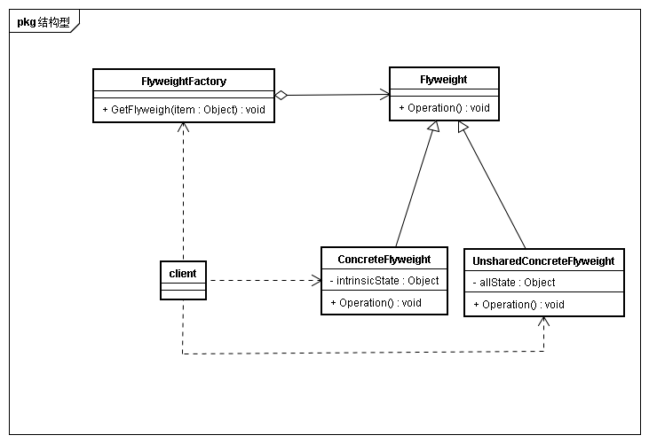

## 意图
运用共享技术有效地支持大量细粒度的对象

## 动机
一个文档可能会有很多字符对象，如果每处字符都对应一个字符会产生大量的内存消耗。所以通常是每个字符共享一个底层对象，使得文档中的每处文字可以大量细粒度的共享字符。  
fliweight是一个共享对象，可以在多个场景中使用，且在每个场景中都是独立的对象。flyweight不能对场景做任何假设，关键概念在于外部状态与内部状态。内部状态存储与flyweight中，外部状态取决于场景，有场景进行计算和存储。例如文档中文字的在哪一行那一列什么风格的状态作为外部状态，而字符的值代表的含义作为内部状态进行共享。

## 适用性
* 一个应用程序使用了大量的对象
* 完全由于使用大量对象，造成很大的存储开销
* 对象大多数状态可以变为外部状态
* 如果删除对象的外部状体，那么可以用相对较少的共享对象取代很多组对象
* 应用程序不依赖于对象标识。

## 结构

## 参与者
* Flyweight
描述一个接口，通过flyweight可以接受并作用于外部状态
* COncreteFlyweight
实现flyweight接口，并为内部状态增加存储空间。ConcreteFlyweight必须是可共享的，存储的状态必须是内部状态。独立于场景
* UnsharedFLyweight
并非所有Flyweight子类都需要共享。Flyweight接口使得共享成为可能，但不强制
* FLyweightFactory
创建并管理flywegith对象  
确保合理的共享Flyweight
* clinet
维持一个对Flyweight对象的引用  
计算或存储flyweight的外部状态

## 效果
* 共享，实例总数减少
* 对象内部状态的平均数目，影响存储节省
* 外部状态是计算的还是存储的

## 实现
* 删除外部状态
* 管理共享对象
	* 创建
	* 获取
	* 共享回收
	* 删除

## 相关模式与思考
* Flyweight通常和Composite结合使用，用共享叶节点的有向无环图实现一个逻辑上的层次结构
* 通常，最好用Flyweight实现state和strategy对象
* 思考python的垃圾回收机制和字符串、数字等变量在内存上的共享原理

