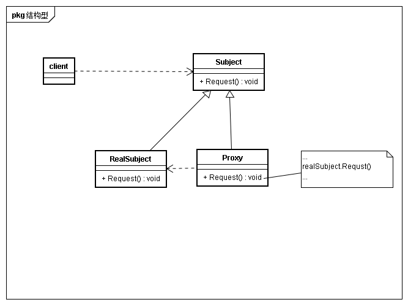

## 意图
为其他对象提供一种代理以控制对象的访问

## 动机
为对象进行访问控制的一个原因是为了只有在我们确实需要这个对象时才对它进行创建和初始化  

##  适用性
* 远程代理
为一个对象在不同的地址空间提供局部代表  
考虑linux文件系统，一个目录下的文件或目录可能在不同的文件系统中
* 虚代理
根据需要创建开销很大的对象。 
考虑文件系统中的文件读写，写时复制技术
* 保护代理
控制对原始对象的访问。保护代理用于对象应该有不同的访问权限的时候。 
例如nginx的https与证书功能
* 智能指引
取代简单的指针，在访问对象时执行一些附加操作。 
考虑python中变量在内存中的存储与引用计数

## 结构

## 参与者
* Proxy
	* 保存一个引用使得代理可以访问尸体
	* 提供一个与Subject的接口相同的接口，从而代替实体
	* 控制对实体的存取，并可能负责创建和删除它
	* 其他功能依赖于代理的类型
		* 远程代理 负责对请求及其参数进行编码，并向不同地址空间中的实体发送已编码的请求
		* 虚代理 缓存尸体的附加信息，以便延迟对它的访问。例如文件描述符记录了文件的大小等信息
		* 保护代理 检查调用者是否具有实现一个请求所必须的访问权限
	
* Subject
定义RealSubject与Proxy公用接口，便于在任何RealSubject地方可以使用Proxy
* Readsubject
定义Proxy所代理的实体

## 效果
* Remote Proxy隐藏一个对象存在于不同空间的事实
* Virtual Proxy可以进行最优化，例如根据要求创建对象
* Protection Proxies 和 Smart Reference 都允许访问一个对象时附加一些内务处理

## 实现

## 相关模式与思考
* adpter注重与复用已有接口，提供了一个不同与已有接口，但是能使用于专业领域的接口。而代理提供与实体相同的接口
* Decorator与proxy的实现类似，但相似程度上有差别。保护代理与decorator差不多，都可以添加额外职责，保护代理侧重于访问权限控制等。而decorator可以附加更多职责。远程代理只是间接引用。虚代理初始只是间接引用，在最终才会获取实体的直接引用