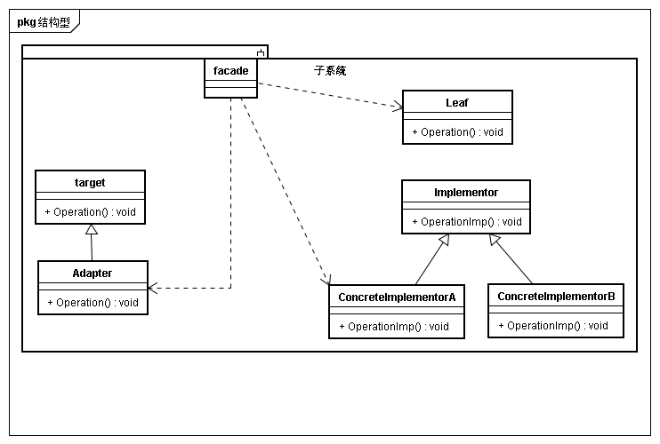

## 意图
为子系统提供一个一致界面，Facade提供一个高层接口，这个接口使得这一子系统更加容易使用

## 动机
将一个子系统划分为若干个子系统有利于降低该子系统的复杂性。一个常见的设计目标是使子系统间的通信和相互依赖关系达到最小。引入一个外观对象，为子系统中较一般设施提供一个单一而简单的界面

## 适用性
* 为一个复杂子系统提供一个简单接口
* 客户程序和抽象类的实现部分之间存在很大的依赖性。引入facade将子系统与客户程序以及其他子系统分离，提高子系统的独立性和可移植性
* 当你需要一个层次结构的子系统是，使用facade模式定义子系统中每层的入口点。如果子系统间相互依赖，让它们仅通过facade进行通讯，从而简化了它们之间的依赖关系

## 结构

## 参与者
* Facade
	* 知道哪些子系统类复杂处理请求
	* 将客户请求带来给适当的子系统对象
* Subsystem Classes
	* 实现子系统功能
	* 处理有Facade对象指派的任务
	* 没有Facade任何信息

## 协作
* 客户程序通过发送请求给Facade的方式与子系统通讯，Facade将消息转发给适当的子系统对象。Facade需要它的接口转换为子系统的接口
* 客户程序不需要直接访问子系统

##　效果
* 对客户屏蔽子系统组件
* 实现子系统与客户间的松耦合关系
* 如果有需要，并不限制应用使用子系统类。可以在易用性和通用性间选择

## 实现
* 降低客户-子系统间耦合度
* 公共子系统类与私有子系统类

## 相关模式与思考
* 与AbstracFacrtory一起使用提供一个接口，这个接口可以用来以一种子系统独立的方式创建子系统对象。AbstractFactory也可以替换Facade模式隐藏平台相关类
* Mediator与facade相似之处子啊与，它抽象了一些已有类的功能。然而Mediator目的是同事间任意通讯的抽象，mediator的同事对象知道中介者并与其通信，而不是与其他同类直接通信。Facade仅对子系统对象接口进行抽象，并不定义新功能，子系统也不知道facade的存在
* tornado的handler处理是否就是一个facade对象，外部请求通过路由转发到handler，再有handler调用各个对象，最终返回一个满足接口定义的结果
