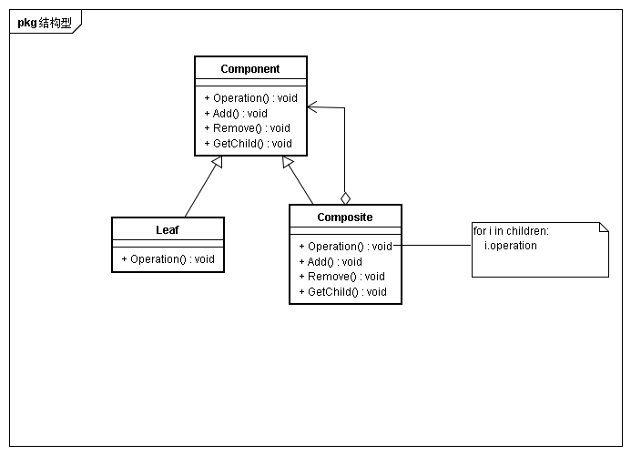
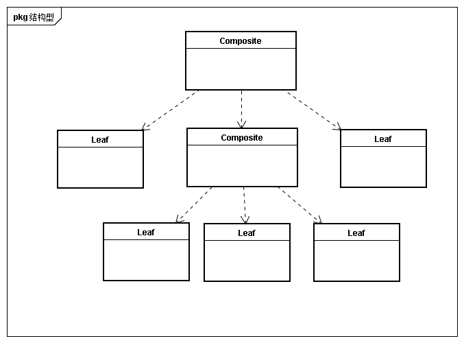

## 意图
将对象组合成树形结构以表示"部分-整体"的层次结构，使得用户对单个对象和组合对象的使用具有一致性

## 动机
通过组合多个简单组件形成符合组件。此时使用这些对象的客户需要区别对待简单组件和复合组件，但大部分情况下客户认为这些组件是一致的。因此Composite模式的关键在于抽象类，它既可以代表简单组件又可以代表复合组件

## 适用性
* 表示对象的部分-整体层次结构
* 希望用户忽略组合对象和单个对象的不同，统一的使用所有对象

## 结构

## 参与者
* Component
	* 为组合对象声明接口
	* 适当情况下，实现所有类公共接口的省却行为
	* 声明一个接口用于访问和管理Component的子组件
	* （可选）在递归结构中定义一个借口，用于访问一个父部件，并在合适情况下实现它
* Leaf
	* 在uzuhe中表示叶节点对象，叶节点没有子节点
	* 组合中定义图元对象的行为
* Composite
	* 定义有子部件的那些部件行为
	* 存储子部件
	* 在Component接口中实现与子部件有关的操作
* client
	通过Component接口操纵组合部件的对象
	
## 效果
* 定义了包含基本对象和组合对象的类层次结构
* 简化客户代码
客户可以一致的使用组合结构和单个对象
* 使得更容易增加新类型的组件
* 使得设计变得更一般化

## 实现
* 显示的父部件 引用
保持父部件的引用能简化组合的遍历和管理。父部件引用可以简化结构的上移和删除，同时父部件引用也支持Chan of Responsibility模式

* 共享组件
可以减少存储需求
* 最大化Component接口
* 声明子部件的操作
* component是否应该实现Component列表
可以，方便了对子部件的管理，但是会导致叶节点的空间浪费，一般在该结构中子类数目相对较少时，才会使用这种方法(问题是没有这么一个对象，又如何管理子部件呢？)
* 子部件排序
* 使用告诉缓冲存储改善性能
* 应该由谁删除Component
即垃圾回收，如何回收
* 存储组件最好用什么数据结构
常见的有连接列表，树，数组和hash表。数据结构的选择取决于效率

## 相关思考
* 通常部件-父部件连接用于Responsibilitu of chain模式
* Decrator常常与Composite模式一起使用
* Flyweight可以使得大家共享组件(待理解，什么情况下需要共享组件)
* iterator 用于遍历Composite
* visitor 将分布在Composite和leaf类中的擦着和行为局部化
* 在创建多个组件组合时是否可以使用builder模式固化某种场景下的创建算法，以及使用其他创建型模式增强组件的创建。