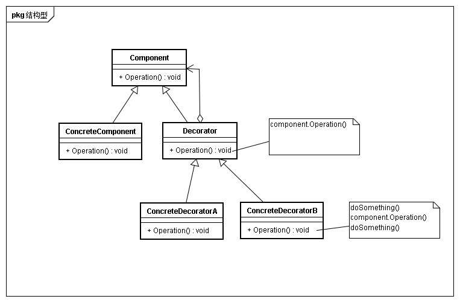

## 意图
动态的给一些对象添加额外的职责。就增加功能来说，Decrator模式比生成子类更灵活

## 动机
有时候希望给某个对象而不是整个类添加一些功能。继承也可以完成功能的添加但是不够灵活，此时可以通过将组件嵌套到另一个对象中，由这个对象增加新的功能

## 适用性
* 不影响其他对象的情况下，以动态、透明的方式给单个对象添加职责
* 处理那些可以撤销的指责
* 当不能采用生成子类进行扩充

## 结构

## 参与者
* Component
	* 定义一个对象接口，可以给这些对象动态添加职责
* ConcreteComponent
	* 定义一个对象，这个对象实现具体操作
* Decorator
	* 维持一个对象的实例，并定义与Component对象一致的接口
* ConcreteDecorator
	* 向Component添加职责

## 效果
* 比静态继承灵活
* 避免在层次结构高层的类有太多特征
可以从简单部件组合出复杂功能。这样应用不必为不需要的特征付出代价。同时也更易于不依赖Decorator所扩展的类而独立定义新类型的Decorator。但是扩展复杂类，可能会暴露与添加的职责无关的细节
* Decorator与Component不同
* 有许多小对象
这些对象仅仅在他们相互连接方式上不同，而不是类或者它们的属性值有所不同(没理解)。

## 实现
* 接口一致性
* 省略抽象的Decorator类
当仅停驾一个职责是，没必要定义抽象Decorator类
* 保持Component类额度简单性
* 改变对象外壳与改变对象内核
可以将Decorator看作一个对象的外壳，可以改变对象的行为。另一种方法是改变对象内核，例如Strategy模式

## 相关模式与思考
* adapter模式会给对象一个全新的接口，注重与复用与适配已有接口。而Decorator更注重于保持原接口的一致性，同时添加额外的职责
* 比较Coposite模式的结构图，两者很类似，可以将装饰器视为一个退化的、仅有一个组件的组合。装饰器更注重的是添加额外职责，Composite还会在意组件的层次与组件的一致。
* strategy可以改变对象内核，而adapter模式可以改变对象的外壳

	