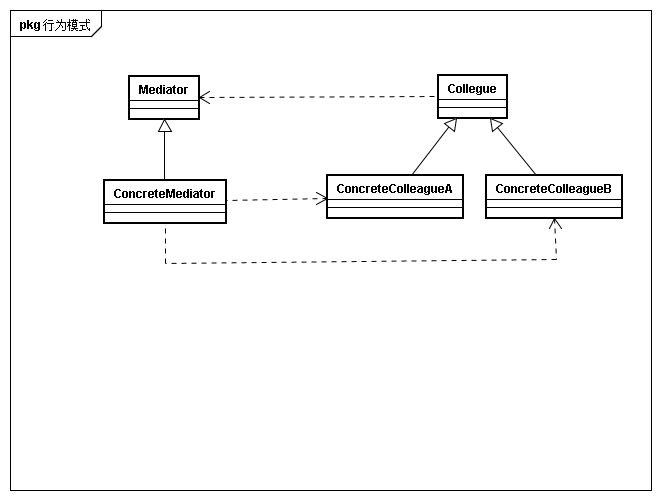

## 意图
用一个中介者对象封装一系列对象的交互。中介这不需要显示的相互引用，从而使其耦合松散，而且可以独立的改变他们之间的交互

## 动机
面向对象设计鼓励将行为分布到各个对象中。这种分布可能会导致对象间会有许多连接。大量的相互连接会将其其可复用性，使得系统表现为一个不可分割的整体。
有些架构设计中及时是内部子系统间的交互也想要通过nginx进行，一个是为了内部的交互权限控制，另一个其实也是为了做到降低子系统间的直接调用，并且易于随时替换子系统服务对象

## 适用性
* 一组对象以良好但是复杂的方式进行通信。产生的相互依赖关系结构混乱且难以理解
* 一个对象引用其他狠毒对象并且直接与这些对象通信，导致难以复用该对象
* 想要定制一个分布在多个类中的行为，有不想生成太多的子类

## 结构

## 参与者
* Mediator
	* 中介这定义一个借口与各个同时对象通信
* ConcreteMediator
	* 具体中介者通过协调各个同事对象实现协作行为
	* 了解并维护各个同事
* Colleague calss
	* 每个同事类都知道它的中介者对象
	*　每一个同时对象在需要与其他同事通信时，与中介者通信

## 协作
同事向中介这发送和接受请求。中介者在各个同事间适当的转发请求以实现协作行为

## 效果
* 减少子类生成
* 将各个Colleague解耦
* 简化对象协议
* 对对象协作进行了抽象
* 使得控制更加集中

## 实现
* 忽略抽象的Mediator
当各个Colleague仅与一个Mediator工作时可以不定义抽象的Mediator类
* Colleague与Mediator通信(事件兴趣情况下)
	* 利用Observer模式实现，Mediator作为Subject，Colleague作为Subject
	* 在Mediator定义特殊的通知接口，各Colleague在通信时直接调用接口

## 相关模式
* facade模式与Mediator不同在于，facade是对子系统进行抽象，从而提供更方便的接口，协议是单向的。而Mediator提供了各Coleague对象不支持或不能支持的协作行为，而且协议是多向的
* Colleague可以使用Obeserver模式与Mediator通信