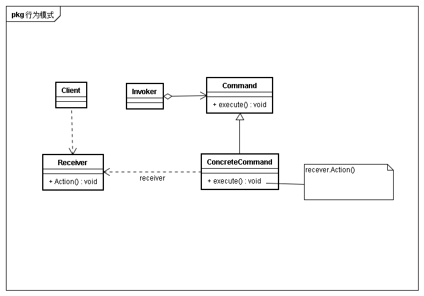
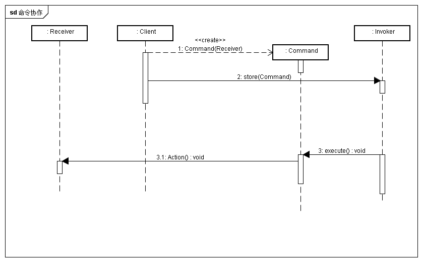

## 意图
将一个请求封装为一个对象，从而使用不同的请求对客户进行参数化；对请求排队、记录日志，以及支持可撤销的操作

## 别名
动作，事物

## 动机
有时需要向某对象提交请求，但不知道关于被请求的操作或请求接收者任何信息。 
游戏中想要实现角色群体加血，但是加血请求不知道被加血对象信息，对加血对象操作。因此将加血封装为加血动作。在命令处理时触发相应加血对象的加血函数。

## 适用性
* 抽象出待执行的动作以参数化对象。
在过程语言中用回调函数表达了这种参数化机制。Command模式是回调机制的一个面向对象的替代品
* 在不同时刻指定、排列和执行请求
* 支持取消操作
command的执行操作可以将执行前的状态进行记录，取消操作时这个状态可以用来消除该操作的影响
* 支持修改日志
当系统崩溃时，这些修改可以再次重做。
* 用构建在原语操作上的高层操作构造一个系统
这种结构在支持事物的信息系统中很常见。command有公共的接口，使得可以用同一种方式调用所有事物

## 结构

## 协作
* client创建ConcreteCommand、并指定Receiver对象
* 某个Invoker存储该ConcreteCommand对象
* Invoker通过调用Command的Execute操作来提交一个请求
若请求时可撤销的，ConcreteCommand就使用之前的状态撤销命令
* ConcreteCommand对象调用它的Receiver的一些操作以执行该请求

回想为一个群体范围内的角色加血。每个角色其实代表了一个Receiver。技能首先选中多个角色，分别创建Command，并将Command保存在一个Invoker中。最终将Invoker中的每个加血命令执行。加血命令中会调用角色对象的操作，修改角色的血量数值。 
那么为什么这么麻烦的使用command模式来实现一个加血请求。如果直接在角色对象中直接实现加血操作，然后由clinet进行调用，那么未来每一个新增角色都要实现这个加血操作。并且如果增加新的命令行为，那么需要给所有的角色都实现新的行为。

## 实现
* 命令对象应该达到何种只能程度
命令对象可大可小，一个极端是命令仅确定接受者和执行该请求的动作。另一个极端是命令完成所有功能，甚至不需要额外的接收者
* 支持取消和重做
* 避免取消操作过程中的错误积累

## 相关模式与思考
* Composite可以用来实现宏命令
* Memento模式可用于保持状态
* Invoker会调用存储的Command，那么什么时候invoker会执行呢？在一些实现中甚至没有出现Invoker角色，或者说invoker角色直接由client替代了

