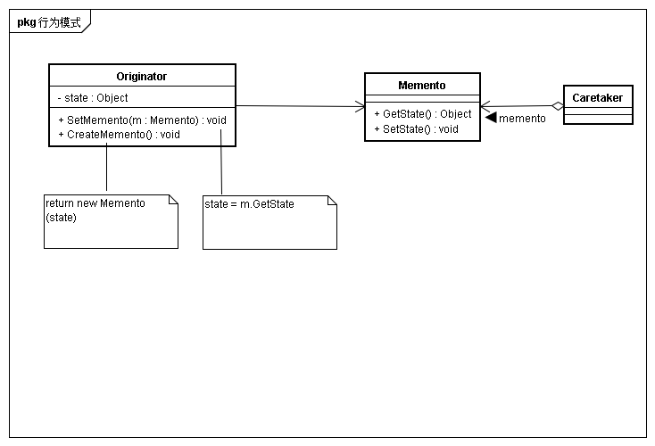
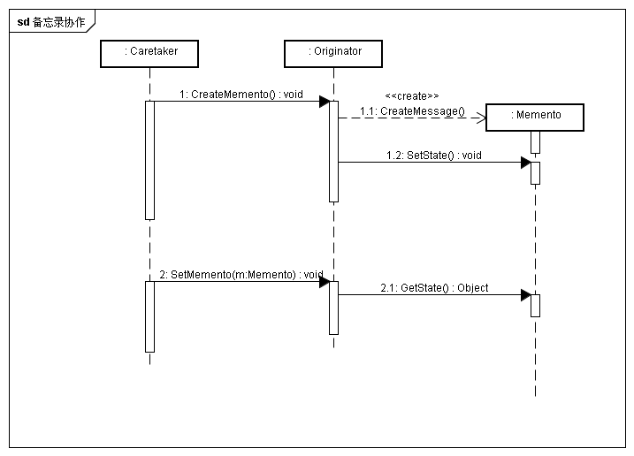

## 意图
在不破坏封装性的前提下，不惑一个对象的内部状态，并在该对象之外保存这个状态。以便后续对该对象恢复到原先状态

## 动机
一个对象的公共接口并不足以精确地逆转它对其他对象的作用，为重建先前的状态，必须和该对象更紧密的结合，但同时也应该避免将对象内部暴露给取消操作机制。备忘录模式中提供一种备忘录对象，存储另一个对象的瞬间内部状态，后者为备忘录的原发器。当需要设置元发起的检查点时，取消操作机制会向原发器请求一个备忘录。原发器用描述当前状态的信息初始化备忘录。只有原发器可以向备忘录存取信息。备忘录对其他对象不可见。

## 适用性
* 必须保存一个对象在某以时刻的状态，这样在后续需要时它才能恢复到原先的状态
* 如果用一个借口来让其它对象直接得到状态，会暴露了对象实现细节并破坏队形的封装性

## 结构

## 参与者
* Memento
	* 备忘录存储原发器对象的内部状态。原发器根据需要决定备忘录存储原发器的哪些内部状态
	* 防止原发器意外的其他对象访问备忘录。备忘录实际上只有两个接口，管理者caretaker只能看到窄接口，将备忘录传递给其他对象
* Originator
	* 原发器创建以恶搞备忘录，用以记录当时刻在它的内部状态
	* 使用备忘录恢复内部状态
* CareTaker
	* 负责保存备忘录
	* 不对备忘录内容进行操作或检查
	
## 协作

## 效果
* 保持封装边界
* 简化原发器
* 使用备忘录可能代价过高
* 定义窄接口和宽接口
* 维护备忘录的潜在代价

## 实现
* 存储增量式改变

## 相关模式
* Command可以使用备忘录来记录可撤销操作的状态
* Iterator可以用Memento记录迭代状态

