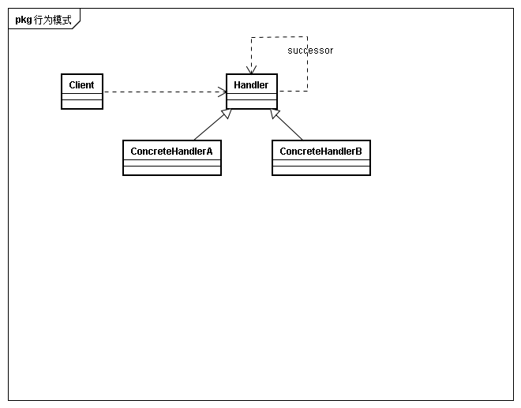
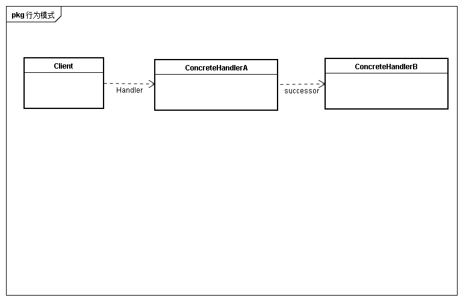

## 意图
使得多个对象都有机会处理请求，从而避免请求的发送者和接收者之间的耦合关系。将这些对象连成一条链，并沿着这条链传递该请求，直到有一个对象处理它为止

## 动机
一个请求并不明确谁是最终响应者。职责链模式提供一种方法将发送请求的对象与处理请求的对象解耦。
请求提交的对象并不会明确知道哪一个对象将会处理请求，请求是由一个隐式接收者处理的。
在责任链中，每个请求沿链转发请求，并保证接收者为隐式的，每个职责链上的对象都有一致的处理请求和访问链上后继者的接口。 
思考iptables中的规则链工作原理

## 适用性
* 有多个对象可以处理一个请求，哪个对象处理该请求运行时刻自动确认
* 在不想明确指定接收者的情况下，向多个对象中的一个提交一个请求
* 处理一个请求的对象集合应动态指定

## 结构

## 参与者
* handler
	* 定义一个处理请求接口
	* 实现后继链(可选)
* ConcreteHandler
	* 处理负责的请求
	* 访问后继
	* 如果可处理则处理，不可处理则转发给后继

* Clinet
	* 向链上具体处理者对象提交请求
	
## 协作
当客户提交请求时，请求沿着责任链传递至一个ConcreteHandler对象负责处理它

## 效果
* 降低耦合度
* 增强了给对象指派职责的灵活性
* 不保证被接受

## 实现
* 实现后继者
	* 定义新的链接。可以在handler中定义也可以在ConcreteHandler中定义后继
	* 使用已有链接
	例如使用Composite模式形成的层次结构，父构件可以定义为一个部件的后继者
* 连接后继者
如果没有已知的后继者，则必须自己引入它们。
* 表示请求
	* 硬编码操作调用，方便且安全，但是只能转发handler类定义的一组固定请求
	* 使用处理函数，这个函数以一个请求码为参数。可以支持请求数目不限。但是要求发送方和接收方在如何编码问题上保持一致

## 相关模式与思考
* 职责链常与Composite一起使用。
* 职责链的链接方式是否可以考虑使用链表，树和图等。例如Composite是将组件形成一个整体一致的整体结构。
* 请求如何选择出接受请求的handler，是否可以在handler中设置匹配条件。例如iptables里设置的匹配条件。
* 职责链是否可以沿着职责链被串行执行，正如一个数据流一般，而不是仅仅被其中某一个handler处理，而是被一个handler集合处理。每个handler仅仅决定是否处理，而不决定是否传递给后继，而是一旦有后继就会在本handler完成后传递给后继。