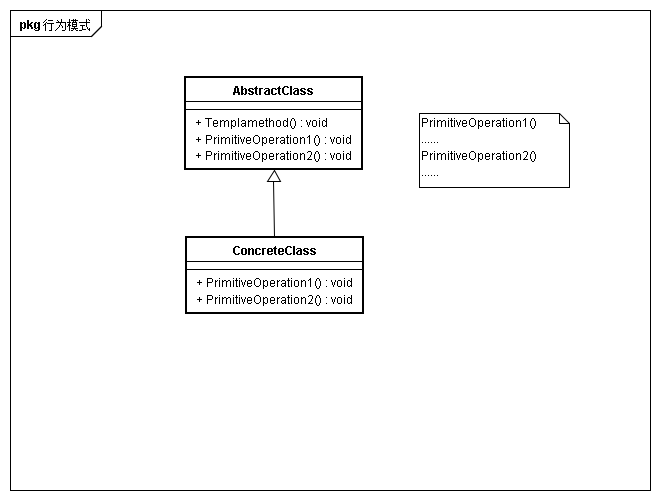

## 意图
定义一个操作中算法的骨架，而将一些步骤延迟到子类

## 适用性
* 一次性实现一个算法的不变部分
* 各个子类中的公共行为应被提取出来并集中到一个公共父类中避免代码重复
* 控制子类扩展

## 结构

## 参与者
* AbstractClass
	* 定义抽象的原语操作，具体子类将重定义它们以实现一个算法各步骤
	* 实现一个算法的骨架。
* ConCreteClass
	* 实现原语操作以完成算法中特定子类相关的步骤

## 协作
concreteClass靠AbstractClass来实现算法中的不变部分

## 效果
* 反向控制

## 实现
* 访问控制
* 尽量减少原语操作
* 命名约定

##　相关模式
* Factory Method 模式常被作为模板方法调用
* 模板方法使用继承改变算法的一部分，Strategy使用委托改变整个算法
* 是否感觉在builder模式中的想法类似，builder是在其他类中固化了创建骨架，由各个Builer类实现对应builder的创建算法，将builder创建算法与构架分离。而在模板方法中模板方法在抽象类中固化了算法骨架，在子类中实现原子操作，将实现延迟到子类。当然两者目的不同，结构也不同，仅仅是有些想法类似
