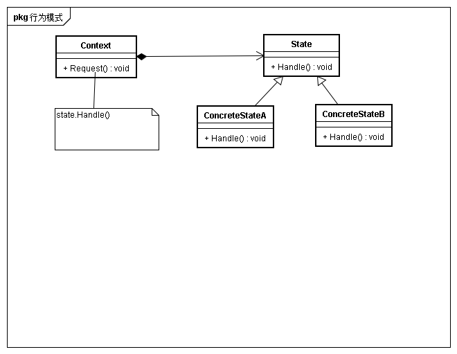

## 意图
允许一个对象在内部状态改变时改变它的行为。对象看起来似乎修改了它的类

## 动机
考虑一个TCPConnection对象的状态处于不同状态时，当它接收到其他对象的请求时，它根据自身的当前状态做出不同的反应。state模式描述了TCPConnection如何在每一种状态下表现出不同行为。通过抽象出TCPState类来表示网络连接状态，并未不同状态的子类声明公共的接口。

## 适用性
* 一个对象的行为取决于它的状态，并且必须在运行时刻根据状态改变它的行为
* 一个操作后者那个含有庞大的多分支的条件语句，且这些分支依赖于该对象的状态

## 结构

## 参与者
* Context
	* 定义客户感兴趣的接口
	* 维护一个ConcreteState子类实例，这个实例维护当前状态
* State
	* 定义一个接口以封装与Context的一个特定状态相关的行为
* ConcreteState
	* 每一个子类实现一个与Context的一个状态相关的行为

## 协作
* Context将状态相关的请求委托给当前的ConcreteState处理
* Context将自身当作一个参数传递给处理该请求的状态对象
* context是客户使用的主要接口。
* context或ConcreteState都可以决定哪个状态是另外哪个状态的后继

## 效果
* 将于特定状态相关的行为局部化
* 使得状态转换显式化
* State对象可以被共享

## 实现
* 谁定义状态转换
* 表的状态
	* 使用表将输入映射到状态装潢
	* 对表查找通常不如函数调用效率高
	* 用统一的、表格的形式表示转换逻辑使得转换准则变得不够明确而难以理解
	* 通常难以加入伴随状态装潢的一些动作。
* 创建和销毁state对象
* 使用动态继承

## 相关模式
* 使用Flywweight共享状态对象
* 状态通常是Singleton的