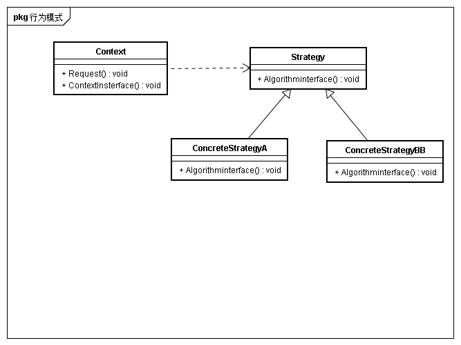

## 意图
定义一系列算法，把他们封装起来，并使得它们可以相互替换。本模式使得算法可以独立于使用它的客户而变化

## 动机

## 适用性
* 许多相关的类仅仅是行为有异
* 需要使用一个算法的不同变体
* 算法使用客户不应该知道的数据
* 一个类定义了多种行为，并且这些行为在这个类的操作中以多个条件语句的形式出现。将相关条件分支移入它们各自的Stategy类中代替这些条件语句

## 结构

## 参与者
* Strategy
	* 定义所有支持算法的公共接口
* ConCreteStrategy
	* 实现具体算法
* Context
	* 用一个ConCreteStrategy对象来配置
	* 维护一个Strategy对象的引用
	* 可定义一个借口来让Strategy访问它的数据

## 协作
* Strategy与Context相互作用以实现选定的算法
* Context将它的客户的请求转发给Strategy

## 效果
* 相关算法系列
* 一个替代继承的方法
* 消除一些条件语句
* 实现的选择
* 客户必须了解不同的Strategy
* Stratrgy和Context之间的通信开销
* 增加对象数目

## 实现
* 定义Strategy和Context接口
* 将Strategy作为模板参数
* 使Strategy对象成为可选的

## 相关模式与思考
* Strategy对象经常是很好的轻量对象，可以考虑使用Flyweight进行共享
* Strategy模式在选择策略子类的时候可以通过工厂来选择具体的策略，再交由Context使用
