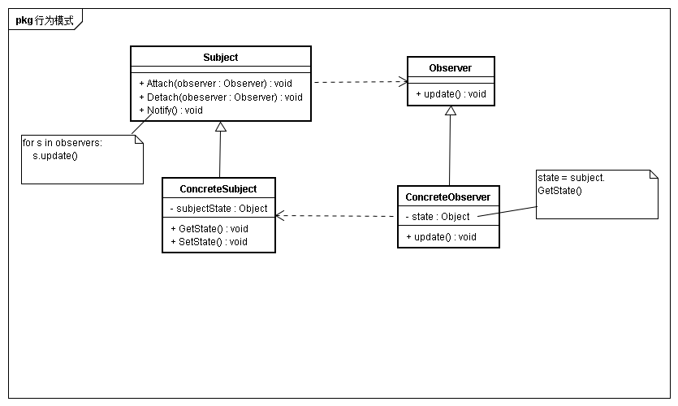
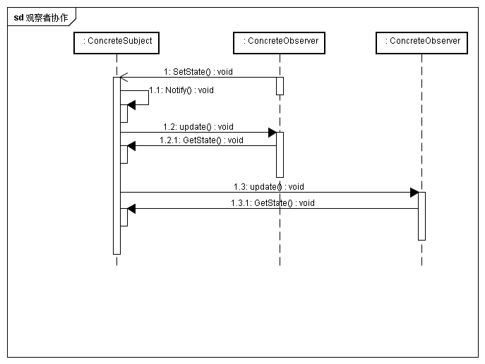

## 意图
定义对象间的一种一对多的依赖关系，当一个对象的状态发生改变时，所有依赖于它的对象都会得到通知

## 动机
一个系统分割成一系列相互协作的类有一个常见的副作用：需要维护相关对象的一致性。不希望为了维持一致性而使各类紧密耦合，以为内这样降低了他们的可重用性。 
观察者模式中利用目标和观察者建立一种发布订阅的关系。一个目标可以有多个观察者，一旦目标状态发生改变，所有观察者将得到通知。观察者根据得到的通知进行自身状态的同步

## 适用性
* 当一个抽象有两个方面，一个方面依赖于另一个方面。将两者封装在独立的对象中，以使它们可以独自地改变和复用
* 当对一个对象的改变需要同时改变其他对象，而不知道具体有多少对象有待改变
* 当一个对象必须通知其他对象，而又不能假定其他对象是谁

## 结构

## 参与者
* subject
	* 目标知道它的观察者。可以有任意多个观察者观察同一个目标
	* 提供注册和删除观察者对象的接口
* Observer
	* 为那些在目标发送变化是，需要获得通知的对象定义一个更新接口
* ConcreteSubject
	* 将有关状态存入各自的ConcreteObserver对象
	* 当状态发生变化时，向它的各个观察者发出通知
* concreteObserver
	* 维护一个指向ConcreteSubject对象的引用
	* 存储有关状态，这些状态应与目标保持一致
	* 实现Observer的更新接口，使得自身状态与目标保持一致
	
## 协作
* 当concreteSubject发生任何可能导致其观察者与本身状态不一致的改变时，它将通知各个观察者
* 在得到一个具体目标的改变通知后，ConcreteObserver对象可向目标对象查询信息。ConcreteObserver使用这些信息使得它的状态与目标对象保持一致

## 效果
* 目标与观察者间的抽象耦合
* 支持广播通信
* 意外更新

## 实现
* 创建目标到观察者间的映射
* 观察多个目标
* 谁触发更新
* 对已删除目标的悬挂引用
* 在发出通知前确保目标的状态自身是一致的
* 避免特定于观察者的更新协议——推/拉协议
* 显式地知道那个感兴趣的改变
* 封装复杂的更新语义
* 结合目标类和观察者类

## 相关模式
* Mediator封装复杂的更新语义，充当目标和观察者间的中介
* Singleton保证中介者唯一且全局可访问

