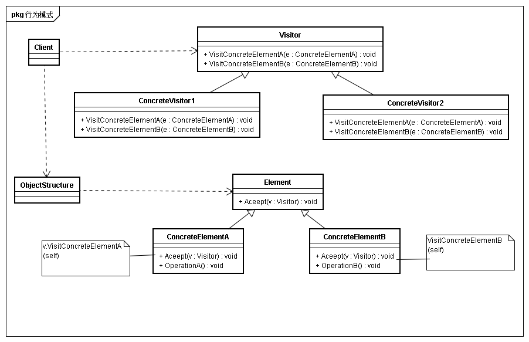
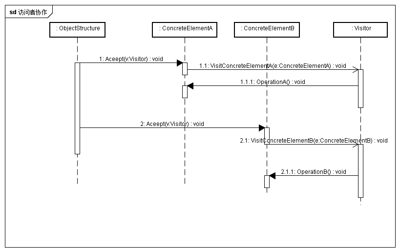
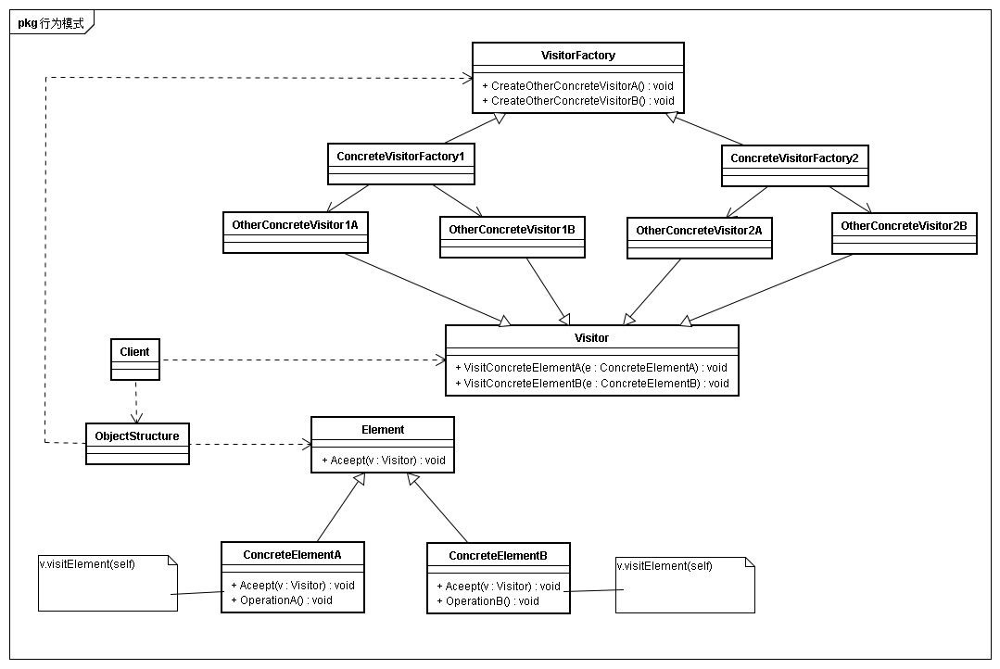

## 意图
表示作用于于某个结构的各个元素的操作。它使得你可以在不改变各个元素的前提下定义作用于这些元素的新动作。

## 动机
考虑一个树，已经定义好其遍历算法，此时需要对树上的节点进行一定的行为操作。不同节点要求进行不同的处理如果将这些处理分散到不同的节点类中，会导致整个系统难以理解、难以维护和修改。 
因此可以通过每个类中相关操作包装在一个独立的对象，称这个对象为visitor，并且在遍历节点中将此对象传递给当前访问的节点元素。当节点接收visitor时，节点向visitor发送包含自身类信息的请求。该请求同时也将该元素自身作为一个参数。然后visitor为该元素执行操作。

## 适用性
* 一个对象结构包含很多类，他们有不同的接口，而像对这些对象实施一些依赖于具体类的操作
* 需要uid一个对象结构的对象进行很多不同的并且不相关的操作
* 定义对象结构的类很少改变，但经常需要在此结构上定义新的操作、

## 结构

## 参与者
* Visitor
	* 为对象结构ConcreteElement的每一个类声明一个visit操作
* COncreteVisitor
	* 实现个Visitor声明的操作
	* 提供上下文并存储他的局部状态，这一状态常常在遍历该结构的过程中累积结果
* Element
	* 定义一个Accept操作，它以一个访问者为参数
* ConcreteElemet
	* 实现一个accept操作
* ObjectStruct
	* 枚举它的元素
	* 提供高层接口以运行访问者访问它的元素
	* 可以是一个复合或是一个集合

## 协作
* 一个使用visitor模式的客户必须创建一个ConcreteVisitor对象，然后遍历该对象结构，并用该访问者访问没一个元素
* 当一个元素被访问是，它调用对应于他的类的操作。如果必要，该元素将自身作为这个操作的一个餐宿合以便该访问者访问它的状态

## 效果
* 访问者模式使得更易于增加新操作
仅需要增加一个新的访问者即可在一个对象结构上定义一个新的对象
* 访问者集中相关操作而分离无关操作
* 增加新的ConcreteElement类很困难
* 通过类层次访问
一个迭代器可以通过钓鱼那个节点的特定操作来遍历整个对象，同时访问这些对象。但是不能对具有不同元素类型的对象结构进行操作
* 累积状态
如果没有访问者，这一状态将作为额外擦书传递给遍历操作或定义为全局变量
* 破坏封装性
Concrete如果接口功能足够强，足以让访问者访问它的工作，但可能会破坏其封装性。

## 实现
* 谁负责遍历对象结构

## 相关模式
* 访问者可以用于对一个由Coposite模式定义的对象进行操作
* 访问者可以用于Interpreter解释
* 访问者的一个确定是难以支持新增ConcreteElememt，那么是否可以通过工厂方式或者抽象工厂使得visitor类分层解决呢如下图结构
	* 在这种情况下如果想要增加ConcreteEletement，除了增加ConcreteElement之外还需要增加Visitor子类。需要增加的度子类数量反而更多了
	* 如果按照访问者模式，除Element子类外，不需要添加额外的Visitor子类，但是需要在每个已有的ConCreteVisitor中添加访问新Element子类的方法。
	* 所以结论就是这种使用工厂或者抽象工厂想法没什么卵用

