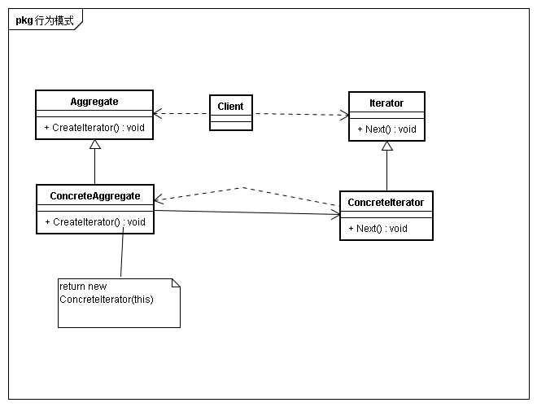

## 意图
提供一种舒血宁访问一个聚合对象中各个元素，而不暴露该对象内部表示

## 动机
一个聚合对象，例如列表，应提供一种方法访问其元素，而不需要暴露它内部结构。并且针对不同需要，可能以不同方式遍历整个列表。Iterator将对聚合对象的访问和遍历从列表对象中分离出来并放入一个迭代器对象中。

## 适用性
* 访问一个聚合对象的内容而不需要暴露它的表示
* 支持对聚合对象的多种遍历
* 为遍历不同聚合结构提供统一的接口（即支持多态迭代）

## 结构

## 参与者
* Iterator
	* 定义访问和遍历的接口
* ConcreteIterator
	*　实现迭代器接口
	* 对该聚合遍历时跟踪当前位置
* Aggregate
	* 聚合定义创建相应迭代器对象的接口
* ConcreteAggregate
	* 实现创建迭代器的接口，返回具体迭代器对象
	
## 效果
* 支持以不同方式遍历一个聚合
* 迭代器简化聚合接口
* 同一个聚合上可以有多个遍历

## 实现
* 谁控制迭代
	* 由客户控制迭代时，称为外部迭代器
	* 由迭代器控制迭代时，称为内部迭代器
* 谁定义遍历算法
	* 聚合本身定义遍历算法，并在遍历过程中使用迭代器存储当前迭代状态。称这种迭代器为游标，因为它仅用于指示位置
	* 迭代器负责遍历算法，易于在相同的聚合上使用不同的迭代算法，也易于在不同聚合上实现相同迭代。但如果迭代器需要访问聚合私有变量，则破坏了其封装性
* 迭代器健壮程度
健壮的迭代器保证插入和删除操作不会影响遍历
* 迭代器可有特权访问
* 用于复合对象的迭代器
* 空迭代器
一个退化的迭代器，有助于处理边界条件

## 相关模式
* 迭代器通常被应用到像Composite这样的递归结构上
* 多态迭代器通常依靠Factory Method来实例化适当的迭代器子类
* 迭代器可利用Memento来不惑迭代的状态

