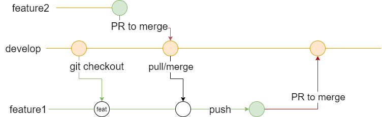
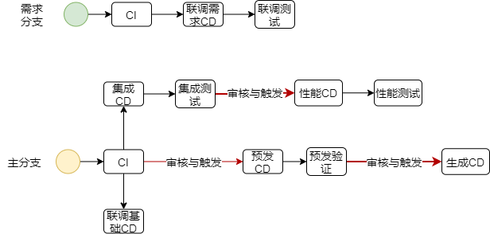
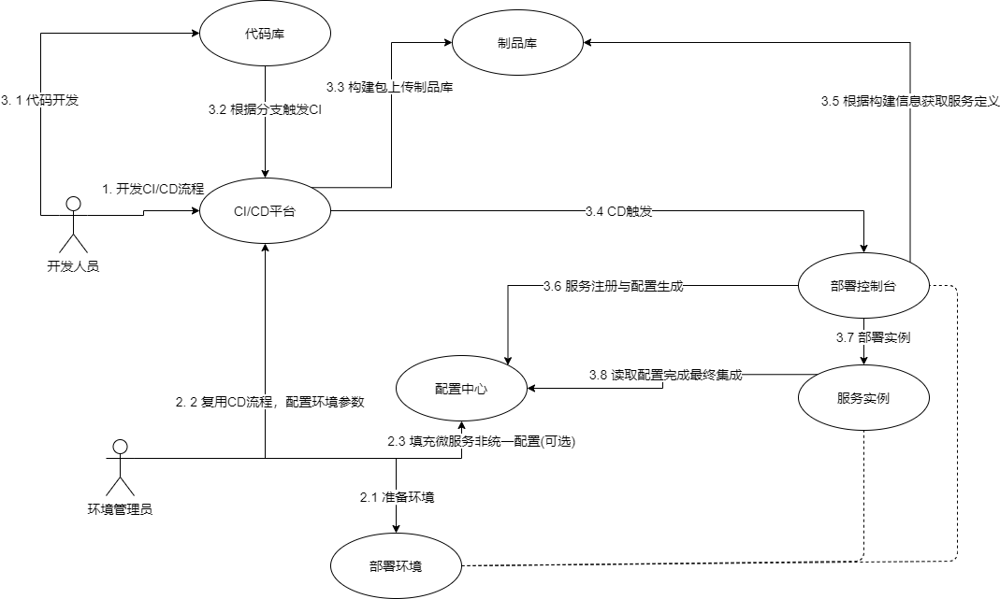
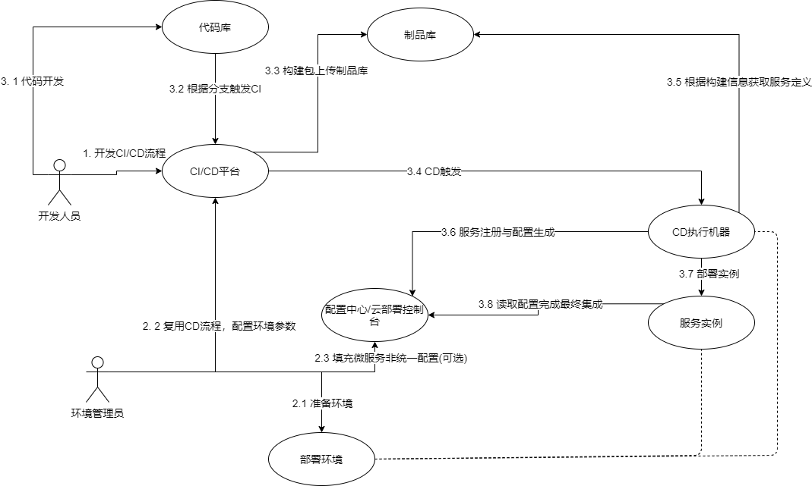

[toc]

# 一、CI概念

微服务持续集成包括持续构建微服务，产品配置持续集成策略，服务包持续集成。

从某种意义上来讲，目前的CI只能称为自动化构建，因为根本没有微服务持续集成策略。各个微服务团队仅关注于自身的可执行程序构建，**从没有关注过服务的集成**。

集成过程含有2个部分：**可执行程序集成，配置集成**(运行时集成)。

可执行程序集成主要是可执行程序集成、升级任务集成。

配置集成可以详细划分为服务定义配置、统一配置读取、非统一配置读取。

## 可执行程序集成

可执行程序集成为对应微服务的执行程序以特定的名称归档到特定的位置。

升级任务集成则根据版本定义完成对应升级任务可执行程序到特定位置的存储。

### 可执行程序集成

可执行程序集成，主要是基于版本定义为可执行程序添加版本号，然后根据版本号集成到程序大包中。整体版本号的构成可以考虑结合应用版本号，分支开发模型组合。除了基本的可执行程序打包外，CI需要对可执行程序有一定的质量保证，因此对程序进行质量的检验和分析等行为必不可少，例如UT。

### 升级任务集成

需要进行版本定义，升级场景确认。没想好，略。

## 配置集成

### 服务定义

服务定义用于对本次集成的服务进行定义，用于告知发布方如何对本次发布的本服务进行**版本选择、服务注册、存储选择和相应权限分发**。根据目前的微服务发布过程，主要需要考虑为**服务网络定义、服务权限角色定义**。

* 服务网络定义：部署端根据一定策略进行服务注册，并将服务加入可见网络，目前可见网络**考虑为统一配置中心的网络域**
* 服务权限角色定义：部署端根据服务角色定义为其生成对应证书、密钥或token等身份标识，并为其进行分发。目前**考虑将生成的权限配置存储在统一配置中心的权限域**，分发可以考虑部署时静态分发、SDS动态分发、配置中心监听读取等形式。在角色定义上可以将**业务层和系统层**的权限结合或分离
* 版本定义：部署端可以根据版本的在发布时选择对应的可执行程序实体、并决定是否执行升级策略、如何进行升级策略等
* 存储选择：用于将对微服务所需进行存储定义，通过一定策略保留给部署人员，并为其分配存储。目前暂不考虑有状态服务的自动分配，如果需要可以考虑将定义存储标签，在部署时有部署端准备对应存储，并通过存储标签自动选择标签。将服务部署与存储准备分离。

### 统一配置读取

一个产品往往由多个微服务组合集成而来，因此会存在可统一的配置形式。对于这种统一的配置，应通过**统一的策略****进行读取或分发(否则统一毫无意义)，例如代表服务注册的统一配置中心的网络域、代表微服务权限的配置中心配置域。

统一配置为系统层面的标准，各个微服务团队应根据统一的策略对这些配置进行获取。统一配置的生成、分发**不应需要部署人员进行参与**、自动生成、自动订阅/分发

例如：目前的各个微服务在编写helm chart时，通过填写depservice来告知部署端微服务依赖，由部署端完成从配置中心的网络域读取和对于配置的填写到微服务运行配置，由部署端向用户中心申请token，并填写到微服务运行配置。

### 非统一配置读取

非统一配置与统一配置的区别在于该种配置由服务特性决定，且需要和**其他服务分开控制**的配置，往往**需要部署人员参与配置**。例如日志级别、jvm设置等配置，在不同微服务都有自身不同的需求。非统一配置的实际生成由不同微服务开发团队自行决策，但是需要提供统一的配置入口，以便实际部署人员、运维人员进行配置调整。非统一配置入口不宜过于复杂，因此可以考虑通过从**系统配置中心**读取指定配置文件、指定配置目录，并根据一定策略由微服务开发者自行**映射到自身的配置中**。而为了易用性，一般每个服务都会带有最小化的默认配置。

在目前的场景中该行为可以通过"entrypoint"机制，在不改变应用代码的情况下进行改造。如果需要进行热更新则需要改造对应微服务代码，并需要对应的配置中心sdk进行配置订阅。


# 二、CD逻辑

CD将自动化构建产生的服务，持续的、自动的根据环境的定义，按一定的部署策略部署到特定的环境。在部署过程中会完成集成中的一部分工作，常见的有为部署的服务进行服务注册，分配服务权限等。即CD是在已有集成规则下，根据环境定义按一定发布策略持续、自动将服务部署到特定环境的过程。

部署微服务使用的配置一般有三层，最底层为微服务开发定义的最小化默认配置，第二层为部署平台/人员定义的特定配置，第三种是微服务用户定义的配置。三种优先级逐渐变高，高优先级覆盖低优先级。CD主要涉及第二层配置，由环境管理员定义全局统一配置和部署配置，部署/CD人员配置部分需要的非统一配置(有可能需要从全局配置做映射)，这些配置主要由CD对象环境定义和发布策略决定。


## 环境定义

1. 集成环境：用于需求分支包成进入大包后的集成测试，环境仅需要满足整个系统的最低资源配置定义，各个微服务部署均采用默认参数配置
2. 开发联调基础环境：环境服务于集成环境相同，主要用于提供需求开发分支的联调基础组件
3. 开发联调需求环境：用于开发进行初步的联调、自测与接口测试等，主要测试微服务自身，不涉及其他服务对本服务的依赖。与开发联调基础环境在复用相同的底层资源，但通过隔离策略形成隔离，仅复用一些基础组件。
   * 开发性能测试环境：该环境主要用于对不需要依赖其他服务时，服务自身能力的性能测试，建议仅提供充足的资源，不提供CD，由开发和测试根据具体情况决定是否进行，由谁进行，不计入5种环境中
4. 性能测试：用于对系统局部和整体的性能测试，环境资源充足。部署的服务包与集成环境相同，但部署的参数在CD时仍采用默认参数，但需要特定手段允许调整。
5. 预发环境：提供整体系统上线前的试营、整体验证性工作和一些质量验证工作，与生产环境配置相同。多套预发环境对应不同重点客户，目前仅考虑一套对应共有云生产环境。
6. 生产环境：在公有云上提供客户使用。


# 三、实现

## 3.1 微服务配置

1. 第一层配置由微服务开发团队配置，通过**镜像**的方式配置默认配置。

2. 第二层配置由部署人员配置(非统一配置)，通过配置中心保存。
   1. 建议微服务的自身通过配置中心接口进行订阅(统一与非统一配置)并映射到自身配置上。
   2. 如果希望较小改动的实现，则通过镜像入口脚本的形式，完成对配置中心的读取与映射，避免对代码的修改。
   3. 虽然也可以通过像现在一样配置depService的方式填写，但是这样会增加服务定义的复杂度，而且不能解决非统一配置的分发。

3. 第三层配置目前不存在。


## 3.2 分支管理、CI/CD与部署环境






如图基于TBD分支管理完成自动化构建和自动化发布。

分支开发和CI/CD触发流程如图所示：

1. 基于主线创建本地需求分支
2. 基于本地需求分支开发代码，阶段开发完毕需要提交到远程本质前，将最新远程主线合并到本地需求分支后再推送到远程需求分支
3. 当远程需求分支提交后会触发需求分支自动化构建生成需求分支包
4. 需求分支CI构包完毕后，会触发**联调需求环境**的CD，将需求分支包部署到联调需求环境，其**依赖服务为联调基础环境**中的服务。随后进行联调开发测试。
5. 当需求开发完毕后，通过PR或者其他方式，将代码合并到主线分支，此时需要相关人员进行代码审核。代码审核人员必须确定本次需求分支的合并代码中**包含主线分支的最新代码**
6. 当主线分支代码发生变更后，触发主线分支的自动构建，主线分支包触发三个环境的CD
   1. 触发**联调基础环境**的CD，更新基础联调环境服务
   2. 触发**集成测试环境**的CD，更新集成测试环境的服务，并进行集成测试。当集成测试完成后，由**测试人员决定是否触发性能测试的CD**(理论上应该进行，只不过是性能CD是否包含性能测试)
   3. 完成测试后，经过测试人员和预发布环境管理员的审核后触发预发布环境的CD，在预发布验证完毕后经过生产环境管理员的审核后触发生产环境CD

PS: 服务回滚，目前仅能想到可执行程序的回滚，即通过helm回滚到特定版本，或重新触发特定构建包的CD

PS: 联调需求环境和联调基础环境本质上是同一个环境，联调基础环境上的服务为主线分支上的包，联调需求环境上服务为需求分支上的包，但是两个环境将会使用不同的命名空间，不同的租户进行隔离。在联调需求环境上不存在的服务会默认使用联调基础环境上的服务。


## 3.3 CI与CD

根据上文的分支管理介绍，要达到对应目的，CD至少要保证三个参数的传递：**版本号、分支名、构建信息**。自动构建通过这三个信息完成微服务构建包到产品大包的集成。通过CD这三个信息，才能够定位到自动化构建生成的服务定义、可执行程序包升级包。

通过分支名与构建信息可以唯一定位一个包与某次代码提交，实现具体的代码版本定位。通过版本号确定当前微服务版本，进行应用版本管理。如果版本号难以简单的显式传递，则需要考虑在制品包中进行定义，隐式的传递给CD。

所以制品包可以考虑以**"/<团队名称>/<服务名称>:<应用版本号>-<分支名>.<构建信息>"或"/<团队名称>/<服务名称>:<分支名>.<构建信息>"**的格式构建出包。在实现中可以考虑将使用**"git commit"简写模式作为构建信息**，之所以不使用构建号是为了减少对构建平台的依赖，便于传递构建包的元数据。

在实际过程中**"<应用版本号>-<分支名>.<构建信息>"**可以考虑将使用git分支相关信息完成**"\<tag>-<分支名>.\<commit shot>"**的形式作为映射。

### 3.3.1 包的CI

一般一个微服务的CI过程包含：

1. 静态代码分析与报告
2. 可执行二进制程序构建
3. UT测试
4. 基于桩或mock的接口场景测试
5. 性能基准测试
6. 各种测试结果报告
7. 构建运行时镜像，上传归档镜像
8. 完成服务定义包构建，并上传归档
9. 升级包任务，上传并归档


#### 3.3.1.1 镜像名

这里主要确定运行时镜像的镜像到制品库和服务定义的归档。镜像名构成为"/<团队名称>/<服务名称>:<应用版本号>-<分支名>.<构建信息>"组成。

#### 3.3.1.2 服务定义(思路，具体格式和内容未定义)

每个服务定义对应一个微服务，对应到Kubernetes上为一个deployment(可能会按一定策略被部署为多个Deployment)。最终完成后上传，名称构成为"/<团队名称>/<服务名称>:<应用版本号>-<分支名>.<构建信息>"。

**现在该步骤对应的其实就是helm chart的构建。**

更复杂的场景使用和格式未来另开单章讨论和管理。目前格式简单定义如下

```
{
	"appVersion": "<appVersion>",
	"team": "<team>",
	"type": "self_developed"
	"appName": "<appName>"
	"spec": {
		"containers": [<images_name0>, <images_name1>...]
	}
	"services": [
		{
			"name": "<name>",
			"type": "http",
			"spec": {
				"port": <port>,
				"prefix": "<prefix>"
			}
		}
	]
}
```

* type字段：为定义该服务的类型，部署时可以根据其类型进行一定策略的部署，例如当type为"self_developed"时，如果部署到Kubernetes上时，部署端可以为其自动生成deployment和service等对象并统一的配置文件或其他一些行为。
  * services.name：提供服务名称，需要符合dns域名标准
  * services.type：服务类型，例如http
  * services.spec：服务相关定义，目前仅定义了端口号和http路由前缀
* services字段：为由多个service组成的服务定义，每个service对应该服务内部提供的一种能力，部署端将根据一定的**网络策略**将各个services进行暴露。对
* team字段字段：团队分组，英文，未来可能会称为url一部分，格式待定。
* appName：应用服务名称，该名称和services.name不同，它可能会用于获取包、部署包的依据。
* spec字段：用于部署

例如一个服务定义如下

```
{
	"appVersion": "3.0.1",
	"team": "test",
	"type": "self_developed"
	"appName": "elasticsearch-admin"
	"spec": {
		"containers": [
			"searcher",
			"backuper"
		]
	}
	"services": [
		{
			"name": "cluster",
			"type": "http",
			"spec": {
				"port": 9200,
				"prefix": "/_nodes"
			}
		},
		{
			"name": "cat",
			"type": "http",
			"spec": {
				"port": 9300,
				"prefix": "/_cat"
			}
		},
	]
}
```

那么可以在部署端可能生成如下的格式。实际内容生成需要结合集成、发布策略等

```
---
apiVersion: apps/v1
kind: Deployment
metadata:
  	name: elasticsearch-admin
......
spec:
	spec:
		containers:
			- test.docker.registry/test/searcher:3.0.1-develop.119
			......
			- test.docker.registry/test/backuper:3.0.1-develop.119
			......
			
---
apiVersion: v1
kind: Service
metadata:
  	name: elasticsearch-admin-cluster
  ......
spec:
	ports:
		- name: cluster
		  protocol: TCP
		  targetPort: 9200
......
---
apiVersion: v1
kind: Service
metadata:
  	name: elasticsearch-admin-cat
  ......
spec:
	ports:
		- name: cat
		  protocol: TCP
		  targetPort: 9300
......
---
apiVersion: networking.k8s.io/v1
kind: Ingress
spec:
	rules:
	  - host: test.test.com
    	http:
      	paths:
      	- backend:
       		serviceName: elasticsearch-admin-cluster
        	servicePort: 9200
       		path: /_nodes/
       		pathType: ImplementationSpecific
......
---
apiVersion: networking.k8s.io/v1
kind: Ingress
spec:
	rules:
	  - host: test.test.com
    	http:
      	paths:
      	- backend:
       		serviceName: elasticsearch-admin-cat
        	servicePort: 9300
       		path: /_cat/
       		pathType: ImplementationSpecific
......
			
```


### 3.3.2 CD

在CI结束后会根据分支管理与CI/CD的关系，触发对应CD。

CD的主要流程有：

1. 下载根据版本号、分支号、构建信息下载对应的服务定义包
2. 部署端通过服务定义包，注册服务，分发可执行程序包，启动服务
3. 最后有两种策略完成最终的集成
   1. 一种是部署端根据服务定义，通过一定策略读取服务所需配置，再进行分发
   2. 另一种是部署端为服务分配角色实例后，服务端自行完成服务的订阅(最简单的entrypoint入口完成配置读取和映射，或复杂的代码内订阅支持热更新)


整个CI/CD流程将会变为如下流程



或当部署控制台负责同一配置部分，如服务注册时，此时部署实例由CD完成



