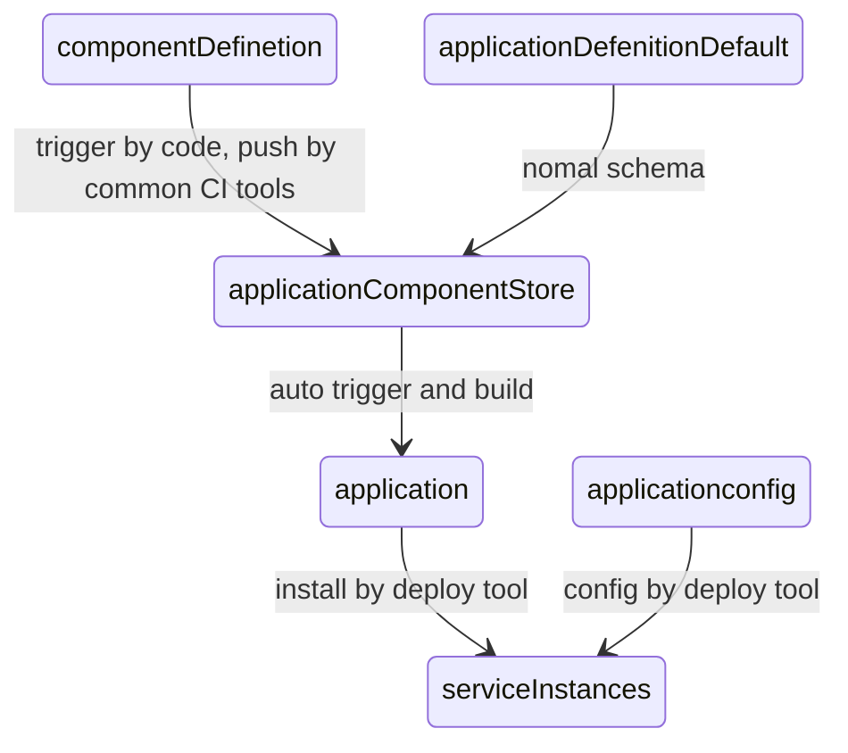

# 一、component和workload提供

workload类似于[taskRunner]()中的`task`接口。task和workload的关系为，task是workload的执行，workloadDefinetion是对workload的描述。

基于workload定义componentDefinetion。在前期可能在对component的公共能力抽象提取较弱的情况下，可能会出现workload和componentDefinetion呈现1:1 对应的关系，随着系统的逐渐完善和能力抽象，可能会出现1:N的关系。

1. 一般性服务
   1. 用于一般应用开发服务交付
   2. 新增OrdinaryDeployment为新的task，componentDefinetion基于OrdinaryDeployment workload生成，componentDefinetion名称为组件名称
2. 服务别名
   1. 使用已存在第三方组件等价替换应用内部组件，例如不需要通过平台创建或独立与applicationPackage管理的第三方数据库资源。
   2. 通过服务别名的方式保证application视图的完整性，同时引用第三方资源
   3. 新增task为configAlias或config
   4. component名称为ConfigAlias
3. 开源组件资源
   1. 用于创建第三方资源组件并等价替换应用内部组件，例如需要平台创建对应资源并替换application内置数据库为云上数据库
   2. 新增task为thirdResouce
   3. conponentDefinetion名称和数量待定
4. helm任务
   1. 用于执行helm chart包，并附加一些额外的装饰器
   2. 底层workload为helm
   3. componentDefinetion名称为helm，通过component包装，指明需要附加的管理能力
5. script任务
   1. 用于执行脚本，
   2. 底层workload为script
   3. componentDefinetion以封装脚本底层执行环境，名称由提供者提供

# 二、application定义

## application

application头部信息，用于对象版本管理

| attribute    | type           | require | description                               |
| ------------ | -------------- | ------- | ----------------------------------------- |
| `apiversion` | string         | y       | must be "runner.deploy.dev/v1alphal"      |
| `kind`       | string         | y       | must be "application"                     |
| `spec`       | [spec](##spec) | y       | application's component、trait and config |

## spec

与oam不同，除了oam定义的component字段外，额外增加了globalTraits用于对全局组件的添加默认特性，graphEdge可通过自动工具生成整个component的依赖关系

| attribute      | type                       | require | description                                                  |
| -------------- | -------------------------- | ------- | ------------------------------------------------------------ |
| `component`    | [[]component](##component) | y       | Component specification，it represent the service in application |
| `globalTraits` | [[]trait](##trait)         | n       | global trait                                                 |
| `graphEdge`    | [\][2]string               | n       | the depdence in cmponent, auto generate when build package   |

## component

比oam额外增加了depService字段，用于对当前组件代表服务的依赖服务。这是因为应用内服务依赖并不会像依赖第三方服务一般纯粹，往往会存在对架构内其他服务的依赖，而这些依赖往往不是部署开发能够意识到的，而是应用开发在开发时决定的。

depService字段会在应用开发声明应用元数据时填写，在生成包时自动生成。因此应用开发在填写应用元数据时，其实本质上也参与了部分集成工作，应用开发需要思考在整体架构内的角色和提供的能力。如果难以理解，可以认为这个字段的本质是应用开发对输入参数的要求，不过这些参数为全局统一规划和分配，因此需要应用开发声明其需要参数，再被应用统一分配。

depService字段的另一个好处是对服务依赖关系的补充，有利于后续版本兼容等行为的扩展。oam没有这个字段是由于oam认为声明式api顺序是无关的，他们追求最终一致，只有命令式api才需要关注顺序。但往往部署/升级过程，如果组件提供者不是非常的有经验，很难设计出顺序无关且顺利执行，例如应用服务需要等待数据库启动或数据库内数据升级等行为。有良好经验的人可以在服务启动前进行等待，但可能情况是导致数据异常，而提供依赖声明则可以大限度的降低这种错误，并且这种行为可以基于框架进行检查，不需要服务内部进行，将这种通用行为下沉。

基于depService字段，并且基于service我们可以生成最简化的应用拓扑图，并根据图形决定执行计划。

| Attribute    | Type               | Required | Default Value | Description                                                  |
| ------------ | ------------------ | -------- | ------------- | ------------------------------------------------------------ |
| `name`       | string             | Y        |               | The name of the component instance, it equal to a service id in application |
| `type`       | string             | Y        |               | A reference to the [component definition]() that will be instantiated by the application. Optionally a namespaced component may be referenced as `<namespace>/<component_name>`. The meaning of *namespace* is implementation specific depending on the runtime being used and the target platform where entities are created. In the case of the Kubernetes, the concept of `namespace` matches the existing one in Kubernetes. |
| `properties` | [`Properties`]()   | Y        |               | A set of values assigned to the parameters exposed from the [componentDefinetion support](#componentDefinetion). |
| `traits`     | [[]trait](##trait) | N        |               | The traits to attach to this component instance.             |
| `depService` | []name             | N        |               | the dependence service in application. auto generate when build |

## trait

| Attribute    | Type             | Required | Default Value | Description                                                  |
| ------------ | ---------------- | -------- | ------------- | ------------------------------------------------------------ |
| `type`       | string           | N        |               | A reference to the name of trait definition. For one type of trait, there could be only one configuration in one component. |
| `properties` | [`Properties`]() | Y        |               | The properties values to use this trait. see [trait support](). |


# 三、trait提供


# 四、componentDefinetion

## componentDefinetion通用格式

| Attribute    | Type           | Required | Default Value | Description                                                  |
| ------------ | -------------- | -------- | ------------- | ------------------------------------------------------------ |
| `apiVersion` | `string`       | Y        |               | A string that identifies the version of the schema the object should have. The core types uses `core.oam.dev/v1beta1` in this version of model |
| `kind`       | `string`       | Y        |               | Must be `ComponentDefinition`                                |
| `metadata`   | [`Metadata`]() | Y        |               | Entity metadata.                                             |
| `spec`       | [`Spec`]()     | Y        |               | The specification for the component definition.              |

### spec

| Attribute   | Type                                                         | Required | Default Value | Description                                                  |
| ----------- | ------------------------------------------------------------ | -------- | ------------- | ------------------------------------------------------------ |
| `workload`  | [`WorkloadTypeDescriptor`](https://github.com/oam-dev/spec/blob/master/3.component_model.md#workloadTypeDescriptor) | Y        |               | Identifier to [workload type](https://github.com/oam-dev/spec/blob/master/4.workload_types.md) of this component. |
| `schematic` | [Schematic](###Schematic)                                    | Y        |               | Schematic information for this component.                    |

### WorkloadTypeDescriptor

| Attribute    | Type                          | Required | Default Value | Description                                                  |
| ------------ | ----------------------------- | -------- | ------------- | ------------------------------------------------------------ |
| `type`       | `string`                      | Y        |               | A reference to a `WorkloadDefinition` via name.              |
| `definition` | [WorkloadGVK](###workloadGVK) | Y        |               | Mutually exclusive to `type`, a reference to `WorkloadDefinition` via group, version, and kind. |

### WorkloadGVK

| Attribute    | Type     | Required | Default Value | Description                        |
| ------------ | -------- | -------- | ------------- | ---------------------------------- |
| `apiVersion` | `string` | Y        |               | The API version the workload type. |
| `kind`       | `string` | Y        |               | The API kind of the workload type. |

## 一般服务componentDefinetion

OrdinaryDeployment类型componentDefinetion通过对OrdinaryDeployment workload封装得到。

### componentDefinetion

| Attribute       | Type       | Required | Default Value | Description                                                  |
| --------------- | ---------- | -------- | ------------- | ------------------------------------------------------------ |
| `apiVersion`    | `string`   | Y        |               | A string that identifies the version of the schema the object should have. The core types uses `deploy.core.oam.dev/v1alpha` in this version of model |
| `kind`          | `string`   | Y        |               | Must be `ComponentDefinition`                                |
| `metadata.name` | `string`   | Y        |               | componentDefinetion name                                     |
| `spec`          | [`Spec`]() | Y        |               | The specification for the component definition.              |

### spec

| Attribute   | Type                                                         | Required | Default Value | Description                               |
| ----------- | ------------------------------------------------------------ | -------- | ------------- | ----------------------------------------- |
| `workload`  | [`WorkloadTypeDescriptor`](https://github.com/oam-dev/spec/blob/master/3.component_model.md#workloadTypeDescriptor) | Y        |               | Must be `OrdinaryDeployment `             |
| `schematic` | [Schematic](###Schematic)                                    | Y        |               | Schematic information for this component. |
| `version`   | `string`                                                     | y        |               | component version.                        |

### WorkloadTypeDescriptor

| Attribute    | Type                          | Required | Default Value | Description                                                  |
| ------------ | ----------------------------- | -------- | ------------- | ------------------------------------------------------------ |
| `type`       | `string`                      | Y        |               | Must be `ordinaryDeployment `                                |
| `definition` | [WorkloadGVK](###workloadGVK) | Y        |               | Mutually exclusive to `type`, a reference to `WorkloadDefinition` via group, version, and kind. |

### WorkloadGVK

| Attribute    | Type     | Required | Default Value | Description                           |
| ------------ | -------- | -------- | ------------- | ------------------------------------- |
| `apiVersion` | `string` | Y        |               | must be `deploy.core.dev.oam/v1alpha` |
| `kind`       | `string` | Y        |               | must be `microService`                |

### Schematic

该部分未来可能会由worklodDefinetion参数定义部分生成说明，移步[workload仓库]()

应用开发团队填写应用元数据，服务定义工具实现对helm chart包的初步生成，由部署工具完成对helm chart包的trait部分配置填写

最简化服务定义如下

| Attribute    | Type                          | Required | Default Value | Description                                                  |
| ------------ | ----------------------------- | -------- | ------------- | ------------------------------------------------------------ |
| `container`  | [`container`](###container)   | Y        |               | main service workload container                              |
| `containers` | [`[]container`](###container) | no       |               | opption service container，should be considered carefully    |
| config       | `string`                      | y        |               | use [k8s openapi3.0 schema object](https://kubernetes.io/docs/tasks/extend-kubernetes/custom-resources/custom-resource-definitions/#validation) to describe the container args. the args will inject by a common way. services should support the way to read args. |
| updater      | [`[]updater`](###updater)     | n        |               | component update policy, Execute in sequence                 |
| depservice   | `[string]string`              | n        |               | the dependence component for this component. key is component name, values is version support |

### container

| Attribute    | Type                          | Required | Default Value  | Description                        |
| ------------ | ----------------------------- | -------- | -------------- | ---------------------------------- |
| `imagesName` | [`container`](###container)   | Y        |                | image Name in repository           |
| `imagesTag`  | [`[]container`](###container) | y        |                | image tag                          |
| `name`       | `string`                      | y        |                | container name                     |
| `command`    | `[]string`                    | n        | /entrypoint.sh | container entrypoint command       |
| `args`       | `[]string`                    | n        |                | command's args                     |
| `health`     | [`[]health`](###health)       | y        |                | health check for container service |
| `protocol`   | `[]protocol`                  | y        |                | the container service protocol     |
| `env`        | `map[string]string`           | n        |                | developer default env              |

### health

| Attribute        | Type                                                         | Required | Default Value | Description     |
| ---------------- | ------------------------------------------------------------ | -------- | ------------- | --------------- |
| `livenessProbe`  | [ref](https://kubernetes.io/docs/tasks/configure-pod-container/configure-liveness-readiness-startup-probes/) | Y        |               | live check.     |
| `startupProbe`   | [ref](https://kubernetes.io/docs/tasks/configure-pod-container/configure-liveness-readiness-startup-probes/) | y        |               | startup check.  |
| `readinessProbe` | [ref](https://kubernetes.io/docs/tasks/configure-pod-container/configure-liveness-readiness-startup-probes/) | y        |               | readiness check |

### protocol

| Attribute | Type           | Required | Default Value | Description             |
| --------- | -------------- | -------- | ------------- | ----------------------- |
| `type`    | `string`       | Y        |               | tco or http or somehing |
| `spec`    | `protocolSpec` | y        |               | the protocol defiend    |

###  protocolSpec

#### tcp

| Attribute | Type     | Required | Default Value | Description        |
| --------- | -------- | -------- | ------------- | ------------------ |
| `port`    | `int`    | y        |               | the tcp port       |
| `name`    | `string` | y        |               | the port indentity |

#### http

| Attribute | Type       | Required | Default Value | Description      |
| --------- | ---------- | -------- | ------------- | ---------------- |
| `port`    | `int`      | y        |               | the http port    |
| `path`    | `[]string` | y        |               | the route prefix |
| `name`    | `string`   | y        |               | the indentity    |

#### 

### 示例

一个最简化服务定义如下：

```yaml
apiVersion: deploy.core.oam.dev/v1alpha
kind: ComponentDefinition
metadata:
	name: sleep
spec:
	workload:
		type: ordinaryDeployment
		definition:
			apiVersion: deploy.core.dev.oam/v1alpha
			kind: microService
	version: 3.0.1
	schematic:
        container:
            ImagesName: /fun/custom/sleep
            name: sleep
            Args: 10d
            Env: 
                SLEEPCOMMAND: /sbin/sleep
            Health:
                livenessProbe:
                    exec:
                        command:
                            - cat
                            - /tmp/healthy_livenessProbe.sh
                    failureThreshold: 1
                    periodSeconds: 10
                startupProbe:
                    exec:
                        command:
                            - cat
                            - /tmp/healthy_startupProbe.sh
                    failureThreshold: 1
                    periodSeconds: 10
                readinessProbe:
                    exec:
                        command:
                            - cat
                            - /tmp/healthy_readinessProbe.sh
                    failureThreshold: 1
                    periodSeconds: 10
```

### 应用版本升级定义

升级过程类似服务定义，通过交付服务定义如下

```
....
	schematic:
        updater:
            type: conatiner
            from: 3.0.1
            to: 3.0.6
            container:
                ImagesName: /fun/custom/sleepUpdate
                name: update
         rollback:
            - type: shell
               script: |
                   echo 3.0.1 >/usr/sleep/version 
             - type: script
                source:
                    type: FTP
                    path: /sleep/update/rollback/3.0.1_3.0.6.sh
 .....
    
```

### 应用依赖定义

```yaml
....
	schematic:
		depsService:
			a: 3.0.4
			b: 3.0.9
 .....

```

### 最终交付物

1. 镜像和应用定义
2. 升级定义和对应升级镜像或脚本
3. 应用依赖定义
4. 应用依赖定义


# 五、实现

1. workload暂不提供Definetion，直接使用基本工具内部实现，未来如果需要对外开发则根据外部平台支持的workload进行转换和适配。
2. 后续workload通过openapi3.0提供参数说明和对component的基本校验
3. 应用开发基于workload封装，提供componentDefinetion。componentDefinetion注册由基础工具在构建大包时完成。
   1. componentDefinetion目前由应用开发保存，随代码变更或手工修改componentDefinetion触发的CI集成当特定包，对应集成工具由基础开发提供

## 制品流向状态图



## 项目

整体项目名称暂定DeployTaskController。
