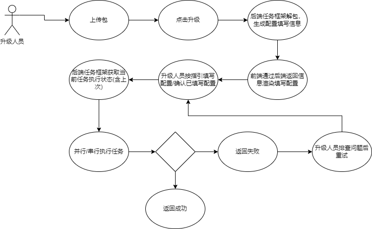
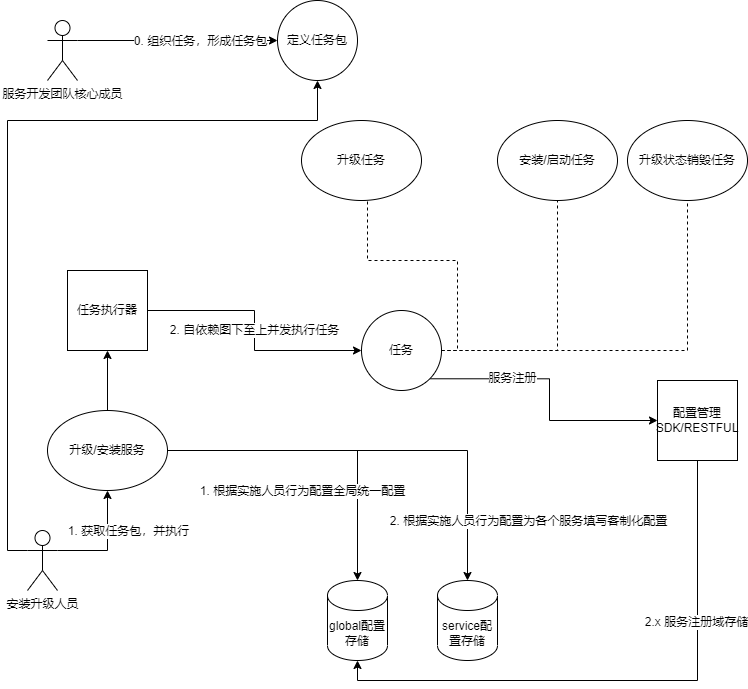
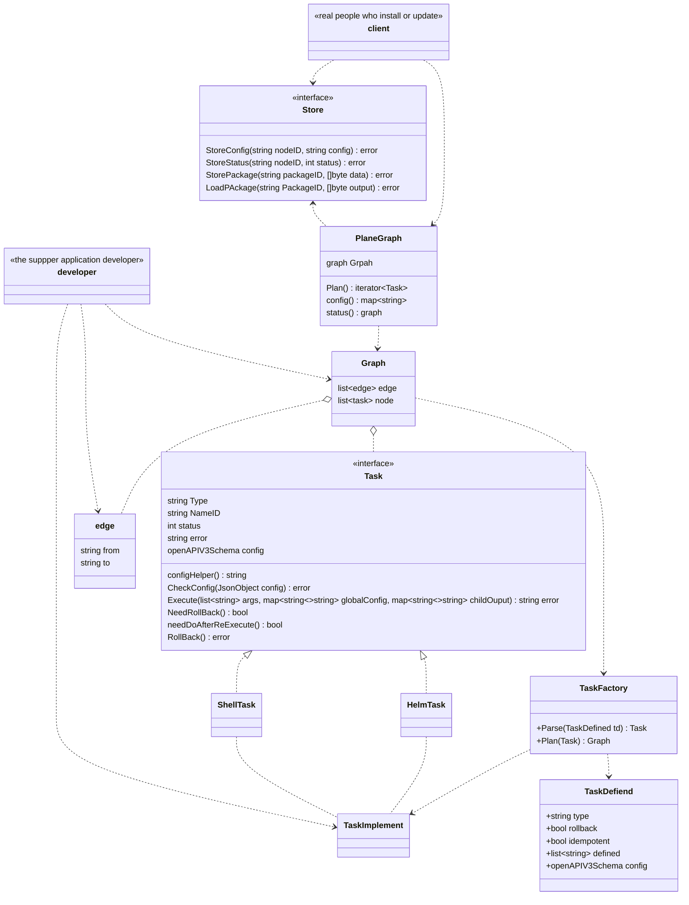

# 一、目的

1. 期望将安装部署和升级以一系列任务的形式完成
2. 提供多种任务类型，以提供开发者可以通过这些任务定义完成对于的升级所需操作或子操作
3. 提供一种任务实例的关系定义，可以使得任务间按一定依赖顺序进行。
4. 包含一系列任务实例和任务关系的的包可以作为对于的任务包。
5. 存在关系的任务间，可以传递其结果集。
6. 任务执行框架taskRunner通过解析任务包生成可运行的任务，通过任务关系可以形成任务执行图，并发执行包内任务。
7. taskRunner通过记录任务执行结果，在任务包执行过程出现异常退出后，是否回退对应任务由任务定义决定，重试时是否重新执行已成功任务由任务定义决定。

# 二、用例

# 三、整体框架

* developer：真实世界的上层应用开发者，开发人员需要通过对部署安装任务进行描述，通过`TaskDefiend`的参数填写，生成对应的任务。如果部署安装任务中需要多个任务协作完成，除了完成这些任务的编写外，还需要对`edge`编写，形成任务流
* client：实际对包执行安装部署或升级的人，通过taskRunner接口对包进行解析，可以进行安装升级并查看状态，当包需要配置时由taskRunner对配置进行渲染并返回。
* `TaskDefined`：一个任务定义对象模板，通过任务定义对象可以生成一个可执行的任务，任务定义决定

  * 该任务属于哪种类型
  * 任务执行失败后是否需要回滚，
  * 本任务执行成功但被依赖任务执行失败，任务包重新执行时是否需要重新执行
  * 任务该如何执行
  * 任务该如何回滚
  * 执行该任务需要手工填写的参数描述，通过openapiV3Schema进行定义
* `edge`：单向边，用于连接两个任务，组织任务关系，并按任务依赖关系顺序执行，没有关系的任务可以并发执行。
* `Task`：任务在内存的对象，用于获取任务配置帮助和任务执行。

  * 对于服务型`Task`(例如 HelmTask)在执行完成后还会对其状态进行管理，纳入服务管理的一部分。
  * 对于短期`Task`仅进行配置和状态的保存
  * `Task`通过`Execute`函数执行时，会传入人工配置参数、**全局统一配置项**和子任务输出配置项。
    * 对于子任务输出配置项需要与对应定义团队协商保持一致
    * 对于人工传入配置参数项，由服务开发团队定义task时通过openapiV3Schema进行定义，由框架渲染并初步验证，由部署用户进行填写
    * 对于**全局统一配置项**由部署团队或底层系统管理团队统一规划，各个团队根据需要使用
    * Task在对参数进行进一步验证和使用前，应更加全局统一配置做模式上的选择(例如使用云上数据库时，数据库安装任务应改变行为，仅对配置进行输出）
* `Graph`：基于包解析，生成的一个有向无环图，描述了整个包的任务关系和任务
* `PlanGraph`：基于`Graph`形成执行计划，并执行任务流。

  * 根据生成的有向无环图，自下而上并发执行任务，并将任务状态进行保存，对服务状态进行更新
* `TaskImpletement`：对`Task`接口的具体实现，例如`ShellTask`和`HelmTask`分别可以完成对shell脚本的执行和对helm chart包的安装。由**部署团队**对需求进行提炼，并实现针对某方面需求的`Task`
  * 例如若期望使用`HelmTask`封装`helm2`到`helm3`带来的tiler变化，则通过自定义的`helmTask`完成对开发团队定义的helm包识别，与对当前状态的识别，按策略完成从`helm2`到`helm3`的应用无感知升级。
  * 如`ShellTask`之类的非服务任务，应用团队在任务定义中编写的**shell执行的脚本**本应通过**全局统一配置**和服务管理接口获取服务状态根据实际情况完成任务。例如数据库的初始化，在升级时不需要，数据的升级在安装时是不需要的，应用版本与当前版本相同也不需要，当前版本较低时应该失败并中断。这些应该通过服务状态获取，并根据情况完成。
  * 如`HellTask`类似的任务，在执行完成后，应将结果(版本号、结果等)纳入服务管理中，为后续服务以及其他任务提供依据。
* `Store`：部署与升级记录、配置的存储
  * 存储任务包执行记录
  * 存储服务状态
  * 存储升级记录
  * 存储配置信息

