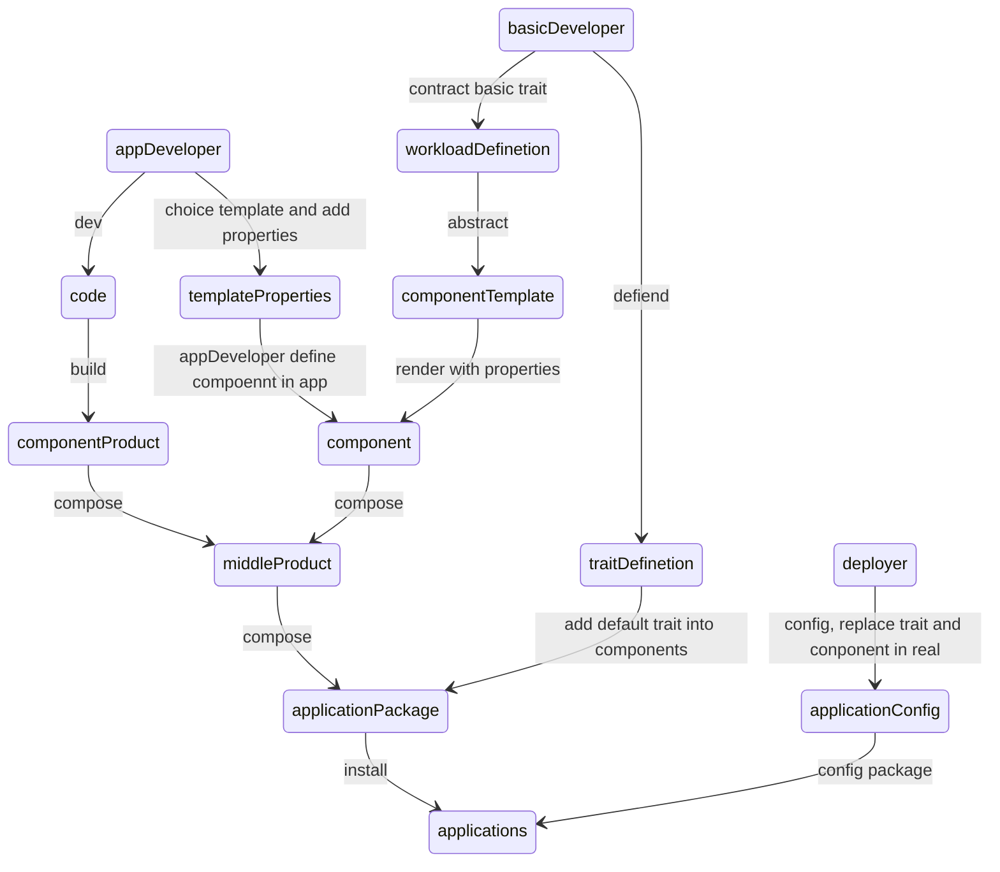
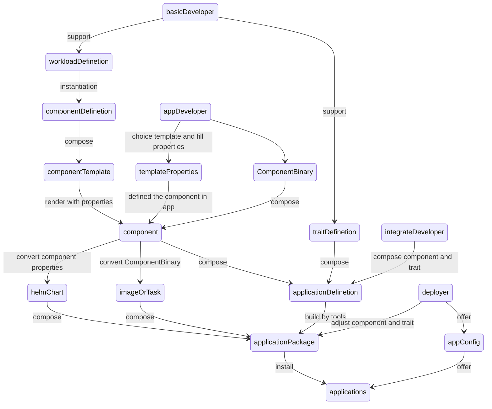

# 背景

多个不同角色团队间对服务的交付、部署复杂。往往只是对服务的一些简单改动也会波及多个团队。

这种复杂在于两个方面：

1. 底层平台调整，引发应用开发团队调整和支持
2. 应用开发服务调整，引发集成、部署和实施需要定制化配置

为此考虑引入以下原则：

1. 基础团队提供服务定义模板，将底层平台进行thin接口，约束应用团队关注点，分离应用开发与运行平台的关注点。应用团队利用服务定义模板定义自身服务，基础团队进行调整时，基于服务定义自动调整应用。
2. 应用团队提出的要求，需要考虑其基础共性，应用团队在基础共性上设计方案。

# 职责




整个开发、发布与部署生命周期如上所示，可以将参与人员根据职责划分为应用开发(appDeveloper),基础底层开发(basicDeveloper),集成开发和部署实施人员(deployer)。

通过`workloadDefinetion`将应用开发人员的关注点与集成开发分离，降低应用开发对实际底层细节的关注必要。通过`traitDefinetion`提取和抽象底层特性，让集成开发人员无需关注具体实现，在集成时可利用trait为应用定义增强能力。通过对`applicationPackage`的图形化管理，以及对`trait`和`component`的提供，让实施人员可以根据实际的底层平台，选择应使用的组件和需要根据实际情况添加的特性。

* 应用开发：关注于自身的服务开发、网络和存储结构。通过服务定义对象，交付服务
* 基础底层开发：负责通用能力抽象，提供底层能力，根据服务通用特性，提供服务定义。统筹全局，对上了解应用需要，提炼通用需求，支持能力。对下了解实际底层平台，为上层提供统一的能力接口。基于服务交付，为上层应用开发提供服务定义，为集成开发和实施人员提供抽象能力`trait`和执行工具。
* 集成开发：集成开发考虑实际应用的网络结构、存储结构和一般运行时需要，组合应用开发的交付组件形成服务包。同时基于基础底层开发提供工具，对实施者提供可根据需要调整服务包的能力
* 部署实施人员：实施人员根据实际需要调整应用包，将应用包进行部署安装/升级。而部署实施人员根据一定的权限又可以分为资源管理员和应用管理员
  * 资源管理员：资源管理员为应用提供存储、网络、计算甚至是第三方应用资源等。例如为有状态应用准备本地存储卷，为轻量级服务提供第三方数据库等
  * 应用管理员：应用管理员会使用资源管理员提供的资源，对应用包(或已部署应用)进行调整，调整应用架构内可使用的资源。例如替换默认数据库组件为第三方数据库组件，为有状态应用选择存储卷


# 无状态应用服务服务定义方案alpha1

## trait提供


## 服务定义

### 目标服务

对一般轻量级应用进行服务定义，为一般轻量级应用提供部署模板。

一般轻量级应用往往存在如下特点：

* 服务内无状态或状态外移
* 可多副本协作无状态
* 优雅退出
* 单主服务


### 应用元数据定义

应用开发团队填写应用元数据，服务定义工具实现对helm chart包的初步生成，由部署工具完成对helm chart包的trait部分配置填写

最简化服务定义如下

* name：服务名称
* version：服务版本,语义化版本号
* containers：多容器定义，**不向应用开发团队直接提供**，该模式某些trait支持不易，一些sidecar行为可以看情况下沉到trait，一些组合行为应该和应用层对方案重新考虑。
* containers[N].imagesName：第N个容器镜像名称，路径
* catainers[N].imagesTag：第N个容器镜像版本，默认使用服务版本
* containers[N].name：第N个容器名称
* containers[N].Command：容器命令行入口，默认/dockerentrypoint.sh
* containers[N].Args：第N个容器命令行参数，默认无
* containers[N].Env：需要附加的环境变量
* containers[N].Health.livenessProbe：必填，存活探测器
* containers[N].Health.startupProbe：必填，启动探测器
* containers[N].Health.readinessProbe：必填，就绪探测器。health内三个探测器必须不同
* container：容器负载定义，应作为主要服务定义，内容与containers相同，但不支持配置多个,两者二选一
* config: 基于openAPI格式的参数描述，用于编写应用所需的配置

一个最简化服务定义如下：

```yaml
name: sleep
version: 3.0.1
container:
	ImagesName: /fun/custom/sleep
	name: sleep
	Args: 10d
	Env: 
		SLEEPCOMMAND: /sbin/sleep
	Health:
		livenessProbe:
            exec:
        		command:
        			- cat
        			- /tmp/healthy_livenessProbe.sh
            failureThreshold: 1
            periodSeconds: 10
		startupProbe:
            exec:
        		command:
        			- cat
        			- /tmp/healthy_startupProbe.sh
            failureThreshold: 1
            periodSeconds: 10
		readinessProbe:
            exec:
        		command:
        			- cat
        			- /tmp/healthy_readinessProbe.sh
            failureThreshold: 1
            periodSeconds: 10
```

### 应用版本升级定义

升级过程类似服务定义，通过交付服务定义如下

```
updater:
    type: conatiner
    from: 3.0.1
    to: 3.0.6
    container:
        ImagesName: /fun/custom/sleepUpdate
        name: update
 rollback:
    - type: shell
       script: |
       echo 3.0.1 >/usr/sleep/version 
     - type: script
        source:
        	type: FTP
        	path: /sleep/update/rollback/3.0.1_3.0.6.sh
    
```

### 应用依赖定义

```yaml
depsService:
	a: 3.0.4
	b: 3.0.9
```

### 最终交付物

1. 镜像和应用定义
2. 升级定义和对应升级镜像或脚本
3. 应用依赖定义
4. 应用依赖定义

## 实现方案



### 基本工作流程原则

1. 部署团队暂时充当基础底层开发人员，定义基本服务类型，提供基本`workloadDefinetion`，并实现对应工具。
2. 应用开发团队根据需要填写应用元数据(即`componentDefinetion`)，对外交付component应用元数据格式alphav1暂时使用内部定义格式，不采用OAM规范，以降低入门门槛，且后续同样可以通过实现工具，实现从自定义格式到对外OAM的转换。
3. 目前基础顶层开发仅提供上节所示服务定义`componentDefinetion`，`componentDefinetion`和`workload`遵循**按实际需求且需求具备共性**原则开发和提供，在不应提供新开发时，通过**提供解决方案**的方式提供
4. `trait`的提供，按实际需要提供
5. 部署团队为集成开发主要开发人员，通过对应用提供的`component`和`trait`组合编写`applicationDefienetion`实现所需的应用架构。`applicationDefinetion`应包含最小化默认配置。
6. 集成开发在集成过程中应尽可能减少开发行为，如果有开发必要应该识别需求是否属于**上层应用**或是`trait`和`componentDefinetion`范畴，让应用的交给应用，让基础框架的交给基础框架，让集成的归属集成。原则不能为上层应用和基础框架做临时开发，不利于后续的管理和健康发展。
7. 基础框架开发人员提供服务定义规范和执行所需工具，集成开发或基础框架开发人员提供`applicationPackage`的可视化配置管理页面(取决于集成开发是否需要二次调整底层接口，以期提供简化操作给实施人员)。
8. 实施人员基于对应用包的管理工具，在实施时，根据实际情况对包内组件进行替换和配置。例如将内置数据库替换为第三方数据库，调整组件默认配置。
9. 实施人员应在实施时具体分为两个角色，资源准备者和应用部署执行者。前者根据实际需要准备基本平台，管理平台底层资源，包括但不限于准备第三方资源或准备第三方资源创建条件(例如准备好云上token，用于基本框架在创建云上component时使用)，这实施人员对资源需求要提前进行规划(可能由集成团队发版告知，或在application内通过文档或其他方式提供)。部署配置人员则根据资源准备情况为`applicationPackage`进行配置并进行安装，包括但不限于替换组件为第三方组件，添加hpa，修改工作负载数量等。这要求实施人员能够事先基于目标准备好资源，以及了解如何对应用进行配置。

### 实现

1. 服务定义暂时提供上节所示服务，细节可以继续讨论，暂不提供`workloadDefinetion`层级的开发，而是直接提供`workload`，目前不支持上层应用开发直接对`workload`进行操作，而是对`ComponentDefinetion`实例化进行组件交付(即目前所说的填写应用元数据)。
2. `component`为应用开发提供的容器镜像(或许可以考虑只有二进制，由部署构建镜像，但需要维护一套基础镜像)和helm chart。 helm chart由基础工具基于`ComponentDefinetion`和应用元数据自动生成支持各种`trait`的helm chart和helm values。理想情况下以后的helm chart版本不再与应用版本绑定，基础工具更多的是生成values
3. 基础框架提供对`applicationPackages`的配置、调整和执行接口。
   1. 配置接口分为统一配置和非统一配置。统一配置由集成团队对配置进行统一规划。非统一配置主要为上层应用需要的个性化配置。基础框架通过对服务定义中的参数定义进行渲染，提供配置和基本检查。非统一配置可以继续细分为热更新配置和非热更新配置(看实际需要)。
   2. 调整接口用于对`applicationPackages`内component的替换、对trait的按需配置或调整，例如替换内置数据库组件为第三方数据库组件。
   3. 执行接口，为对`applicationPackage`的执行，部署或升级整体服务，对执行进行记录。
4. 服务定义存放位置分为两种，第一种位于应用开发项目代码内，第二种位于集成开发指定目录内。第一种在应用开发提交代码触发CI后自动将服务定义提交到指定位置，续集成过程种比较效率，但缺少安全审核，即可能会提交错误代码。第二种则是在应用开发和验证后，向集成提出服务定义修改请求，可以确保最后大包种不会出现集成错误代码。个人倾向第一种，因为错误的代码就不应该提交到主线，如果只是分支包，影响很小，而且可以在更早的阶段发现问题。
5. 集成团队根据实际架构编写`applicationDefinetion`和构建流程，通过基础工具将`ComponentDefinetion`转换为`Componet`从而生成`application`
6. `trait`的实现目前可直接通过helm values配置开关和对象注入完成。

### 实现需求

1. 服务定义，见上节，待继续完善
2. `ComponentDefinetion`转换`component`工具
3. `applicationDefinetion`定义和转换`applicationPackage`工具，参考[taskRunner]()
4. `applicationPackage`配置、调整和执行框架，参考[taskRunner]()
5. `trait`定义和实现，参考[服务定义与资料]()
6. 云中立组件/资源工具(可做可不做)

### 已有组件升级

若已有组件满足服务定义，可使用服务定义定义自身服务，从原先的helm chart方式升级。目前有两种情况，一种是原先已满足，另一种的服务拆分后满足。

因此已有对象升级分为两种：

1. 无缝升级，针对原先已满足需求，对配置存放位置进行变更，迁移到统一配置和非统一配置。随后是helm chart的变更，直接对新helm chart执行helm update
2. 需要删除旧对象后升级，升级前自动对旧helm对象进行备份，删除并 helm install 安装新chart。
   1. 潜在问题，如果helm delete会删除数据则需要事先对数据进行解绑，建议手工。这个问题估计在有状态应用中比较常见，建议对所有出现该问题的服务进行统一评估后提供方案。

### 兼容

兼容分为两种，第一种为与自身原部署框架兼容，另一种为与开源标准兼容，如oam。

1. 第一种，在部署时根据`applicationPackage`内的服务定义决定部署方式，符合服务定义的组件由服务定义框架完成，否则按原方式执行
2. 第二种又分为集成第三方和对外开发，前者在有需要的时候需要额外的开源框架完成例如kubevela，一般不建议做。后者将基础工具新增数据类型，将`applicationPackage`输出为特定规范。
