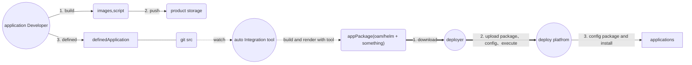

[toc]

# oam简介


oam主要目标是对关注点进行分离，让各个团队聚焦于兴趣点。例如让运维团队可以主要关注于运维特性的管理，让开发团队关注于组件的开发。例如上图中集成或运维可以通过对开发团队提供的零碎组件组合得到期望的应用。

* workload：对应一种能力，例如提供k8s中的deployment
* component：即组件，通过对workload的使用和包装，提供组件级别的能力，例如通过使用statefulset类型的workload提供了数据库组件
* Tait：一种在运行时附加到component的workload，用于组件运行时能力。例如为pod附加sidecar，无需组件开发者开发
* Application：application通过多个componet将零碎的组件能力进行集成，组合形成期望应用能力，并在component上附加trait，以增强应用实际运行时期望的状态，整体组成可见上图。例如一个数据管理应用，可以有数据库component和web服务component组成，并通过trait使得数据库component支持hpa能力。
* application scope：一种逻辑上的对component的分组，可用于不同分组的内部和边界行为。目前分为health scope和network scope。名字为application scope实际上是对application内的compnent进行设置。一个application内的scope可以同时有多个不同的scope。例如通过health scope，可以划分多个控制平面的健康定义，当一个component出现健康问题时，波及多个scope，多个控制平面都会被认为是健康问题。network scope甚至可以决定component间是否可以通信或网络通信路由等。


# kubevela对oam的实现

kubevela是对oam运行时的一种实现。它基于oam的设计，意图使用oam提供平台无关的服务定义交付能力，并提供oam特性。kubevela基于oam的基本概念，提供了一些基本内置的workload、component、trait和scope(后文统称oam定义对象)等。kubevela提供插件安装的方式运行应用提供新的workload、component、trait和scope定义。并通过新插件的方式为新的workload提供服务。kubevela还提供了如工作流、环境和触发器等额外的能力和概念，但不是主要暂不介绍。

有两种途径扩展kubevela的oam定义对象：

1. kubevela使用者可以通过对已有oam定义对象进行组合、编程的方式自定义新的oam定义对象。例如kubevela的webservice是基于deployment workload定义的内置componet，使用者同样可以利用同样的workload编写出自定义的component。

2. kubevela使用者也可以通过编写插件并安装插件的方式增加自定义oam定义对象，例如kubevela通过对fluxcd的包装支持helm类型的compnent，通过编写了terraform-controller项目，利用terraform实现了云平台资源component。这种插件式的除了利用上一种方法外，还可莪能需要利用k8s平台的controller模式，对新component的支持。例如terraform的支持，实际上component是生成了terraform资源配置，再由terraform-controller对配置进行资源的创建。helm任务的支持是生成了fluxcd的crd，再由fluxcd服务进行处理。

kubevela官方文档对其能力描述十分美好，但实际上一些能力并没有达到。例如对oam已定义的通用的trait支持，则是仅只有kubevela内置component可支持，如果是helm compent的方式则无法进行。例如scaler trait对内置的webservice component生效，但对helm component无效，仅仅是在对应的application中附带，是否支持取决于fluxcd是否识别这个trait和是否支持。


所以可以认为除了上图一的kubevela core提供的能力实际是kubevela core(官方提供) + app controller(官方或第三方提供)，如上图二。


# kubevela与现状分析

目前实际的安装部署行为实际上也已经是开发提供组件，部署进行集成，实施进行配置的方式。比较粗暴的做等价，应用开发提供的helm chart实际可以认为是component，而部署对外提供的组合包可以认为是application，不过没有采用oam的定义方式。

对比其kubevela的component方式，已有的helm chart问题在于trait的支持行为，以及部署团队的对现有的云资源支持行为没有kubevela强大。例如部署团队难以为应用helm chart做到sidecar trait等各种trait，支持外部云资源需要用户对到特定云资源进行部署。

而优点在于目前的方式较为贴合业务行为，例如application实际上是有部署服务提供了最小化配置的窄接口，并对统一配置进行分发。如果使用kubevela，在当前版本情况下其velaux页面并不支持组合component，需要用户从后台配置，在目前配置较多的情况下实施者可能无法上手。

kubevela的另一个问题在上文描述的自定义component插件的支持上，有可能需要额外的controller，且不一定支持某些特性(例如trait)，例如helm component。

使用kubevela的一个好处在于第三方集成，当双方都使用kubevela时，第三方集成包可以开箱即用，无需额外开发。**但目前给人的感觉时kubevela并没有发展得这么成熟和权威**。例如对helm component的支持，kubevela目前的helm componentdefinition是由fluxcd插件安装的，如果第三方集成提供的包中helm component不是fluxcd插件提供，而是额外的controller提供，则有可能存在冲突，无法直接集成。即**kubevela的权威性和认可度**问题。

而且即使不使用kubevela也可以达到对应的能力，例如当若需要**label trait**完全可以定义一个chart模板，让应用开发人员参考后，将label注入的部分加入其chart内，从而达到效果。又或者通过确定服务定义，让应用开发填写元数据，由工具生成chart的方式，实现类似oam trait的能力。从目标来看是否使用kubevela不影响目的，对比让应用开发直接转用oam而言，对helm chart更为熟悉，达成目标更简单。而且不需要引入额外的第三方系统，整体系统更简洁，维护成本更低。

## trait收集

- NAME                          APPLIES-TO             DESCRIPTION
- annotations                   ["*"]                  Add annotations on K8s pod for your workload which follows the pod spec in path 'spec.template'.
- configmap                     ["*"]                  Create/Attach configmaps on K8s pod for your workload which follows the pod spec in path 'spec.template'. This definition is DEPRECATED, please specify configmap in 'storage' instead.
- cpuscaler                     ["deployments.apps"]   Automatically scale the component based on CPU usage.
- env                           ["*"]                  Add env on K8s pod for your workload which follows the pod spec in path 'spec.template'
- expose                                               Expose port to enable web traffic for your component.
- gateway                                              Enable public web traffic for the component, the ingress API matches K8s v1.20+.
- hostalias                     ["*"]                  Add host aliases on K8s pod for your workload which follows the pod spec in path 'spec.template'.
- import-grafana-dashboard      []                     Import dashboards to Grafana
- ingress                                              Enable public web traffic for the component.
- ingress-1-20                                         Enable public web traffic for the component, the ingress API matches K8s v1.20+.
- init-container                ["deployments.apps"]   add an init container and use shared volume with pod
- kustomize-json-patch                                 A list of JSON6902 patch to selected target
- kustomize-patch                                      A list of StrategicMerge or JSON6902 patch to selected target
- kustomize-strategy-merge                             A list of strategic merge to kustomize config
- labels                        ["*"]                  Add labels on K8s pod for your workload which follows the pod spec in path 'spec.template'.
- lifecycle                     ["*"]                  Add lifecycle hooks for every container of K8s pod for your workload which follows the pod spec in path 'spec.template'.
- nocalhost                     ["*"]                  nocalhost develop configuration.
- node-affinity                 ["*"]                  affinity specify node affinity and toleration on K8s pod for your workload which follows the pod spec in path 'spec.template'.
- pure-ingress                  []                     Enable public web traffic for the component without creating a Service.
- pvc                           ["deployments.apps"]   Create a Persistent Volume Claim and mount the PVC as volume to the  first container in the pod. This definition is DEPRECATED, please specify pvc in 'storage' instead.
- register-grafana-datasource   []                     Add a datasource to Grafana
- resource                      ["*"]                  Add resource requests and limits on K8s pod for your workload which follows the pod spec in path 'spec.template.'
- rollout                                              Rollout the component.
- scaler                        ["*"]                  Manually scale K8s pod for your workload which follows the pod spec in path 'spec.template'.
- service-account               ["*"]                  Specify serviceAccount for your workload which follows the pod spec in path 'spec.template'.
- service-binding               ["*"]                  Binding secrets of cloud resources to component env. This definition is DEPRECATED, please use 'storage' instead.
- sidecar                       ["*"]                  Inject a sidecar container to K8s pod for your workload which follows the pod spec in path 'spec.template'.
- storage                       ["deployments.apps"]   Add storages on K8s pod for your workload which follows the pod spec in path 'spec.template'.
- volumes                       ["deployments.apps"]   Add volumes on K8s pod for your workload which follows the pod spec in path 'spec.template'. This definition is DEPRECATED, please use 'storage' instead.

# oam与现状分析

现状实际情况中，我们面临的问题是应用开发人员不清楚自身应该怎么写好一个chart，以及部署团队想要在应用开发提供的组件上进行能力增强和管理难。所以即使改用oam，应用团队写出来的oam定义对象仍然不会改善，甚至可能会更差。当然部署团队在此的获利的是可以较简单的进行类似trait等能力的增强行为，但部署团队需要引入oam运行时，如果使用kubevela作为运行时，为了贴合业务，也需要在此基础上进行包装，并且kubevela增加系统复杂度(感觉使用kubevela付出大于得到)。

**oam不解决当前组件顺序问题，组件替换问题，配置管理问题**

但是我们可以oam的定义可以帮助我们对服务定义进行切割。有两种策略可以参考：

1. 我们实现一个简单的工具，提供component，由服务开发团队使用该component对自身开发的服务进行定义，即应用开发人员填写应用元数据，部署开发团队根据元数据生成helm chart或部署计划/对象。但是这种方式较难，首先提出这么一个component不简单，可能出现对应component无人使用或component限制过大。
2. 让helm chart提供可配置**trait**的能力，由部署团队或实施配置。而如何实现可配置**trait**由部署团队提供模板方法，应用开发人员对已有chart进行修改，即**trait**作为统一配置，应用团队支持

# terraform和现状

terraform是一个云平台资源编排工具，kubevela基于该工具提供了资源云中立能力，我们可以不经过kubevela直接使用它，用于云上资源管理


# 前进方向

前进方向有两个，一个是基于现状，基于已存在helm添加trait能力。另一个是增加服务定义，将helm编写下沉。

## trait实现

### trait基于helm实现

* annotation：values.globalconfig.trait.annotations
* configmap: values.globalconfig.trait.comfigmap对pod注入
* cpuscaler：values.globalconfig.trait.cpuscaler对pod进行hpa设置
* env：values.globalconfig.trait.env对pod注入
* expose：在helm包中注入service
* gateway：在helm包中注入ingress或通过values.globalconfig.trait.gateway中指定ingress class，目前情况下指定class合适，ingress path不适合由使用者提供。如果由集成提供，可以直接注入ingress即可。
* hostalias：values.globalconfig.trait.hostalias注入以及通过统一配置配置别名
* import-grafana-dashboard：chart包中注入dashboard crd或添加hook进行注册和删除
* ingress：能力同gateway，由平台选择，提供能力而不是具体实现
* ingress-1-20：能力同gateway，由平台选择，提供能力而不是具体实现
* init-container：values.globalconfig.trait.init-container注入pod，位于所有pod之前。
* kustomize-json-path：目前不需要，后续可以考虑引入第三方包+k8s webhook实现
* kustomize-patch：目前不需要，后续可以考虑引入第三方包+k8s webhook实现
* kustomize-strategy-merge：目前不需要，后续可以考虑引入第三方包+k8s webhook实现
* labels：values.globalconfig.trait.labels注入
* lifecycle：values.globalconfig.trait.lifecycle注入
* nocalhost：部署注入chart包
* pure-ingress：部署注入
* register-grafana-datasource：chart注入hook实现，添加service与gateway构造网络
* resource：values.globalconfig.trait.resource.global注入全局，values.trai.resource.<containerName>注入指定容器
* sidecar: values.globalconfig.trait.sidecar注入
* storage：为chart包注入卷对象，通过values.globalconfig.trait.storage注入pod
* dnsconfig：通过values.globalconfig.trait.dnsconfig注入

## 服务定义

### 应用元数据定义

应用开发团队填写应用元数据，服务定义工具实现对helm chart包的初步生成，由部署工具完成对helm chart包的trait部分配置填写

最简化服务定义如下

* name：服务名称
* version：服务版本,语义化版本号
* containers：多容器定义，不向应用开发团队直接提供，该模式某些trait支持不易。
* containers[N].imagesName：第N个容器镜像名称，路径
* catainers[N].imagesTag：第N个容器镜像版本，默认使用服务版本
* containers[N].name：第N个容器名称
* containers[N].Command：容器命令行入口，默认/dockerentrypoint.sh
* containers[N].Args：第N个容器命令行参数，默认无
* containers[N].Env：需要附加的环境变量
* containers[N].Health.livenessProbe：必填，存活探测器
* containers[N].Health.startupProbe：必填，启动探测器
* containers[N].Health.readinessProbe：必填，就绪探测器。health内三个探测器必须不同
* container：容器负载定义，应作为主要服务定义，内容与containers相同，但不支持配置多个,两者二选一

一个最简化服务定义如下：

```yaml
name: sleep
version: 3.0.1
container:
	ImagesName: /fun/custom/sleep
	name: sleep
	Args: 10d
	Env: 
		SLEEPCOMMAND: /sbin/sleep
	Health:
		livenessProbe:
            exec:
        		command:
        			- cat
        			- /tmp/healthy_livenessProbe.sh
            failureThreshold: 1
            periodSeconds: 10
		startupProbe:
            exec:
        		command:
        			- cat
        			- /tmp/healthy_startupProbe.sh
            failureThreshold: 1
            periodSeconds: 10
		readinessProbe:
            exec:
        		command:
        			- cat
        			- /tmp/healthy_readinessProbe.sh
            failureThreshold: 1
            periodSeconds: 10
```

### 应用版本升级定义

升级过程类似服务定义，通过交付服务定义如下

```
updater:
    type: conatiner
    from: 3.0.1
    to: 3.0.6
    container:
        ImagesName: /fun/custom/sleepUpdate
        name: update
 rollback:
    - type: shell
       script: |
       echo 3.0.1 >/usr/sleep/version 
     - type: script
        source:
        	type: FTP
        	path: /sleep/update/rollback/3.0.1_3.0.6.sh
    
```

### 应用依赖定义

```yaml
depsService:
	a: 3.0.4
	b: 3.0.9
```

### 最终交付物

1. 镜像和应用定义
2. 升级定义和对应升级镜像或脚本
3. 应用依赖定义
4. 应用依赖定义

### 开发与部署流程




# ~~Kustomize 功能特性列表~~

| 字段                  | 类型                                                         | 解释                                                         |
| --------------------- | ------------------------------------------------------------ | ------------------------------------------------------------ |
| namespace             | string                                                       | 为所有资源添加名字空间                                       |
| namePrefix            | string                                                       | 此字段的值将被添加到所有资源名称前面                         |
| nameSuffix            | string                                                       | 此字段的值将被添加到所有资源名称后面                         |
| commonLabels          | map[string]string                                            | 要添加到所有资源和选择算符的标签                             |
| commonAnnotations     | map[string]string                                            | 要添加到所有资源的注解                                       |
| resources             | []string                                                     | 列表中的每个条目都必须能够解析为现有的资源配置文件           |
| configMapGenerator    | [][ConfigMapArgs](https://github.com/kubernetes-sigs/kustomize/blob/master/api/types/configmapargs.go#L7) | 列表中的每个条目都会生成一个 ConfigMap                       |
| secretGenerator       | [][SecretArgs](https://github.com/kubernetes-sigs/kustomize/blob/master/api/types/secretargs.go#L7) | 列表中的每个条目都会生成一个 Secret                          |
| generatorOptions      | [GeneratorOptions](https://github.com/kubernetes-sigs/kustomize/blob/master/api/types/generatoroptions.go#L7) | 更改所有 ConfigMap 和 Secret 生成器的行为                    |
| bases                 | []string                                                     | 列表中每个条目都应能解析为一个包含 kustomization.yaml 文件的目录 |
| patchesStrategicMerge | []string                                                     | 列表中每个条目都能解析为某 Kubernetes 对象的策略性合并补丁   |
| patchesJson6902       | [][Patch](https://github.com/kubernetes-sigs/kustomize/blob/master/api/types/patch.go#L10) | 列表中每个条目都能解析为一个 Kubernetes 对象和一个 JSON 补丁 |
| vars                  | [][Var](https://github.com/kubernetes-sigs/kustomize/blob/master/api/types/var.go#L19) | 每个条目用来从某资源的字段来析取文字                         |
| images                | [][Image](https://github.com/kubernetes-sigs/kustomize/blob/master/api/types/image.go#L8) | 每个条目都用来更改镜像的名称、标记与/或摘要，不必生成补丁    |
| configurations        | []string                                                     | 列表中每个条目都应能解析为一个包含 [Kustomize 转换器配置](https://github.com/kubernetes-sigs/kustomize/tree/master/examples/transformerconfigs) 的文件 |
| crds                  | []string                                                     | 列表中每个条目都赢能够解析为 Kubernetes 类别的 OpenAPI 定义文件 |