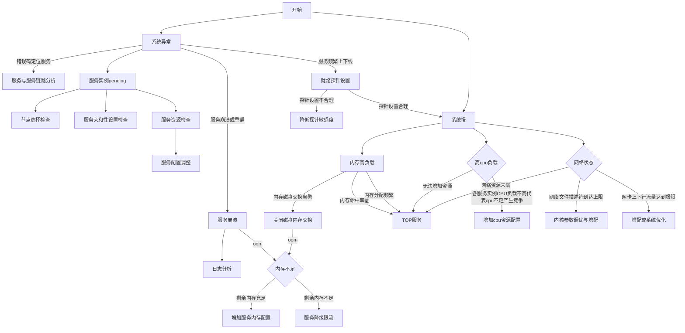
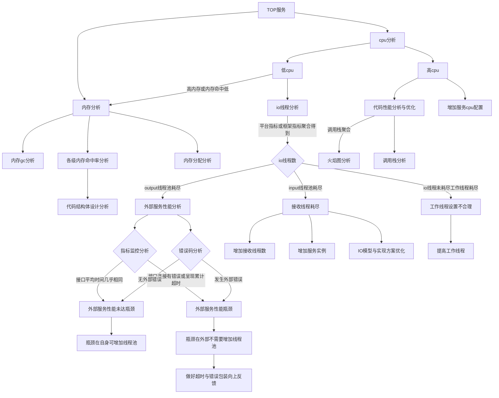

# 一、基础概念

k8s目前提供三种探针：启动、存活和就绪。

首先第一件事情就是要区分存活探针和就绪探针的概念和使用场景。

* 存活探针：在容器化的服务中，往往会认为修复的代价远大于重建，因此更趋向于重建容器的方式进行修复。存活探针就是用于判断服务是否满足基本存活条件可以继续正常运行的方式。**存活探针用于需要对服务容器进行重建以修复服务，作用于容器**。
* 就绪探针：服务在运行过程为了保证自身核心业务安全，例如避免oom或线程耗尽等，往往会有停止部分请求的需要。而在多副本场景下，可以将自身从可用副本中移除，其本质类似nginx的upstream中实例的增减。**就绪探针用于当前实例的暂停服务，作用于网络，在这个过程中服务进程不会重启，当探针重新满足要求后会重新加入可用副本中**

# 二、探针概念混淆带来的问题与现象

## 2.1 就绪探针当存活探针使用

场景模拟：目的为当接口连续出现4次超时，认为进程可能是由于内部线程死锁导致超时，通过对程序进行重启可以安全释放锁并重试未完成事务。并且将就绪探针设置为该接口

问题现象：存活探针超过4次无法满足要求，但是一直没能被k8s通过探针重建，反而是一直服务不可用。

解决：正确设置就绪探针，将该逻辑移动到存活探针

## 2.2 存活探针当就绪探针使用

场景模拟：目的为当进程的内存超过1GB或工作线程数量超过10000时(服务繁忙时)，暂停服务，使得不在新增新的请求，内部堆积的事务可以逐渐完成。并且将存活探针设置为该接口。

问题现象：服务繁忙时，进程不断重启，且已进行中的事务可能存在不安全的终止(k8s服务重建不会无限期等待进程正常结束)

解决：正确设置存活探针，将该逻辑移动到就绪探针

# 三、探针接口并发编程常见问题

## 3.1 探针与业务接口公用同一接口线程池

进程运行时：存活探针和就绪探针逻辑上没有问题，但其探针服务的接口和业务接口复用同一个端口且为同一个线程池。

现象：服务繁忙时，容器被不断重启，容器呈现出存活探针超时导致失败事件。

原因：服务繁忙时，由于业务接口将线程池耗尽，导致探针接口无法申请新线程以处理探针请求。k8s认为存活探针失败，通过重建容器进行修复。

典型场景：

1. python裸用tornado，并且将探针和业务接口注册到同一server下
2. C++/C使用http基本框架，但接口请求有线程数量设置，探针和业务接口共享同一线程池
3. golang一般框架并发使用的是协程，一般不会出现该问题。如果出现了应该确认使用的框架并发IO模型是否是类似线程池的。如果是协程的并发模式下仍然发生了该现象，往往是计算密集型进程或程序bug，则应该考虑就绪探针的逻辑重新调整以保护进程实例进入到当前绝境，以及后续的调优、扩容和预留机制。本质同3.2节。

解决方案参考：详情见4.1节

## 3.2 cpu密集型任务的无限制增长

进程运行时：存活探针设计没问题，就绪探针设计看似没问题，且探针接口与业务接口已经可以独立线程或者某种方式预留了探针接口的可用线程。

现象：服务繁忙时，容器被不断重启，容器呈现出存活探针超时导致失败事件。

原因：该问题现象与3.1一致，但内部原因是因为业务接口和探针接口仍然在同一实例上，即使探针接口开销很小，但是在cpu繁忙时仍然可能无法获得相应资源处理接口，或者竞争cpu资源时间过长导致超时。而这种情况是应该要通过修改就绪探针，对自身进程进行保护，避免陷入绝境。

解决方案参考：重新调整就绪探针保护自身服务安全，实现类似限流。在限流后通过调优或扩容的方式提高服务能力。详见4.2节

## 3.3 使用就绪探针后客户端没有异常处理

进程运行时：各种探针设计合理，且服务端一切编程合理。服务端有多个副本进程

现象：服务繁忙时，服务端进程正常运行，但由于进程暂时停止服务，客户端接收到连接拒绝或服务无可用返回

原因：这是正常现象，客户端应做好重试和异常处理，如果频繁出现，则应该考虑对服务端进行调优或扩容，以及更深入的性能优化重构

解决方案参考：客户端异常处理，服务端扩容和调优。

## 请求线程就是工作线程

进程运行时：使用python tornado框架时设置了几个线程就是几个线程在并发处理请求

现象：

1. io操作密集型服务，cpu不高，数据库等依赖方负载不高，但是就是就绪探针失败被移除了
2. 无限制的cpu密集型服务，cpu和内存炸了，服务不断被重启

原因：陷入了请求线程就是工作线程的误区。例如redis早期版本io设计和redis最新版本io设计，就是对该问题的修正。

解决方案：做好IO模型设计。

# 四、参考方案

## 4.1探针接口与业务接口分离

### 4.1.1线程池/令牌分离

存活探针接口与业务接口在同一server端口的提供服务，但请求时的线程池/令牌独立计算。

python例子：业务接口和探针接口使用tonardo框架的同一个server，注册到不通路由上。假设tonador设置的线程数为4，预留一个线程单独提供给探针接口。那么可以通过在路由注册时附加装饰器，装饰器中每次令牌数超过3时则拒绝客户端业务请求。但是会造成限流，需要客户端做好连接拒绝处理。

### 4.1.2独立端口

使用上面的方案可能会涉及较多服务端代码的调整，接口层锁带来的接口部分性能消耗，和限流时的客户连接拒绝。涉及面较多，那么可以考虑通过探针接口与业务接口在使用独立的端口提供服务的方式。

python例子：业务接口和探针接口使用tonardo的不通server监听不同端口，两个接口路由注册到不同的uri上。简单情况下就绪探针接口可以和业务接口不隔离，但存活探针需要独立隔离。

### 4.1.3可抢占的协程并发

使用例如类似golang的gin等开源框架，使用的是底层的goruntine协程，基本不会导致IO密集型进程的接口卡住，golang会在io等待时自行调度请求。

如果采用协程模式，仍然出现业务繁忙时探针接口异常，那么就可以认为时就绪探针设计不够完善，应该避免进程进入当前状态，因为这种状态是非常危险的，它已经处于被干掉的边缘了。在通过就绪指针限流的方式避免进入该状态的情况下，应该配合扩容或者事务异步化(主要是削峰)等方式来提高服务能力。

当然凡事有例外(例如非抢占式协程管理器遇上cpu密集型操作)，那么这种例外就要涉及到自身服务框架的调整和io模型的涉及了。

### 4.1.4其他

水无常势，随心所欲

## 4.2io框架与模型调整

水无常势，随心所欲

# 五、k8s就绪探针的局限

就绪探针是对自身服务保护和控制多副本可用性的一种手段，但是由于k8s就绪探针是作用于**一个整个服务，绑定于pod定义**。而一些复杂的服务，会希望实现更高级的降级能力，如**仅暂停部分非核心业务，正常提供核心业务**。这个是k8s做不到的，因此可以考虑进行**服务拆分**或者等待后续开发的**绑定于service的探针**

# 六、系统排查

## 整体服务排查

## TOP服务流程图

