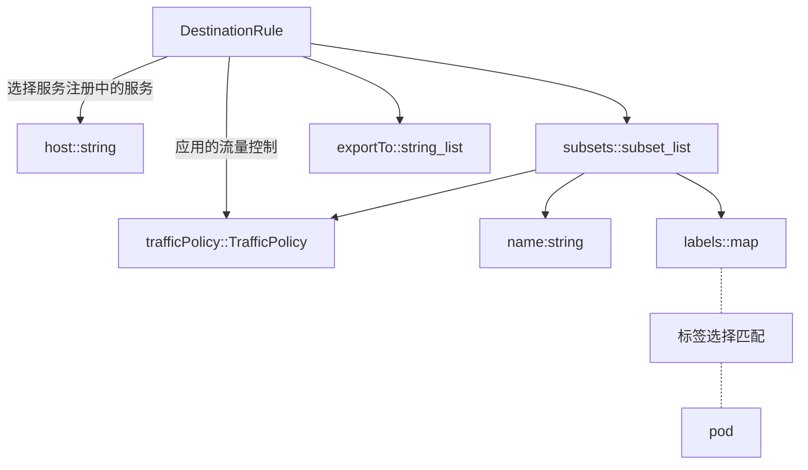
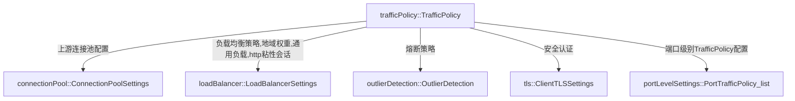
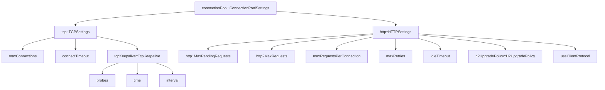

[官网](https://istio.io/latest/docs/reference/config/networking/service-entry/)

```mermaid
graph TB

DestinationRule --应用的流量控制--> trafficPolicy::TrafficPolicy
DestinationRule --选择服务注册中的服务--> host::string
DestinationRule --> subsets::subset_list
DestinationRule --> exportTo::string_list

subsets::subset_list --> name:string
subsets::subset_list --> labels::map
subsets::subset_list --> trafficPolicy::TrafficPolicy
labels::map -.-标签选择匹配-.- pod

```

```mermaid
graph TB     
      trafficPolicy::TrafficPolicy --上游连接池配置--> connectionPool::ConnectionPoolSettings
      trafficPolicy::TrafficPolicy --负载均衡策略,地域权重,通用负载,http粘性会话--> loadBalancer::LoadBalancerSettings
      trafficPolicy::TrafficPolicy --熔断策略--> outlierDetection::OutlierDetection
      trafficPolicy::TrafficPolicy --安全认证--> tls::ClientTLSSettings
      trafficPolicy::TrafficPolicy --端口级别TrafficPolicy配置--> portLevelSettings::PortTrafficPolicy_list
  
```

```mermaid
graph TB;
      connectionPool::ConnectionPoolSettings --> tcp::TCPSettings
      connectionPool::ConnectionPoolSettings --> http::HTTPSettings
      
	  tcp::TCPSettings --> maxConnections
      tcp::TCPSettings --> connectTimeout
      tcp::TCPSettings --> tcpKeepalive::TcpKeepalive
      tcpKeepalive::TcpKeepalive --> probes
      tcpKeepalive::TcpKeepalive --> time
      tcpKeepalive::TcpKeepalive --> interval
      
      http::HTTPSettings --> http1MaxPendingRequests
      http::HTTPSettings --> http2MaxRequests
      http::HTTPSettings --> maxRequestsPerConnection
      http::HTTPSettings --> maxRetries
      http::HTTPSettings --> idleTimeout
      http::HTTPSettings --> h2UpgradePolicy::H2UpgradePolicy
      http::HTTPSettings --> useClientProtocol
```

