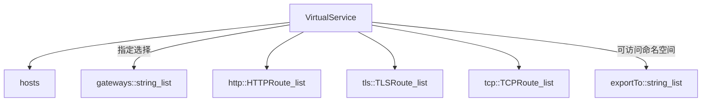
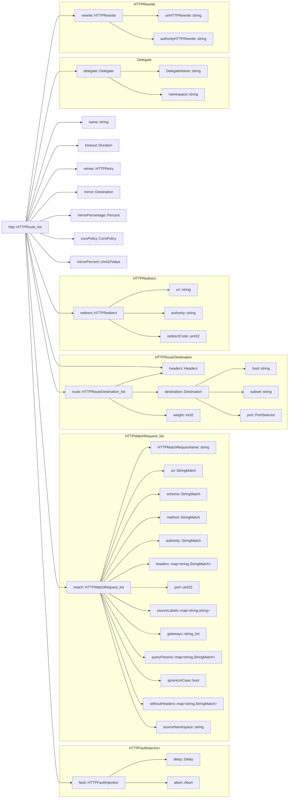
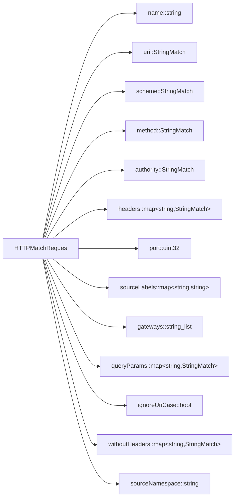

[官网](https://istio.io/latest/docs/reference/config/networking/virtual-service/#VirtualService)

[toc]

# VirtualService

## hosts::string[]
## gateways::string[]
## http::HTTPRoute[]

### name::string
### match::HTTPMatchRequest[]

#### name::string
#### uri::StringMatch
#### scheme::StringMatch
#### method::StringMatch
#### authority::StringMatch
#### headers::map<string, StringMatch>
#### port::uint32
#### sourceLabels::map<string, string>
#### gateways::string[]
#### queryParams::map<string, StringMatch>
#### ignoreUriCase::bool
#### withoutHeaders::map<string, StringMatch>
#### sourceNamespace::string

### route::HTTPRouteDestination[]
### redirect::HTTPRedirect
### delegate::Delegate
### rewrite::HTTPRewrite
### timeout::Duration
### retries::HTTPRetry
### fault::HTTPFaultInjection
### mirror::Destination
### mirrorPercentage::Percent
### corsPolicy::CorsPolicy
### headers::Headers
### mirrorPercent::UInt32Value

## tls::TLSRoute[]

## tcp::TCPRoute[]
## exportTo::string[]

## VirtualService

### HTTPRoute

#### HTTPMatchReques

