### 流控资源组件关系

名词与缩写解释：

* GateWay(gw): 在网格边界的负载均衡器，负责接收入口 HTTP/TCP 连接。 其中配置了对外暴露的端口、协议等(逻辑上)。

* VirtualService(vs): 虚拟主机，用于定义数据流量流向，流量可以从vs移动到另一个vs。vs的特殊属性字段`spec.hosts`用于指定当前vs对外提供的名称。其他vs通过host名称使用该vs。vs中的`match`可用于流量路由匹配，route用于选择流量下一端点(注意这里的选择可能只是逻辑上的选择，并非实际的数据转发行为，实际情况待深入)。

* destinationRule(des): 用于选择流量目的地服务(svc)，一个des可以通过subset字段定义多个目的，vs根据匹配规则选择subset中的对象。每个subset对象通过标签选择选择流量最终的目的服务。在此处设置认证策略.

* service(svc)：服务，代表的是一组后端服务实例(pod)的负载，服务通过标签选择匹配选择负载的后端实例。

* istio-Ingress(ing)：并非k8s原生ingress，istio自定义资源，一个pod服务实例，真实的代表的是一个网格的入口，负责接收外部数据的流入

* ServiceEntry(se)：j将一个外部服务注册到网格内部。当对外部访问进行严格限制后，仅能通过se访问外部网络(或配置istio绕行)。

* Engress(eng)：代表数据出口网关，对外访问不仅可以通过sidecar直接对外访问也可以通过统一的对外网关进行数据访问(经过验证发现这个过程可以不需要设置se)。这么做的好处是更严格的限制服务的出口。

* Workload Entry(we)：管理外部服务实例，常常与se共同使用，se可以通过标签选择器LabelSelector选择对应的we或集群内实例。

* worklad Group(wg): wg描述的是一组工作负载实例，管理其路由行为。偏向于在非k8s平台使用。wg提供了一个规范，可以同时包括虚拟机和 Kubernetes 工作负载，旨在模仿现有的用于 Kubernetes 工作负载的 sidecar 注入和部署规范模型来引导 Istio 代理。

  

| 对比项         | Kubernetes | 虚拟机        |
| -------------- | ---------- | ------------- |
| 基础调度单位   | Pod        | WorkloadEntry |
| 编排组合       | Deployment | WorkloadGroup |
| 服务注册与发现 | Service    | ServiceEntry  |

### 安全资源组件关系

资源对象解释：

* RequestsAuthentication: 针对请求级别的身份认证，作用于每个负载(pod)，当请求进入负载时，由流量劫持envoy对请求进行认证，获得认证信息，主要为利用JWTRule进行身份的提取，如果没有认证信息，不会影响认证，但是将不会存在身份信息，将会影响后续的授权判断。
* peerAuthentication: 针对连接的身份认证。可以作用于整个命名空间的负载或匹配标签的负载，以及负载特定端口的认证。如果存在多个认证策略，则根据最小最旧原则选择认证策略。
* AuthorizationPolicy：作用在负载上的对请求的授权判断，通过标签选择匹配的负载。对负载请求基于授权策略进行授权验证。授权策略可以利用源端身份(sa)、请求jwt的iss/sub信息、源端命名空间、源端IP、请求服务端IP、请求主机、目标端口、请求方法、url路径等对一个请求行为进行描述并对相应行为设置。