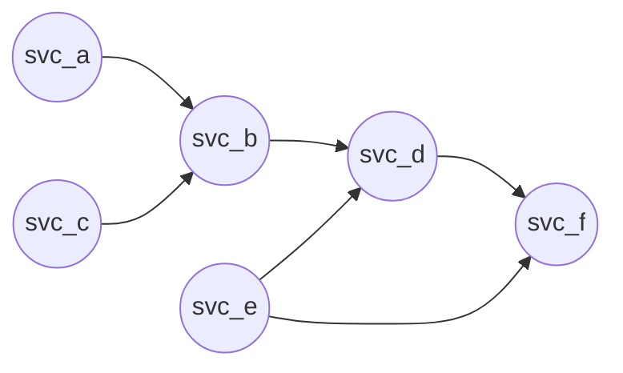
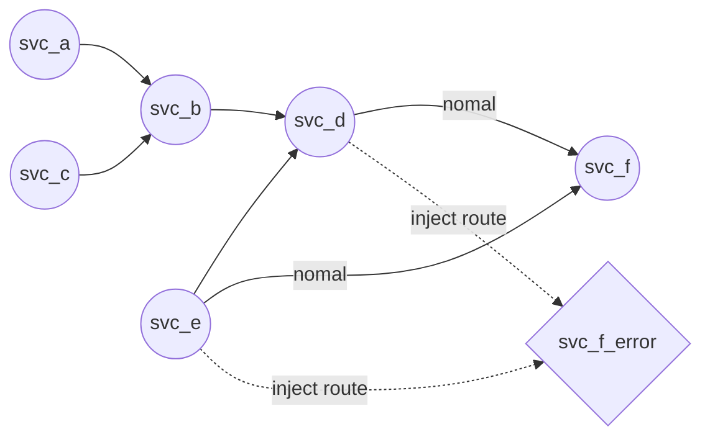
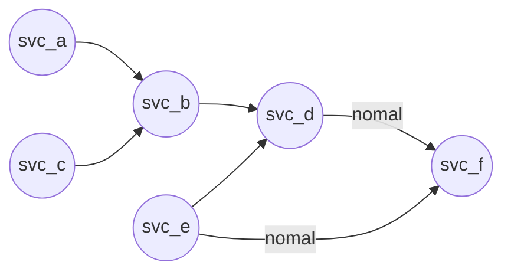
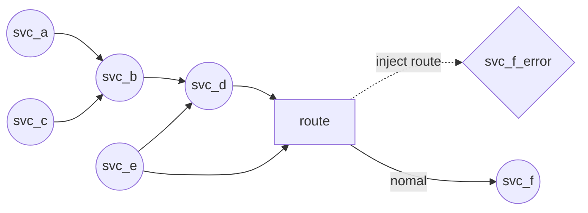
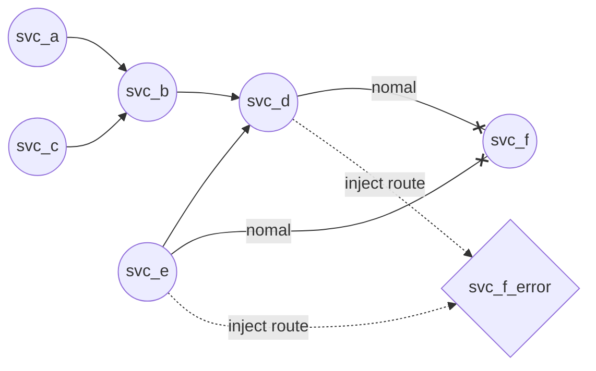

# 一、背景

## 背景

在业务场景中常常会出现局部错误引发系统崩溃，且服务难以恢复。这种情况往往是服务开发时没有进行整体的容错设计，且没有手段在进行整体测试时没有较好的手段进行测试。在生产环境的表现就是错误是偶现的且不知道如何在测试环境进行复现。

通过错误注入，可以对整体系统进行错误注入，以观测局部错误对整体系统的影响。对生产环境的偶像错误，当测试或开发对该错误存在一定猜测时可以通过错误注入的方式对偶先错误进行浮现和验证。

通过整体观察工具，观测错误注入后对系统的状态。

即通过错误注入实现的价值为：

1.  对整体系统容错能力进行检测。
2. 为偶现BUG在测试环境提供低代码、低成本的猜测验证和复现能力。

## 服务拓扑

一般一个良好的系统拓扑可以用一个**有向无环图**表示，服务间的依赖关系或调用关系

### 正常拓扑

下图每个园节点代表一个服务节点，箭头表示其服务依赖方向和流量流向，下图可以表示一个系统的服务依赖关系。

在图种有一个菱形节点，代表的是进行错误注入时的错误模拟。

例如下图对`svc_f`进行局部的错误注入，使得`svc_d`和`svc_e`的部分正常请求仍使用正常服务`svc_f`，而期望错误的请求将会被路由到错误模拟服务`svc_f_error`。

# 二、错误注入场景划分

在日常的软件开发中，一次业务往往意味着一个由多个子事务组成的事务行为，子事务可能由不同的服务在不同的节点，通过网络或某种手段完成。这个事务与子事务在具体执行时可以认为是一个一条多分叉、多层级的调用链，调用链上每个节点可能是一个服务也可能是其他进程或服务，因此节点间的线就是节点服务(函数/进程)间的通信方式。

根据目前系统，我们可以调用链上可能出现的错误主要划分为**存储、网络和应用异常(第三方服务和自研服务)**。

**在测试时，通过在调用链上注入错误可以评估某个节点的服务或某类型的错误，对整体系统的稳定性影响，并根据业务要求优化系统容错能力**

**通过在调用链上的点或线注入错误，我们可以逐渐切割异常范围，逐步定位问题**

## 应用

应用层异常主要指开发者开发的服务或是系统中使用的第三方服务(如数据库)，如数据存储服务也是应用服务，但比较特殊我们可以将其单独讨论。

通过应用层错误的注入往往是通过相同接口的mock方式提供注入。对于应用错误的注入，如果对于应用节点为一个独立的进程或服务，往往还需要**流量控制**能力将流量转发到应用的mock。

通过对应用的错误注入，可以检测调用链上层的服务是否正确处理错误，是否保证了事务的一致性，以及应用的容错能力。

应用异常主要有：

* 应用未按预期返回结果
* 应用自定义错误
* 应用通信协议的错误

## 存储

我们作为软件开发，实际面向的存储主要指数据存储服务或文件系统。存储往往是作为软件开发调用链的最底端。

### 文件系统

在linux操作系统上，linux通过文件系统抽象了底层存储硬件，因此软件开发人员主要面临的是文件系统抛出的错误。文件系统的**使用者往往是存储服务**，因此**对文件系统的错误注入，主要是对存储服务**异常处理的检测，同时也是以**存储服务为调用链底端**的调用链是否有合理的处理异常的检测。

因此我们可以通过对文件系统进行错误注入，完成存储设备或者说文件系统的常见异常处理：

* 存储空间不足
* 存储无法读取
* 存储无法写入
* 使用权限不足
* ......

### 存储服务

存储服务指直接与文件系统交互，负责管理数据，对上层应用提供数据存储、查询和保证数据高可用等行为的服务。常见的存储服务往往有数据库或一些自研的存储管理服务。

**存储服务的使用者往往为上层的无状态服务**，上层无状态服务将状态或者数据存储交给存储管理，降低应用服务复杂度。因此对**存储服务的错误注入，主要试对上层应用服务**的异常处理的检测，同时也是以**存储服务为调用链底端**的调用链是否有合理的处理异常的检测。

## 网络

网络层的异常主要值在服务通信过程中，由于底层网络波动或设备损坏导致的异常。这里的网络异常具体值OSI七层网络协议中的7层网络。而网络层错误往往意味着对调用链上节点间连接线的异常注入。

通过对网络层的异常注入可以起到对调用链上的线或模拟依赖服务异常时对上层调用链包含系统的影响。

目前常见的网络层面异常有：

* http错误
  * 连接错误
  * 超时
  * 一般http错误码相关错误
  * 应用自定义错误(实际是应用异常)
  * ......
* tcp层错误
  * 连接错误
  * 超时
  * ......
* dns错误
  * dns时延高
  * dns查询失败
  * ......
* ip层错误
  * 连接错误
  * 超时
  * .......
* ssl错误
  * sni错误
  * 证书错误
  * ......
* 应用层协议错误(实际是应用异常)

数据库：
\* SQL错误(死锁)
\* 网络断开
\* 网络超时(性能)

依赖微服务：
\* 网络断开
\* 网络丢包
\* 网络超时(性能)

# 三、错误注入细分

## 应用错误

目前应用层错误在语言内部进行单元测试时往往可以自身设置语言内部的mock完成错误处理的检测。但如果时多进程间的通信一般时通过网络进行通信。

为了实现应用错误的注入，需要相关**通信流量路由调整工具**和**相关应用的mock服务器**。通过对mock服务器的配置实现通信协议的错误控制，自定义错误的选择和非法内容的返回。

对应用的错误注入行为主要包含了：

* 对通信协议的一般错误
  * 基于tcp的rpc协议
  * http协议
    * 一般的http错误码(404,500等)
* 服务自定义错误
  * 自定义的错误码
  * 自定义的错误内容
* 非法的返回内容
* 资源不足错误
  * cpu不足(往往是通过压测或性能测试检测，而不是错误注入的方式)
  * 内存不足(可以通过压测时调整资源限制等方式触发，或Fault-injection工具触发内存分配等错误)

## 存储

### 文件系统的错误

文件系统的常见错误主要有：

* 空间不足
* 读/写/执行/管理权限不足
* 读失败
* 写失败

对文件系统的错误注入工具有"fuse", "Fault-injection"，......

### 存储服务错误

存储服务错误往往需要工具进行存储服务的模拟，或者根据数据存储通信协议完成存储接口的自研模拟器(性价比较低且易出错，更多的是选择已有的工具)

#### mysql/mariadb数据库错误模拟工具

常见的存储服务有mysql数据库。

mysql具体错误可查看[mysql错误码](https://github.com/VividCortex/mysqlerr/blob/master/mysqlerr.go)和mysql官方文档相关内容。

而mysql错误模拟工具(基本也可以覆盖大部分场景下的mariadb服务器模拟)可以使用mysql官方工具[mysql server mock](https://dev.mysql.com/doc/dev/mysql-server/latest/PAGE_MYSQL_SERVER_MOCK.html)，mock错误模拟能力可见[mock_schema](https://github.com/mysql/mysql-server/blob/8.0/router/src/mock_server/src/mysql_server_mock_schema.js)

通过该工具可以模拟mysql的非预期返回，各种错误，超时等。

### 网络

通过网络层的基础工具可以为对网络层错误进行注入和模拟，但往往对应用层的一些协议不能做到完善能力。

#### istio服务网格

istio是利用envoy在osi 3/4和7层协议上的网络代理能力进行集群的网络控制。一般通过istio可以做到类似熔断，服务拒绝，连接超时、ssl证和连接中断等等错误注入。

#### iptables

通过iptables可以模拟连接丢失、建立连接失败等场景，但错误观测性和易用性较差

#### ebpf

ebpf作为可以对内核进行挂钩的工具，能力非常强大，不仅是网络错误，甚至可以在内核各个hook上注入各种行为从而为对应服务触发各种错误(例如网络拦截，io错误)，且可以做到较好的错误观测能力。但需要响应开发ebpf的能力，且上手难度较大

# 四、系统状态观测工具

一般的系统状态观测工具包含**状态指标生成工具、状态指标采集工具、状态存储工具和状态查询工具**。

通过在k8s集群内搭载网格，网格可以生成网络层相关信息，并使用展示相关网络信息。

istio能够通过envoy代理将envoy生成的指标，**通过kiali生成动态网络拓扑图**，注入错误后在kiali中可以方便的查看到受影响的网络节点。同时也能生成请求调用链，并由相应的分布式调用链查询工具进行展示(需要代码级别的支持，否则调用链上下游无法串联)。

另外通过**良好的日志输出行为**，在出现异常时进行日志输出，最后可以通过日志可视化工具可以很好的将服务注入影响服务展示，**如果日志有较好的上下文串联行为，日志甚至可以形成调用链关系，可以更快速的定位错误注入影响的范围**。

目前成本较低的方式是通过**测试环境**搭载网格和网格可视化工具，附加系统已有的系统监控、日志平台实现错误观测闭环。

# 五、基于网络通信的服务错误注入

## 主要工具划分

为基于网络通信的服务间实现错误注入，主要分为三个部分：

1. `错误模拟服务(mock服务)`：用于模拟被依赖服务接口，并根据需要返回异常或展现出相应异常行为。作用为服务级别的mock，因此后文简称mock服务。在错误注入时用于替换被依赖服务(或者说是请求服务端)。
2. `流量控制`：在错误注入过程中需要将客户端网络流量从请求服务端，切换到mock服务，使客户端实际与mock服务进行交互，从而获得模拟异常。
3. `错误观测工具`：当错误注入后，需要工具能够观测出系统在该调用链上的健康状态。因此需要工具能够识别整个调用链中特定节点注入错误后，整个调用链是否正常满足业务需要。更进一步需要工具能够检测出整个调用链节点上的服务进程/系统是否仍未受到该次错误影响。
   1. 例如错误注入某节点后，临近节点能正常进行错误处理，但其他节点未正常处理传递的错误则可造成请求调用链的错误
   2. 即使调用链表面正常，未必能保证系统后续仍旧正常，例如某个节点未做超时处理、限流等行为，在调用链下游注入超时异常后，可能会造成该节点队头阻塞。又或者处理异常时没释放限制资源，导致其他服务卡死或资源池逐渐耗尽等。这种情况需要多次测量，并结合系统观测工具，服务日志进行观测。

在设计错误注入的时候需要考虑齐全**数据一致性问题**，因为服务间可能是多个接口协作的，一个场景会涉及多个接口相关的调用链，如果场景涉及不全，可能会导致由于数据接口返回数据不一致，导致逻辑不通，**误报**bug。

## 错误注入服务拓扑

### 未注入错误

假设未注入错误前，正常的网络拓扑如下图

### 理想

理想的服务网络拓扑如下所示，但这要求服务间的流量请求可以基于某种机制进行控制和拆分。在整体系统视角下，我们更多的是期望通过统一的工具，**通过修改`svc_d`和`svc_f`的配置(网络配置以及其他系统配置)，无侵入（起码不修改代码）的实现到`svc_f`间请求路由的拆分**。

### 代理控制数据分发

理想是美好的，现实是残酷的。在理想拓扑图中路由的控制并不一定能够做到无中间层的结构。若`svc_f`使用特殊的通信协议提供服务，那么我们很难仅通过修改配置得到，因为流量控制工具不能提供将流量根据拆分并转发到两个`svc_f`服务。

因此常常是在`svc_f`前引入通信中间层作为路由器,有路由器对请求进行流量控制和分流。服务拓扑关系图下

# 六、错误模拟服务实现

针对第二和第三节中对场景的划分。

错误模拟服务的实现主要考虑：

1. 数据库服务模拟：使用官方[mysql server mock](https://dev.mysql.com/doc/dev/mysql-server/latest/PAGE_MYSQL_SERVER_MOCK.html)工具实现mysql服务端的mock，通过编写部署包，实现错误模拟服务的快速部署。在部署包中提供配置接口，控制mock服务对客户端的响应行为。

2. 应用服务模拟：有一下两种方式，在部署时同样可以通过部署包快速部署

   1. 由应用开发提供响应mock服务实现，最贴合错误注入能力需要，mock实现最快速。但管理和使用起来比较复杂，当mock较多时，易用性较差
   2. 统一考虑，为一般性服务提供mock服务工具，并提供配置接口，控制mock服务接口表现。缺点是无法涵盖所有方面，mock工具服务工具开发周期较长，且要求各个接口开发时需要按mock服务工具支持的能力进行开发
      1. 例如统一的http mock工具无法基于tcp协议中的rpc操作，因此对应接口只能用http通信
      2. **例如已有mock不满足rpc mock，需要开发对应mock工具是，则必须要求大家使用的rpc协议保持一致，使得使用者通过统一的配置语言可描述mock行为，而不能是来一套做一套，那这个和方式一没有区别。**
      3. 统一提供的mock工具未必是需要自己开发的，也有一些基本的mock工具。例如通过网格流量控制不需要mock服务部署就能模拟一般的网络错误
      4. 统一的http mock服务工具，可以考虑使用openapi3对mock行为进行描述，在openapi3基础上扩展特殊字段以增加除了http的诸如超时、中断等异常行为描述

3. 一般网络错误模拟：可以考虑使用网格流量控制能力实现模拟，不需要部署mock服务

   

# 七、流量控制

目前一般K8S集群上的内部服务网络通信是通过k8s的service进行通信的。因此**基于k8s的基础网络控制**能力就可以做到初步的第五节所说的流量切换能力。更进一步可以使用**服务网格**和**ebpf**等工具实现更细粒度的管理。

## 基于k8s基础网络控制实现流量切换

### 实现方案

对于服务间通信使用k8s service进行通信的服务，只需要能够管控对应的service即可完成对应流量的切换。

一般service代理后端服务pod方式，是通过**service的label选择器选择pod**，并修改对应的iptables规则完成的。因此可以通过对service 的label选择器的管理实现后端pod的切换。

对label的管理有两种方式：

1. label与服务部署包共同管理，此时**要求服务部署包能够对service的label选择器进行注入**。在通过部署包的配置实现service选择mock服务的pod。
2. label独立于服务部署包管理，此时通过service管理接口配置label选择器，使其选择mock服务pod。

流量切换过程可简单视为：

1. 设置pod服务数为0(服务间可能持有长连接，该连接似乎不会被iptables切换，因此需要关闭已有pod，待验证)，或N(一部分流量流到mock服务，一部分流量流到正常服务)
2. 设置service label选择器选择mock服务

### 服务拓扑

这种方案下流量控制是比较粗糙的。不利于做到细粒度的控制。

可以从图中看到，`scv_e`和`svc_d`的网络流量控制粒度粗糙，两个服务到`svc_f`的正常调用会变未不可用，除非在`svc_f_error`中完善对应用例，但这个会导致**使用复杂，不易于达成进行局部错误的注入，观测整体系统的目的**

### 优缺点

#### 优点

1. 实现简单

#### 缺点

1. 使用复杂
2. 不易于达成进行局部错误的注入，需要完整的用例，即包含正常的请求用例。
3. 开发团角色细分时，完整用例的设计更倾向于开发，同时需要测试的参与

## 基于istio服务网格控制实现流量控制

### 实现方案

基本istio的流量控制，基本的切换能力类似k8s，但可以实现更细粒度控制网络层的表现。

但是似乎可以不需要原pod进行处理，因为istio服务网格的原理不会使得客户端与服务端产生**直接长连接**，实际待验证。

使用istio进行流量控制，可以实现更细粒度的流量控制和网络错误模拟。例如无需mock服务，根据http url实现错误注入；根据特殊请求内特殊header生产错误等；直接模拟服务熔断、限流、超时等等。

### 服务拓扑

这种方案下，可以对**http请求路由进行细粒度的控制**，网格充当了图中route的角色，通过网格代理实现了路由器的能力。可以较好的实现错误注入的行为。

### 优缺点

#### 优点

1. 易于进行局部错误注入

#### 缺点

1. 使用麻烦
2. 实现较复杂
3. 错误注入场景设计时若不考虑完整，容易造成服务数据不一致。

## 基于ebpf等底层工具

难，略

# 八、错误观测工具

1. 链路追踪：调用链观测，几种方式
   1. 服务打印日志，自研工具进行采集，聚合和展示
   2. 网格采集数据，相关网格工具进行聚合，服务请求发起端添加链路追踪字段，并传播
2. 开发日志：观测服务状态
   1. 服务开发时好好做日志输出，对日志进行合理的分级处理。
   2. 日志平台存储和提供查询能力。
   3. 开发自己要有日志分析方案。
3. 系统指标：底层平台和基础环境状态观测
   1. prometheus存储指标
   2. 系统性监控工具采集基础环境指标
   3. 使用istio网格搭载，可以通过kiali查看网络拓扑状态

# 九、错误注入实现流程

整体错误注入流程可以分为一下几个步骤：

1. 设计错入注入测试场景
2. 错误注入人员，配置mock，并通过包部署mock服务
3. 通过工具切换流量至mock服务
   1. 具体实现很多种方式，但具体过程可以不涉及pod的label变化，需要保证mock的pod标签和正常服务mock标签具有一定的隔离性：
      1. 例如获取已有部署包中service，然后自动根据mock的label调整各个service的label选择器。需要工具能够通过mock配置对应到具体service
      2. 人工指定service和pod关系，工具直接修改对应service的label选择器
4. 触发接口、功能等进行测试
5. 观测系统状态，得出初步结论
   1. 看业务行为
   2. 看网络拓扑
   3. 看链路追踪
   4. 看系统指标
6. 对现象进行分析，一步得出结论，或进入第1步再进一步验证和分析
7. 通过工具切换流量至正常服务

实际第2步和第3步可以合并，但需要具体的行为策略。例如定义了一个simplebwe的服务定义模板，该模板下的生成的helm chart，可以方便的将原pod停止，并使用相同的label启动mock pod(当然需要会用这个chart)，直接实现类似原pod停止与流量切换的能力。也可以仅分析chart配置直接对应出哪个service应该对应什么mock(当然需要了解simpleweb的应用元数据设计)

