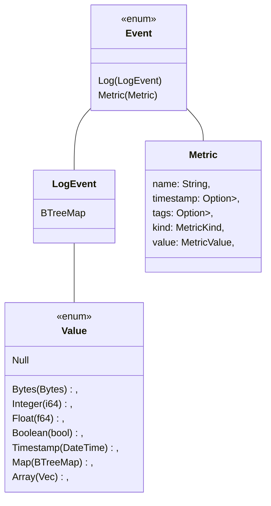
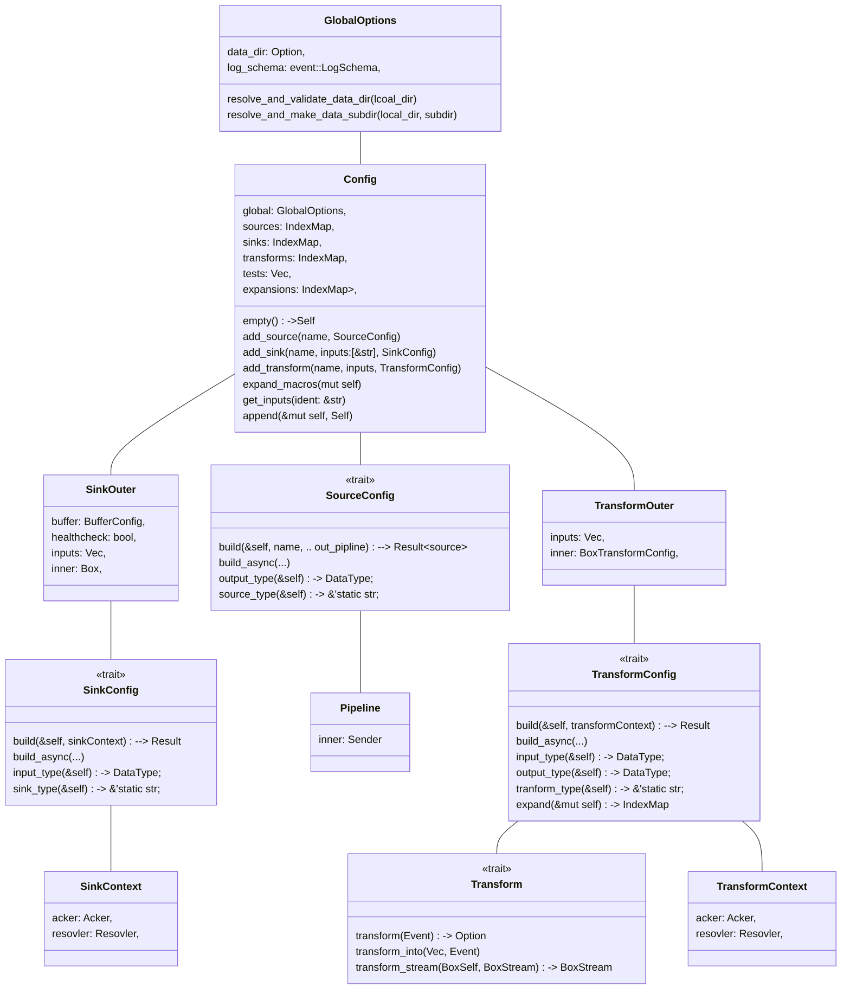
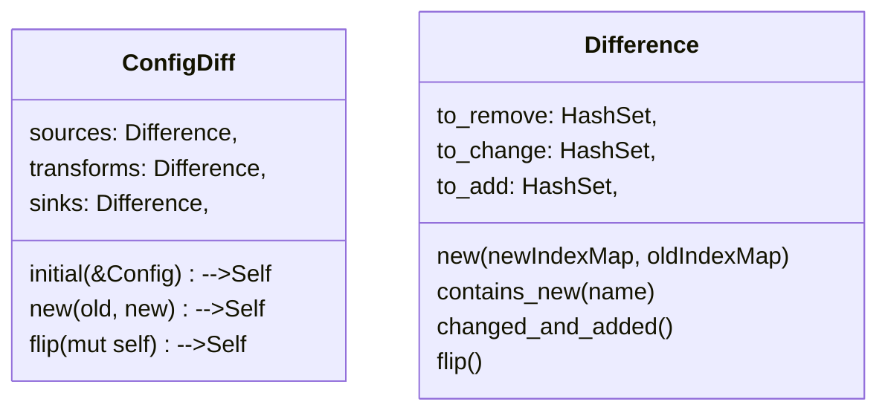

有趣的点：

- 建立internal_events，对每个events实现log、metric的发送
- 错误类型是`Vec<String>`，不bailout，对于配置文件的内容，更适合排错
- signal的映射
- 配置文件的Serde技巧
  - serder attributes
    - `(flatten)`
    - `(default)`，如果没有提供，使用`Default::default`，也可以指定`fn_path`
    - `(skip_serializing_if = "fn_path")`，`fn_path`返回True则跳过，vector判断是否和Default相等
    - `(skip)`，既不序列化也不反序列化
    - 对于enum，4中variant标记法，通过这个可以**控制对象在配置文件上的表现**
      - `(untagged)`不使用tag进行标记，只展示variant内部字段
      - `(tag="type")`，增加type字段，值为variant名，和内部字段同层级
      - `(tag="type", content="c")`，增加type字段，值为variant名，增加`c`字段，值为内部字段object
      - 默认外部标记，新增`variant`名字段，值为内部字段object
  - 使用`crate::typetag`序列化`trait object`

- String Interning
  - 把只读字符串池化，对比hash后直接返回，避免再分配，使用`crate::string_cache`
  - 但是[issue](https://github.com/timberio/vector/issues/1891)提到，1. 在`BTreeMap`中大量使用字符串直接比较，不走hash，所以池化的hash没有帮助 2. 引入了全局LogSchema，减少了atoms的使用场景。两者大大减少了使用Atoms带来的性能提升，不如直接换回String更容易理解


## main.rs

- 根据日志选项，初始化trace和metrics
- 根据线程选项，初始化tokio runtime
- runtime.blockon开始
  - 如果是SubCommand执行，或者有错误，使用退出程序`std::process::exit()`
    - Validate Generate List Test
  - 验证loaded Config，构建基本组件Pieces，调用`topology::start_validated()`得到执行计划(`RunningTopology`, `crash_recv`)，期间spawn了计算图的各个组件，数据流开始流转。
  - select {控制信号，`crash_recv`，`RunningTopo::source_finished`}
    - 重载配置 / 退出信号 / 强制退出信号
    - 如果计算图中一个组件crash了，执行正常关闭
    - 如果全部Source都读完了，执行正常关闭

- 执行正常关闭，调用`RunningTopology::stop`，强制退出则`drop(RunningTopology)`


## signal.rs

- 根据平台，把控制信号/键盘中断，映射到Stream of SignTo
  - Reload
  - Shutdown
  - Quit


## Concepts

`Pipeline`就是`mpsc::channel::Sender`的简单包装

```rust
pub type Source = Box<dyn Future<Item = (), Error = ()> + Send>;
pub type RouterSink = Box<dyn Sink<SinkItem = Event, SinkError = ()> + 'static + Send>;
pub type Healthcheck = Box<dyn Future<Item = (), Error = crate::Error> + Send>;
```





## config

### basic

```toml
[sources.in]   # sources Map, key 为 in，value为Box<dyn SourceConfig>
type = "file"  # 根据typetag，选中FileConfig，作为具体实现
include = ["/var/log/messages"]  # serde(flatten) 写入FileConfig的include字段

[transforms.foo]  # transforms Map, key=foo, value=TransformOuter
type = "json_parser" # 和inputs平级的inner字段被flatten，typetag 选中 JsonParserConfig
inputs = [ "in" ]    # 输入的key值，方便从Map中取

[sinks.out]    # sinks Map，key=out，value=SinkOuter
type = "console"   # inner被flatten，typetag 选中 ConsoleSinkConfig
inputs = ["in"]
encoding = "json"  # 写入ConsoleSinkConfig的encoding字段
```





`GlobalOptions::resolve_and_valid`：检查存在性和可写权限

`GlobalOptions::resolve_and_make`：检查存在性和可写权限，递归创建目录

`Config::expand_macros`：把每个`BoxTransformConfig`调用`expand`，生成更多的`BoxTransformConfig`，按父子关系组合。`transforms`维护的是展开后的子`BoxTransformConfig`，`expansions`是父子关系

`Config::get_inputs`：获取展开后的结果，从`expansions`中查找

`Config::append`：每个配置文件反序列化出一个Config，支持多个Config的合并，检查配置冲突，然后合并`IndexMap`


### diff



`Difference::new()`：

- 每个新老IndexMap做差，得到`to_remove`，`to_add`；
- 对IndexMap的交集迭代，把每个结果序列化到json(为了能显示None)，如果有变化，才说明字段有改动，放入`to_change`

`contains_new()`：存在于`to_change`或者`to_add`

```rust
pub fn changed_and_added(&self) -> impl Iterator<Item = &String> {
    self.to_change.iter().chain(self.to_add.iter())
}
```

`flip`：交换`to_remove`和`to_change`，如果reload配置出现错误，会尝试恢复原配置，就把flip一下再重建


### load

路径检查，glob

单个配置文件读取，环境变量替换，`toml::from_str -> Config`

多个Config再用`Config::append`组合


## buffer


### BufferInputCloner

控制一个Sink再满载时的行为，利用`BufferInputCloner::get`返回一个BoxSink，根据WhenFull设置：

- 如果是阻塞，直接返回底层的Sink
- 如果是丢弃，就套上`DropWhenFull`的Adapter

```rust
pub enum BufferInputCloner {
    Memory(mpsc::Sender<Event>, WhenFull),
    #[cfg(feature = "leveldb")]
    Disk(disk::Writer, WhenFull),
}
```


### BufferConfig

作为Sink组件的一个可选项，可以设置，默认是`Memory { 500, WhenFull::Block }`。通过build方法，获得一个`BufferInputCloner`作为写入端，然后把channel的接收端作为Stream返回，内存不需要Acker

```rust
pub enum BufferConfig {
    Memory {
        max_events: usize,
        when_full: WhenFull,
    },
    #[cfg(feature = "leveldb")]
    Disk {
        max_size: usize,
        when_full: WhenFull,
    },
}

impl BufferConfig {
    #[cfg_attr(not(feature = "leveldb"), allow(unused))]
    pub fn build(&self, data_dir: &Option<PathBuf>, sink_name: &str) -> Result<
        (
            BufferInputCloner,
            Box<dyn Stream<Item = Event, Error = ()> + Send>,
            Acker,
        ),
        String,
    > {
        match &self {
            BufferConfig::Memory { max_events, when_full } => {
                let (tx, rx) = mpsc::channel(*max_events);
                let tx = BufferInputCloner::Memory(tx, *when_full);
                let rx = Box::new(rx);
                Ok((tx, rx, Acker::Null))
            }

            #[cfg(feature = "leveldb")]
            BufferConfig::Disk {..}
        }
    }
}
```


## topology


### Fanout

将结果发送到底层的各个Sink中，处理速度取决于最慢的那个Sink，没有直接使用`crate::futures`的Fanout，因为需要同时fanout到多个Sink，并且受`ControlChannel`的控制。

```rust
pub struct Fanout {
    sinks: Vec<(String, RouterSink)>,
    i: usize,
    control_channel: mpsc::UnboundedReceiver<ControlMessage>,
}

pub enum ControlMessage {
    Add(String, RouterSink),
    Remove(String),
    Replace(String, RouterSink),
}

// new()，新建Fanout，返回控制流的发送端
pub fn new() -> (Self, ControlChannel)
pub fn add(&mut self, name: String, sink: RouterSink)
fn remove(&mut self, name: &str)
fn replace(&mut self, name: String, sink: RouterSink)
pub fn process_control_messages(&mut self)  // 读取消息，调用add remove replace

impl Sink for Fanout {
    // 每次发送前，先检查control信号
    ...
}


```


为Fanout实现的还是futures-0.1的Sink，大致的思想还是可以看的，发起写入，每个Sink都clone一份Event，通过`start_send`发送，`poll_flush`则需要每个都`Sink`的返回Ready


错误处理值得一提。当Fanout向其中一个Sink写入失败时，调用下面的函数。如果这是最后一个Sink，这个出错，说明数据流中断，向前通知错误，让Source停止读取。否则，简单地将这个Sink删除。

注意reload不会造成错误。比如一次reload一个单条无分支数据流，仅仅删除了一个Transform，在`shutdown_diff`中，它的Forward会被drop，同时，删除input时，也会删除前向Fanout的和自己的连接，前向Fanout的Sink为空，写入不会出错，只会在buffer中堆积。

```rust
fn handle_sink_error(&mut self) -> Result<(), ()> {
    if self.sinks.len() == 1 {
        Err(())
    } else {
        self.sinks.remove(self.i);
        Ok(())
    }
}
```


### Task

给BoxFuture增加一层包装，放到结构体里上，增加`name`和`typetag`信息


### shutdown.rs

`Trigger`和`Tripwire`参见[[crate-stream-cancel]]


`ShutdownSignal`交给每个Source使用：

```rust
pub struct ShutdownSignal {
    /// shutdown接收端，被触发开始关闭工作
    begin_shutdown: Tripwire,
    /// Token属于Arc<Trigger>，当完成关闭，返回Token，可以被drop后会通知关闭器。
    /// Optional方便在`poll(Pin<&mut>)`中将Token取出后返回
    shutdown_complete: Option<ShutdownSignalToken>,
}
```


`SourceShutdownCoordinator`，协调器本身有点像拓展坞

```rust
pub struct SourceShutdownCoordinator {
    // 记录到每个Source的关闭开关
    shutdown_begun_triggers: HashMap<String, Trigger>,
    // 记录每个Source的强制关闭开关
    shutdown_force_triggers: HashMap<String, Trigger>,
    // 记录Source到协调器的通知端
    shutdown_complete_tripwires: HashMap<String, Tripwire>,
}

// 新建开关和电线，组装为ShutdownSignal，同时也返回强制关闭的通知端，作为主控main.rs的Select分支
pub fn register_source(&mut self, name: &str) -> (ShutdownSignal, impl Future<Item = (), Error = ()>) {}

// 从另一个ShutdownCoordinator中拿出name相关的状态
pub fn takeover_source(&mut self, name: &str, other: &mut Self)

// 把shutdown_complete_tripwires全部组合仅JoinAll，交给main.rs的主控信号Select
pub fn shutdown_tripwire(&self) -> impl Future<Item = (), Error = ()>

// tokio::timeout_at()组合complete_tripwire和deadline，等待关闭
// 如果超过时间，使用force_trigger通知强制关闭。shutdown_source内部使用
fn shutdown_source_complete(complete_tripwire: Tripwire, force_trigger: Trigger, name: String, deadline: Instant)
   -> impl Future<Item = bool, Error = ()> {}

// 外部RunningTopo::shutdown_diff使用
// 从字段中取出各自三个状态，使用begun_trigger开始关闭，complete_tripwire和force_triger交给shutdown_source_complete
pub fn shutdown_source(&mut self, name: &str, deadline: Instant) -> impl Future<Item = bool, Error = ()> {}

// 关闭全部source，内部逻辑和shutdown_source一致，增加JoinAll
pub fn shutdown_all(self, deadline: Instant) -> impl Future<Item = (), Error = ()>
```


### builder

```rust
pub struct Pieces {
    pub inputs: HashMap<String, (buffers::BufferInputCloner, Vec<String>)>,
    pub outputs: HashMap<String, fanout::ControlChannel>,
    pub tasks: HashMap<String, Task>,
    pub source_tasks: HashMap<String, Task>,
    pub healthchecks: HashMap<String, Task>,
    pub shutdown_coordinator: SourceShutdownCoordinator,
}
```

- inputs：对于`Transform`，`Sink`，他们的输入从何而来，值为tuple，(写入端，数据来源组件名)
- outputs：对于`Source`，`Transform`组件的Fanout结构向哪里输出，用控制信号端改写
- tasks：组件连接处的驱动消费的Future，即Forward结构，放入tasks
- source_tasks：Source组件作为开端，和一个强制关闭信号组成的组合Future，放入source_tasks
- healthchecks：对Sink组件的心跳检查Future


<div style="callout:success">
Summary: inputs和outputs是图连接的引脚。Source提供output，Transform提供input和ouptut，Sink提供input
</div>


#### sources

1. 向`shutdown_coordintor`注册该组件，获得关闭的shutdown_signal，根据需要掐断数据源，以及一个强制关闭的tripwire
2. 新建一个`channel(1000)`，写入端构建Pipeline，用做下一步的参数
3. 调用`SourceConfig::build_async(name, global_config, shutdown_signal, pipeline)`，形成接收数据的server Future
4. 将server和强制关闭的tripwire做select组合，形成Select结构，当tripwire执行，说明数据源关闭花费超过规定的时间，直接drop
5. 将Select计算单元构造为一个Task，`name`和`typetag`沿用当前source的信息，放入**source_tasks**以备之后驱动
6. 将channel的接收端，一个Stream，通过`StreamExt::forward`和一个新建`Fanout`组合，形成一个`Forward`结构，从pipeline中抽出event向后分发
7. 将Forward计算单元构造为一个Task，`name`和`typetag`沿用当前source的信息，放入**tasks**以备之后驱动
8. 最后将Forward的控制端control，放入**outputs**中


#### Transform

1. 新建`channel(100)`
2. channel发送端被`buffers::BufferInputCloner::Memory`包装一下，默认选择Block模式
3. 将(发送端，输入流names)放入**inputs**中，记录该组件的数据来源
4. channel接收端被`filter_event_type()`包装，形成根据`Log | Metric`过滤的Stream
5. 调用`TransformConfig::build_async(TransformContext)`，形成BoxTransform
6. `Transform::transform_stream(input_rx)`组合过滤Stream，形成BoxStream
7. BoxStream，通过`StreamExt::forward`和一个新建`Fanout`组合，形成一个`Forward`结构，将转换的结果Event抽出，向后分发
8. 将Forward计算单元构造为一个Task，`name`和`typetag`沿用当前transform的信息，放入**tasks**以备之后驱动
9. 最后将Forward的控制端control，放入**outputs**中


#### Sink

1. 根据SinkConfig中的BufferConfig，建立最终路由出口的buffer，内存或者disk，得到`(tx, rx, acker)`，acker编入`SinkContext`

2. 将(tx，输入流names)放入**inputs**中，记录组件的数据来源

3. 调用`SinkConfig::build_async(SinkContext)`，形成`(BoxSink, healthcheck)`两个Future。其中`healthecheck`是单次check的Future

4. 对buffer的rx使用`filter_event_type()`包装过滤，然后forward到第2步的BoxSink中，形成一个`Forward`单元

5. 将Forward计算单元构造为一个Task，`name`和`typetag`沿用当前transform的信息，放入**tasks**以备之后驱动

6. 根据是否需要healthcheck，使用timeout组合第三步的healthcheck，放入**healthchecks**中


### RunningTopology


```rust
pub struct RunningTopology {
    // 数据流内部组件的输入端
    inputs: HashMap<String, buffers::BufferInputCloner>,
    // 数据流内部组件的输出端Fanout的控制端
    outputs: HashMap<String, fanout::ControlChannel>,
    // 数据流Source的驱动Task，tokio::spawn后的Handle
    source_tasks: HashMap<String, TaskHandle>,
    // 数据流内部组件的驱动Task，tokio::spawn后的Handle
    tasks: HashMap<String, TaskHandle>,
    // 关闭source的管理层
    shutdown_coordinator: SourceShutdownCoordinator,
    // reload时使用的旧config对照
    config: Config,
    // 组件发生crash时，通过crash的信号端传递给最外层的select控制流，执行关闭流程
    abort_tx: mpsc::UnboundedSender<()>,
}
```


#### started_validated

- 初始化`RunningTopology`，建立crash信号管道
- 执行`run_healthchecks(diff, &mut pieces, require_healthy)`，视`require_healthy`和检查情况中止执行
- 之后连续`connect_diff(&diff, &mut pieces)`，修改`RunningTopology`，连接器计算图
- `spawn_diff(&diff, &pieces)`，启动计算图
- 返回构建完成的（`RunningTopology`，`crash_recv`）


#### run_healthchecks -> bool

取出本次配置需要的Sink的healthcheck的Task，使用`futures-util::try_join_all`组合为一个Future，有一个出错就drop其他的Task。

如果`require_healthy=true`，就地`TryJoinAll.await`，每个Sink都check有且仅一次，根据结果返回true/false

否则，`spawn(TryJoinAll)`


`take_healthchecks`：从`pieces.healthchecks`中删除`diff`中有需要的创建、改动的Sink

```rust
pub fn take_healthchecks(diff: &ConfigDiff, pieces: &mut Pieces) -> Vec<(String, Task)> {
    (&diff.sinks.to_change | &diff.sinks.to_add)  // HashSet的合并
        .into_iter()
        .filter_map(|name| {                 // map，跳过为None的item
            pieces
            .healthchecks
            .remove(&name)
            .map(move |task| (name, task))   // map Option
        })
        .collect()
}
```


#### shutdown_diff

每次`reload`时，都会先`shutdown_diff`，目的，主要处理被remove的组件。

经过`shutdown_diff`，change或者remove的Source，被关停；remove的transform或者sink，从图中完全移除`input - forward - output`

1. 如果存在需要remove的Source，从tasks中remove出Forward任务，就地drop，阻断数据传递，然后删除output(Fanout的控制端)，给30s关闭source

2. 如果存在需要change的Source，只删除output(之后connect_diff会再加入)，给30s关闭source

   > 所以没有修改的Source，在reload期间还是在传输，如果后续路径被drop，就靠Buffer阻塞

3. `join_all`等待上面的关闭任务完成

4. 然后就可以从source_tasks中remove出删除或者修改的source task，等待把剩余在buffer中数据传递完

5. 最后删除需要remove的`transform`和`sink`：remove出Forward任务，drop，删除其input/output

   > 删除input时，需要移除涉及的Fanout的连接，因为connect_diff只会处理add和replace的input，同时也保证前向的数据写入不出错，Fanout错误处理一节有提到


#### connect_diff

经过`connect_diff`，计算图的input/output全部组合完成

 :star2: - Invariant：

1. 成功运行/reload之后的计算图中的组件，和新的Config对应
2. 新启动时，new_pieces = 新Config组件

> 注：new_pieces特指用以连接组件的inputs和outputs集合，不含task


**例子**

```txt
old_config:
S1 ----- T1 ----- T3 ----- O1                  
S2 ----- T2 -----/

new_config:
S1 ----- T1 ----- T3 ----- O1 
S2 ----- T2 ----- T4 -----/
```

上图中，`s1 s2 t1 t2`都属于不改变的组件。`t3 o1 `是change，`t4`是add。

```txt
当connect_diff时，因为本次修改不涉及删除Transform或者Sink，所以现存组件没有改变

new_pieces-inputs：T3 T4 O1
new_pieces-outputs: T3 T4
现存组件:
S1t ----- T1h T1t ----- T3h T3t ----- O1h
S2t ----- T2h T2t -----/

step1: diff.sources.changed_and_added() | setup_outputs
  没有需要改动的Source, 状态不变
  
step2: diff.transforms.changed_and_added() | setup_outputs
  新T3能从old_config中找到O1，连上加入outputs，顶替老T3，老T3的接收端被drop
  T4不存在联系，所以尾部连接没有变化，直接加入outputs
  new_pieces-inputs：T3 T4 O1
  new_pieces-outputs:
  现存组件:
  S1t ----- T1h T1t ----- T3h NT3t ----- O1h
  S2t ----- T2h T2t -----/    T4t
  
step3: &diff.transforms.to_change | replace_inputs
  选中T3，相比old_config，T3的inputs由[T1, T2]变为了[T1]，修改现有组件T1的输出，指向新T3，并且删除T2中的T3指向
  再加上新T3h加入inputs，老T3的发送端已经彻底drop
  new_pieces-inputs：T4 O1
  new_pieces-outputs:
  现存组件:
  S1t ----- T1h T1t ----- NT3h NT3t  ----- O1h
  S2t ----- T2h T2t            T4t
 
step4: &diff.transforms.to_add  | setup_inputs
  选中T4，找到联系后直接放入input端
  new_pieces-inputs：O1
  new_pieces-outputs:
  现存组件:
  S1t ----- T1h T1t ----- NT3h NT3t  ----- O1h
  S2t ----- T2h T2t ----- T4h  T4t
  
 step5: &diff.sinks.to_change | replace_inputs
  选中O1，相比old_config，O1的inputs由[T3]变为了[T3, T4]，修改现有T3的输出，指向新O1，老O1被drop，T4的新增输出到O1
  new_pieces-inputs:
  new_pieces-outputs:
  现存组件:
  S1t ----- T1h T1t ----- T3h T3t ----- NO1h
  S2t ----- T2h T2t ----- T4h T4t -----/

step6: &diff.sinks.add | setup_inputs
  没有新增Sink，无改动
  
图构建完毕
```


**实现描述**

```rust
fn connect_diff(&mut self, diff: &ConfigDiff, new_pieces: &mut Pieces) {
    // 新source组件，输出连接到现存的transform或者sink
    for name in diff.sources.changed_and_added() { self.setup_outputs(&name, new_pieces); }
    // 新transform组件，输出连接到现存的transform或者sink
    for name in diff.transforms.changed_and_added() { self.setup_outputs(&name, new_pieces); }
    // 上述两步完成后，self.outputs包含了新配置所含的全部Fanout的控制信号端。即拥有完整的Source和Transform
    // 并且都和**原配置**中可用input端都建立了的连接，出发点是Fanout，处理的是尾部连接。
    
    // 然后处理inputs，即新组件的前向连接，只有transform和sink提供inputs
    // 对于change类型，对比前后的inputs改变，修改对应组件的fanout输出。
    //   需要先setup_outputs连上老输入后，才能使用replace进行替换
    for name in &diff.transforms.to_change { self.replace_inputs(&name, new_pieces);  }
    // 对于add而类型，没有历史包袱，直接从图中找最新inputs指示的组件，连接就OK
    for name in &diff.transforms.to_add { self.setup_inputs(&name, new_pieces); }
    for name in &diff.sinks.to_change { self.replace_inputs(&name, new_pieces); }
    for name in &diff.sinks.to_add { self.setup_inputs(&name, new_pieces); }
}
```

- `setup_outputs(name, &mut new_pieces)`

  名为name的**新组件**(`Source`或者`Transform`)，将它的Fanout输出，和**旧配置**中有关系的若干`Transform`或者`Sink`的buffer写入端相连

  实际步骤：

  1. 从`new_pieces::outputs`中remove出name组件的`fanoutControl`

  2. 分别遍历**旧config**中的`sinks`和`transforms`，查看其输入项中是否包含name，如果是，并且还存在于`RunningTopology::inputs`中(可能被`shutdown_diff`删除)，拿出其输入端通过`fanoutControl`连接

  3. 将组装好的`fanoutContorl`放入`RunningTopology::outputs`，顶替，老input被drop

- `setup_inputs`

  diff后确定为add的**新组件**(`Sink`或者`Transform`)，只会向图中的一些Fanout增加连接

  实际步骤：

  1. 从`new_pieces::inputs`中remove出name组件的（`BufflerInputCloner`，`inputs：Vec<Stirng>`）
  2. 直接迭代第1步的inputs，往每个组件的Fanout添加到当前bufferInput的连接
  3. 将`BufflerInputCloner`放入结果`RunningTopology::inputs`，顶替，老bufferInput被drop

- `replace_inputs`

  diff后确定为replace的**新组件**(`Sink`或者`Transform`)，需要对比**旧Config**中的inputs端，基于name组件，修改图中的Fanout，删除、添加或者替换连接

  实际步骤：

  1. 从`new_pieces::inputs`中remove出name组件的（`BufflerInputCloner`，`inputs：Vec<Stirng>`）

  2. 选出name在**旧Config**中的inputs，因为该函数对`Transform`和`Sink`都会使用，所以用一个or组合技巧来选择，像电路一样
  
      ```rust
      let sink_inputs = self.config.sinks.get(name).map(|s| &s.inputs);
      let trans_inputs = self.config.transforms.get(name).map(|t| &t.inputs);
      let old_inputs = sink_inputs
          .or(trans_inputs)  // 只有一个*_inputs为Some
          .unwrap()
          .iter()
          .collect::<HashSet<_>>();
      ```
    
  3. 使用第1步的`inputs`和第2步的`old_inputs`，叫集合运算，得到需要增加、删除、更换的Fanout结构
  
  4. 分别迭代步骤3中的三个集合，用对应的Fanout::ControlMessage，增加、删除、更换连接。
  
  5. 将`BufflerInputCloner`放入结果`RunningTopology::inputs`，顶替，老bufferInput被drop
  
      
  

#### spawn_diff

将`new_pieces`中的新task，全部接入tokio调度，insert时顶替，老task主动调用drop。加入时对每个task做如下的额外工作

- 加上tracing包装

- 使用`handle_erros(task, abort_tx)`组合一个新Future，在发生panic时发送abort


### sources_finished

返回`self.shutdown_coordinator.shutdown_tripwire()`，即协调器收到全部source的关闭完成信号则会发送到`tripwire`