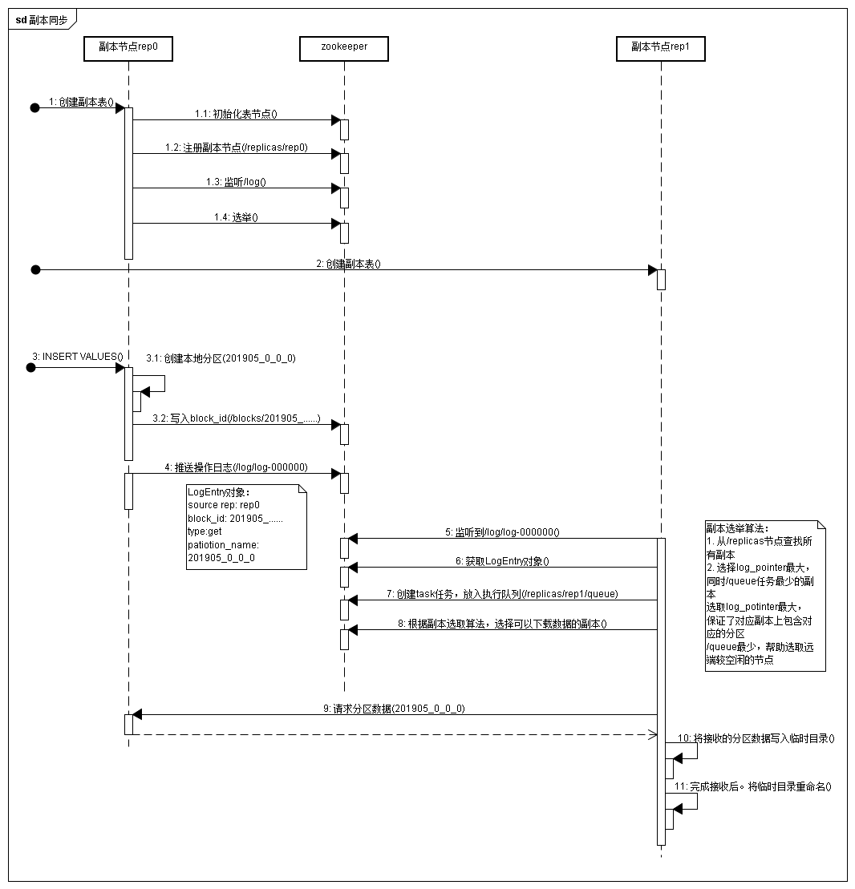
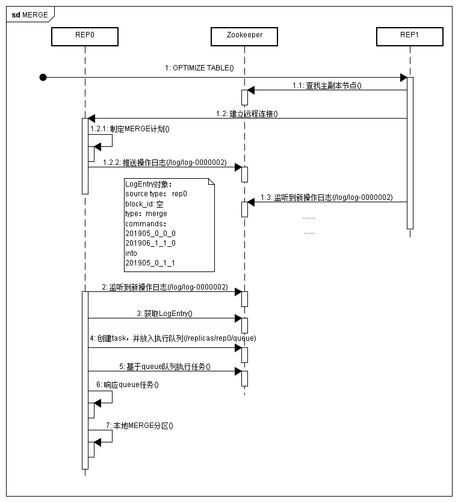
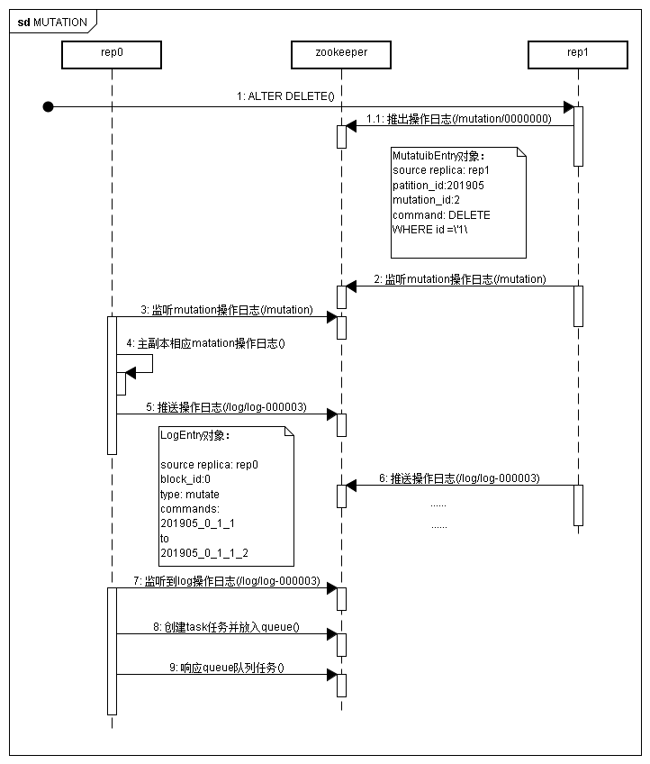
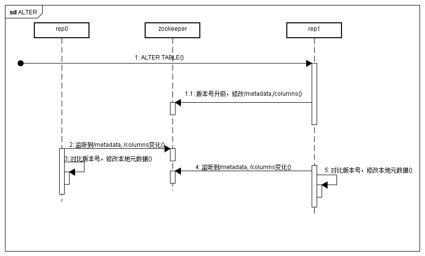

## 副本协同核心流程

## zookeeper 内节点结构

### zookeeper中的表节点约定
约定zk_path规划
/clickhouse/tables/{shard}/table_name

### zk_path下的文件
* /metadata：保存元数据信息，包含主键、分区键、采样表达式等
* /columns：保存列字段信息，保留列名和数据类型
* /replicas： 保存副本名称，对应设置擦书中的replica_name

* /leader_elecetion: 用于主副本选举，主副本主导MERGE和MUTATION操作。这些任务在主副本完成后再借助zookeeper将消息事件分发到其他副本
* /blocks： 记录block数据块的Hash信息摘要，以及partition_id。通过Hash可以判断block是否重复。通过partition_id可以查找到需要同步的数据分区
* /block_numbers：按照分区的写入顺序，以相同的顺序记录partition_id。在各个副本在本地进行MERGE使，按照相同的block_numbers顺序进行
* /quorm： 记录quorum数量，至少这个数量的副本写入成功，写入操作才算成功

* /log: 常规操作日志节点，保存了副本需要执行的任务指令。每个副本实例都会监听/log节点，当有新指令加入时会把指令加入副本各自的任务队列，并执行任务
* /mutations：MUTATIONS操作日志节点，作用与log日志相同
* /replicas/{replica_name}/*：每个副本各自的节点下的一组监听节点，用于指导副本在本地执行具体的任务指令：
    * /queue：任务队列节点，用于执行具体的操作任务。当副本从/log或/mutations节点监听到操作指令时，将执行任务添加至该节点下，并基于队列执行
    * /log_pointer： log日志指针节点，记录了最后一次执行的log日志下标
    * /mutation_pointer：mutation日志指针节点，记录最后一次执行的mutation日志名称

### 疑惑
1. 这里的block概念指的是什么，和在分区目录下.bin文件中的压缩块有关系吗？
答：没有关系，仅仅是用于做重复识别
2. blockID用于重复判断，但是如果业务上是否会出现了两条重复的数据，
答：也许不会，因为如果有大部分数据都不会重复，导致不会同时出现相同的两条数据记录，即使是内容相同，但是可能在主键或者排序键上可能会有不同。
3. 基于疑问2，是否真的有场景是需要插入两条完全一模一样的数据？

## 副本同步
### INSERT核心流程

### MERGE核心流程

### MUTATION 核心流程

#### ALTER核心流程

### 疑惑
为何要将执行任务放入/replicas/queue中，直接存在内存或本地磁盘有什么问题吗？

## 数据分片
clickHouse的数据分片结合Distribute表引擎使用
Distributed引擎本身不存储数据，仅作为分布式的一层透明代理，在集群内部自动展开数据的写入、分发、查询和路由等工作

