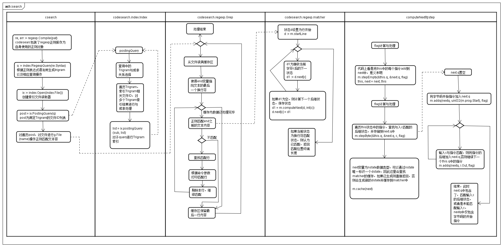
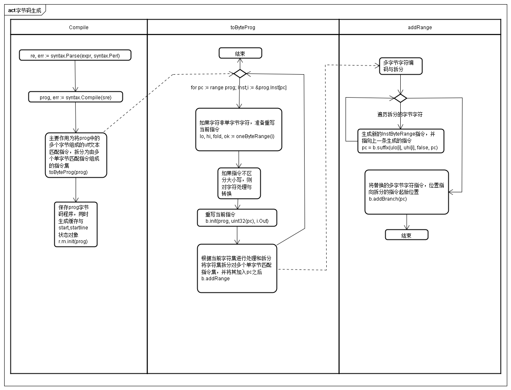

search源码阅读.md

# Csearch正则匹配流程



# codesearch.rexp.Regexp与字节码程序生成

### 构建流程



### codesearch.regexp.Regexp
codesearch.regexp.Regexp对标准正则库syntax.Regexp进行封装，并对syntax.Regexp生成的字节码进行二次处理，这是因为syntax.Regexup会将存在将多个字节作为一个字符，并形成一条InstRune指令，而在codesearch中每条字符匹配指令的粒度为一个字节，所以会对syntax.Regexp的字节码进行二次处理，扩展这种多字节字符匹配指令为多条字节指令，在codesearch.regexp.Regexp中这种指令被称为InstByteRange指令

如上图所示，首先调用go的标准正则库，生成正则语法树，随后通过toByteProg(prog)函数对原始语法树中的字节码程序的字符指令进行处理，将字节码程序中的含有非单字符的utf-8编码格式字符的指令重写、扩展为多个指令.
```
例如将一个"{Op:InstRune1 Out:9 Arg:0 Rune:["中"]}"指令改写为多个"ByteRange"和"nop"指令，以满足对中文"中"的正则匹配."中"最后被解释为[0xe4e4,0xb8b8,0xadad]

  0 fail
  1*    cap 2 -> 2
  2 rune1 "t" -> 3
  3 rune1 "e" -> 11
  4 rune1 "s" -> 5
  5 rune1 "t" -> 6
  6 alt -> 5, 12
  7 rune1 "e" -> 8
  8 rune1 "t" -> 9
  9 alt -> 8, 10
 10 rune1 "中" -> 12
 11 alt -> 4, 7
 12 cap 3 -> 13
 13 match


最后生成的指令集为"byte(14) e4-e4 -> byte(15) b8-b8 -> byte(16) ad-ad -> 12",原本的指令10被替换为"rune1 中 -> 12"被替换为"nop -> 14"

  0 fail
  1*    cap 2 -> 2
  2 byte 74-74 -> 3
  3 byte 65-65 -> 11
  4 byte 73-73 -> 5
  5 byte 74-74 -> 6
  6 alt -> 5, 12
  7 byte 65-65 -> 8
  8 byte 74-74 -> 9
  9 alt -> 8, 10
 10 nop -> 16
 11 alt -> 4, 7
 12 cap 3 -> 13
 13 match
 14 byte ad-ad -> 12
 15 byte b8-b8 -> 14
 16 byte e4-e4 -> 15

 这个过程中源码中的
 b.init()，将第10条指令的替换fail指令
 b.addRange(), 通过b.suffix()生成14-15条指令，并将它们连接，最后通b.addBranch()，将第10条指令替换为nop指令，并指向了第16条指令
```


```go
// Regexp is the representation of a compiled regular expression.
// A Regexp is NOT SAFE for concurrent use by multiple goroutines.
type Regexp struct {
    Syntax *syntax.Regexp //标准库的正则对象
    expr   string // original expression
    m      matcher
}
```

### 非标准单字节字符的字符指令处理
主要由addRange将字符进行编码处理，并将其扩展为多个InstByteRange指令
```go
// appendRange函数，将[lo, hi]表示的区间与r中的已有区间进行比较
// 如果存在交集则将r中已有区间进行根据lo和hi进行扩大，否则将[lo,hi]区间加入r
// appendRange returns the result of appending the range lo-hi to the class r.
func appendRange(r []rune, lo, hi rune) []rune

// 将区间[lo,hi]按minFold和MaxFold划分出新区间，并调用appendRange将划分的区间加入r中
// appendFoldedRange returns the result of appending the range lo-hi
// and its case folding-equivalent runes to the class r.
func appendFoldedRange(r []rune, lo, hi rune) []rune

// 将lo和hi表示的字符区间，转换为若干个InstByteRange指令
func (b *runeBuilder) addRange(lo, hi rune, fold bool)

// 将pc指向的指令连接到b的开始指令之后，b的开始指令指向pc
// Add pc to the branch at the beginning.
func (b *runeBuilder) addBranch(pc uint32) 
```

### 扩展InstByteRange指令的生成
生成新的InstByteRange指令，并将其指向next，主要用于生成将由多字节字符扩展出来的多个单字节生成对应的单字节指令。suffix函数被addRange函数调用，每次生成一条instByteRange指令，并追究到已有指令队列的末端。

```go
func (b *runeBuilder) suffix(lo, hi byte, fold bool, next uint32) uint32 {
    if lo < 0x80 || hi > 0xbf {
        // Not a continuation byte, no need to cache.
        return b.uncachedSuffix(lo, hi, fold, next)
    }

    key := cacheKey{lo, hi, fold, next}
    if pc, ok := b.cache[key]; ok {
        return pc
    }

    pc := b.uncachedSuffix(lo, hi, fold, next)
    b.cache[key] = pc
    return pc
}

func (b *runeBuilder) uncachedSuffix(lo, hi byte, fold bool, next uint32) uint32 {
    if next == 0 {
        next = b.out
    }
    pc := len(b.p.Inst)
    i := syntax.Inst{Op: instByteRange, Arg: uint32(lo)<<8 | uint32(hi), Out: next}
    if fold {
        i.Arg |= argFold
    }
    b.p.Inst = append(b.p.Inst, i)
    return uint32(pc)
}
```

# csearch正则匹配部分流程主要数据结构与源代码

  对应上图中甬道"codesearch.regexp.matcher"和"computeNext与step"部分

## codesearch.regexp.Regexp的匹配

### codesearch.regexp.Regexp对正则库syntax.Regexp的封装
因为codesearch中的正则匹配行为不是标准的正则匹配，而是基于行进行匹配，筛选出特定的匹配行。

matcher数据结构保存在对文本进行正则匹配时需要的字节码，以及dfa的缓存，dfa文本开始和行开始状态。z1主要用于表示当前已经走过的nfa状态，在需要dfa状态没有查找到后继dfa状态时，计算其后继dfa状态。z2为一个临时存储变量，用于指向计算好的后继状态。

成员中map，dstate用于缓存已经生成的状态，使得重复的dstate可以复用，减少存储，同时复用dstate的next数组，减少计算量。map中的每个key值由nstate结构的三个成员唯一确定。

start和startline状态为matcher实例在使用前，通过正则表达式的字节码进行初始化赋值。
```go
// A matcher holds the state for running regular expression search.
type matcher struct {
    prog      *syntax.Prog       // compiled program,存储着对应正则表达式的字节码
    dstate    map[string]*dstate // dstate cache
    start     *dstate            // start state
    startLine *dstate            // start state for beginning of line
    z1, z2    nstate             // two temporary
                                 //nstates。z1指向当前状态，z2临时存储后继状态
}
```

### dstate结构介绍
每个dstate状态保存了dfa上的一个节点，每一个dstate可以由nstate唯一确定，并生成。其next在正则匹配文本时逐步计算。
```
// A dstate corresponds to a DFA state.
type dstate struct {
    next     [256]*dstate // next state, per byte
    enc      string       // encoded nstate
    matchNL  bool         // match when next byte is \n
    matchEOT bool         // match in this state at end of text
}
```

### nstate的使用
nstate中会包含regexp的字节码程序的指令id，并存储在q字段中，同时利用sparse.Set数据结构保证指令不会重复添加。而q.dense中的数组保证了指令的顺序。一个nstate包含了从开始状态和当前后继的多个nfa状态或分支的所有状态的id，而不是仅仅是nfa的一个节点。可以认为nstate打包了dstate的一个或多个后继状态。具体结构和状态查看"4.正则表达式的文本匹配步进"
```go
// An nstate corresponds to an NFA state.
type nstate struct {
    q       sparse.Set // queue of program instructions
    partial rune       // partially decoded rune (TODO)
    flag    flags      // flags (TODO)
}

// A Set is a sparse set of uint32 values.
// http://research.swtch.com/2008/03/using-uninitialized-memory-for-fun-and.html
type sparse.Set struct {
    dense  []uint32    // 真正存储的数组
    sparse []uint32    // 对应数字在dense中的位置
}
```

### 正则表达式的文本匹配步进

在正则匹配中的step行为如下函数,在stepByte中，会从头开始遍历
```
正则表达式:(test+|teet+)
字节码程序：
                                                          |---------|          
                                                          V         |
                                         |---->s(4)---->t(5)---->alt(6)-----|
cap(1)---->t(2)---->e(3)---->alt(10)---->|                                  |---->cap(11)---->match(12)
                                         |---->e(7)---->t(8)---->alt(9)-----|
                                                          ^        |
                                                          |--------|

状态startline或start:
cap(1)----> t(2)

start遇到输入"t":
start.next['t'] = cap(1)----t(2)----e(3)

start遇到输入"f":
start.next['t'] = cap(1)----t(2)

start.next['t']遇到输入"e":
                                                         |----s(4)
start.next['t'].next['e] = cap(1)----t(2)---->alt(10)----|
                                                         |----e(7)

start.next['t']遇到输入"f":
start.next['t'].next['f'] = cap(1)---->t(2)

当start.next['t'].next['e]遇到s时：
start.next['t'].next['e]['s'] = cap(1)----t(2)----t(5)
```

在stepByte函数中会根据当前字符，从nstate存储指令的数组首部开始逐渐遍历，并且只有在遇到结束指令或字符指令时才会将对应指令的后继指令加入next状态中。如果在这个遍历过程中遇到当前字符与已走过的状态字符相同，由于sparse.Set的特性，能够保证其不会被重复添加。
```go
// stepEmpty steps runq to nextq expanding according to flag.
func (m *matcher) stepEmpty(runq, nextq *sparse.Set, flag syntax.EmptyOp) {
    nextq.Reset()
    for _, id := range runq.Dense() {
        m.addq(nextq, id, flag)
    }
}

// stepByte steps runq to nextq consuming c and then expanding according to flag.
// It returns true if a match ends immediately before c.
// c is either an input byte or endText.
func (m *matcher) stepByte(runq, nextq *sparse.Set, c int, flag syntax.EmptyOp) (match bool) {
    nextq.Reset()
    m.addq(nextq, uint32(m.prog.Start), flag)
    for _, id := range runq.Dense() {
        i := &m.prog.Inst[id]
        switch i.Op {
        default:
            continue
        case syntax.InstMatch:
            match = true
            continue
        case instByteRange:
            if c == endText {
                break
            }
            lo := int((i.Arg >> 8) & 0xFF)
            hi := int(i.Arg & 0xFF)
            ch := c
            if i.Arg&argFold != 0 && 'a' <= ch && ch <= 'z' {
                ch += 'A' - 'a'
            }
            if lo <= ch && ch <= hi {
                // 在本个过程中遇到与已走过的指令相同的字符时
                // 通过sparse的特性保证不会重复添加已走过的指令
                m.addq(nextq, i.Out, flag)
            }
        }
    }
    return
}

```

除了保证将当前状态加入到数组中外，还保证当遇到一些特殊的指令时将其后继状态加入数组其作用为将后继状态加入到当前队列中
```go
// addq adds id to the queue, expanding according to flag.
func (m *matcher) addq(q *sparse.Set, id uint32, flag syntax.EmptyOp) {
    if q.Has(id) {
        return
    }
    q.Add(id)
    i := &m.prog.Inst[id]
    switch i.Op {
    case syntax.InstCapture, syntax.InstNop:
        m.addq(q, i.Out, flag)
    case syntax.InstAlt, syntax.InstAltMatch:
        m.addq(q, i.Out, flag)
        m.addq(q, i.Arg, flag)
    case syntax.InstEmptyWidth:
        if syntax.EmptyOp(i.Arg)&^flag == 0 {
            m.addq(q, i.Out, flag)
        }
    }
}
```


## index.Query
```go
// A Query is a matching machine, like a regular expression,
// that matches some text and not other text.  When we compute a
// Query from a regexp, the Query is a conservative version of the
// regexp: it matches everything the regexp would match, and probably
// quite a bit more.  We can then filter target files by whether they match
// the Query (using a trigram index) before running the comparatively
// more expensive regexp machinery.
type Query struct {
    Op      QueryOp
    Trigram []string
    Sub     []*Query
}

// A regexpInfo summarizes the results of analyzing a regexp.
type regexpInfo struct {
    // canEmpty records whether the regexp matches the empty string
    canEmpty bool

    // exact is the exact set of strings matching the regexp.
    exact stringSet

    // if exact is nil, prefix is the set of possible match prefixes,
    // and suffix is the set of possible match suffixes.
    prefix stringSet // otherwise: the exact set of matching prefixes ...
    suffix stringSet // ... and suffixes

    // match records a query that must be satisfied by any
    // match for the regexp, in addition to the information
    // recorded above.
    match *Query
}
```


## regexp.Grep
```go
// TODO:
type Grep struct {
    Regexp *Regexp   // regexp to search for
    Stdout io.Writer // output target
    Stderr io.Writer // error target

    L bool // L flag - print file names only
    C bool // C flag - print count of matches
    N bool // N flag - print line numbers
    H bool // H flag - do not print file names

    Match bool

    buf []byte
}
```