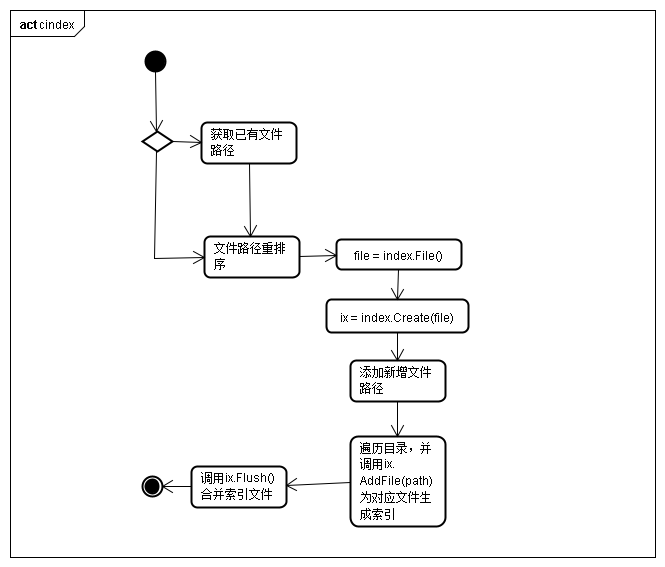
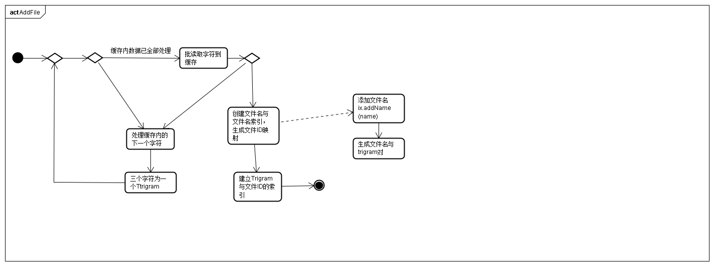
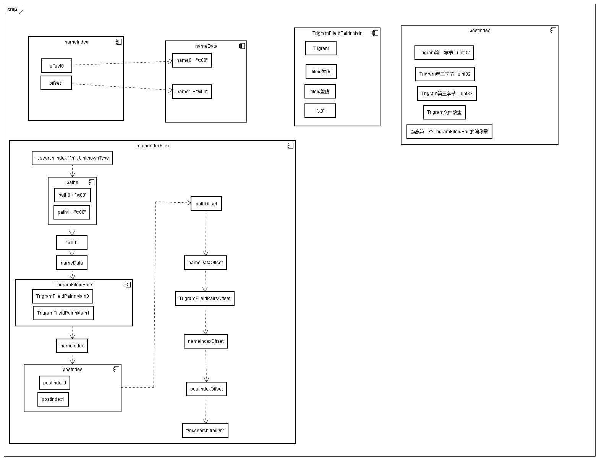

# google/codeSearch源码阅读

## cindex


## indexWriter

```go
type IndexWriter struct {
    LogSkip bool // log information about skipped files
    Verbose bool // log status using package log

    trigram *sparse.Set // trigrams for the current file
    buf     [8]byte     // scratch buffer

    paths []string

    nameData   *bufWriter // temp file holding list of names
    nameLen    uint32     // number of bytes written to nameData
    nameIndex  *bufWriter // temp file holding name index
    numName    int        // number of names written
    totalBytes int64

    post      []postEntry // list of (trigram, file#) pairs
    postFile  []*os.File  // flushed post entries
    postIndex *bufWriter  // temp file holding posting list index

    inbuf []byte     // input buffer
    main  *bufWriter // main index file
}

const npost = 64 << 20 / 8 // 64 MB worth of post entries

func Create(file string) *IndexWriter {
    return &IndexWriter{
        trigram:   sparse.NewSet(1 << 24),
        nameData:  bufCreate(""),
        nameIndex: bufCreate(""),
        postIndex: bufCreate(""),
        main:      bufCreate(file),
        post:      make([]postEntry, 0, npost),
        inbuf:     make([]byte, 16384),
    }
}

```


* 读取一个文件内容，并以三个字符为一个Trigram,最终生成多个"<Trigram, 文件ID>"，并记录在临时文件中
```go
// AddFile adds the file with the given name (opened using os.Open)
// to the index.  It logs errors using package log.
func (ix *IndexWriter) AddFile(name string) {
	f, err := os.Open(name)
	if err != nil {
		log.Print(err)
		return
	}
	defer f.Close()
	ix.Add(name, f)
}
```


* 为文件名分配ID，同时建立文件名->文件ID的索引
```go
// addName adds the file with the given name to the index.
// It returns the assigned file ID number.
func (ix *IndexWriter) addName(name string) uint32 {
	if strings.Contains(name, "\x00") {
		log.Fatalf("%q: file has NUL byte in name", name)
	}

	ix.nameIndex.writeUint32(ix.nameData.offset())
	ix.nameData.writeString(name)
	ix.nameData.writeByte(0)
	id := ix.numName
	ix.numName++
	return uint32(id)
}
```

* ix.Flush将负责将内存或临时文件中的数据写入真正的索引文件中，并调用"mergePost"将分布在各个文件中的post合并，并写入索引文件中

```go
// Flush flushes the index entry to the target file.
func (ix *IndexWriter) Flush() {
    ix.addName("")

    var off [5]uint32
    ix.main.writeString(magic)
    off[0] = ix.main.offset()
    for _, p := range ix.paths {
        ix.main.writeString(p)
        ix.main.writeString("\x00")
    }
    ix.main.writeString("\x00")
    off[1] = ix.main.offset()
    copyFile(ix.main, ix.nameData)
    off[2] = ix.main.offset()
    ix.mergePost(ix.main)
    off[3] = ix.main.offset()
    copyFile(ix.main, ix.nameIndex)
    off[4] = ix.main.offset()
    copyFile(ix.main, ix.postIndex)
    for _, v := range off {
        ix.main.writeUint32(v)
    }
    ix.main.writeString(trailerMagic)

    os.Remove(ix.nameData.name)
    for _, f := range ix.postFile {
        os.Remove(f.Name())
    }
    os.Remove(ix.nameIndex.name)
    os.Remove(ix.postIndex.name)

    log.Printf("%d data bytes, %d index bytes", ix.totalBytes, ix.main.offset())

    ix.main.flush()
}
```


* 将原本写在各个临时缓存的文件ID与Trigram的索引，合并为一个列表。
    * 疑问：每个临时文件中的内容，基本类似与"<T0, f0>,<T0, f1>",那么当又多个临时文件时会出现Tmp0:"<T0, f0>, <T0,f1>,<T1,f0>,<T1,F1>"和Tmp1:"<T0, f2>, <T0,f3>,<T1,f2>,<T1,f3>"，那么此时的mergePost是如何合并两个临时文件"Tmp0"和"Tmp1"的，在源码中没有看到。在下文代码中值看到了"h.addFile(f)"操作，但是在深入后发现这里面并没有进行文件合并后再次排序的行为。
        * 答: 在h.addMem行为中，postHeap会将插入的一批数据进行堆排序处理,h.addFile(f)同样是对批量数据进行push
```go
// mergePost reads the flushed index entries and merges them
// into posting lists, writing the resulting lists to out.
func (ix *IndexWriter) mergePost(out *bufWriter) {
	var h postHeap

	log.Printf("merge %d files + mem", len(ix.postFile))
	for _, f := range ix.postFile {
		h.addFile(f)
	}
	sortPost(ix.post)
	h.addMem(ix.post)

	npost := 0
	e := h.next()
	offset0 := out.offset()
	for {
		npost++
		offset := out.offset() - offset0
		trigram := e.trigram()
		ix.buf[0] = byte(trigram >> 16)
		ix.buf[1] = byte(trigram >> 8)
		ix.buf[2] = byte(trigram)

		// posting list
		fileid := ^uint32(0)
		nfile := uint32(0)
		out.write(ix.buf[:3])
		for ; e.trigram() == trigram && trigram != 1<<24-1; e = h.next() {
			out.writeUvarint(e.fileid() - fileid)
			fileid = e.fileid()
			nfile++
		}
		out.writeUvarint(0)

		// index entry
		ix.postIndex.write(ix.buf[:3])
		ix.postIndex.writeUint32(nfile)
		ix.postIndex.writeUint32(offset)

		if trigram == 1<<24-1 {
			break
		}
	}
}
```