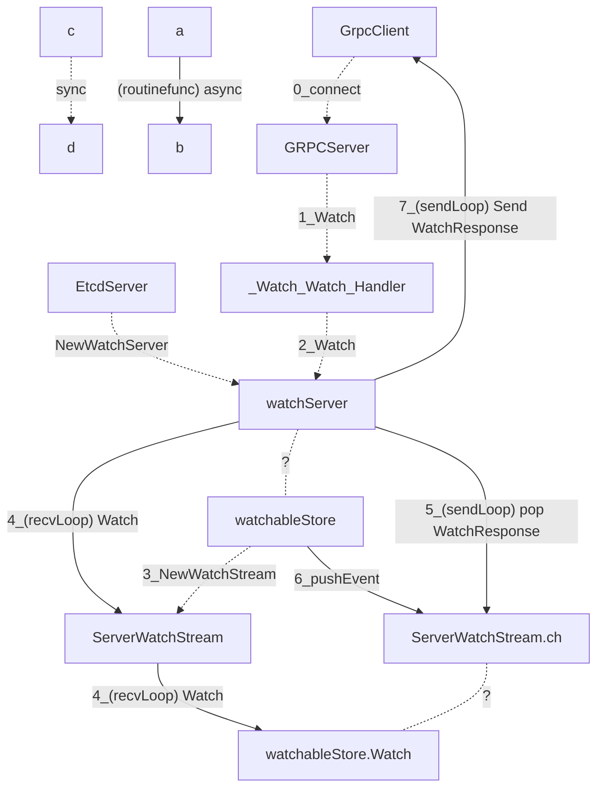
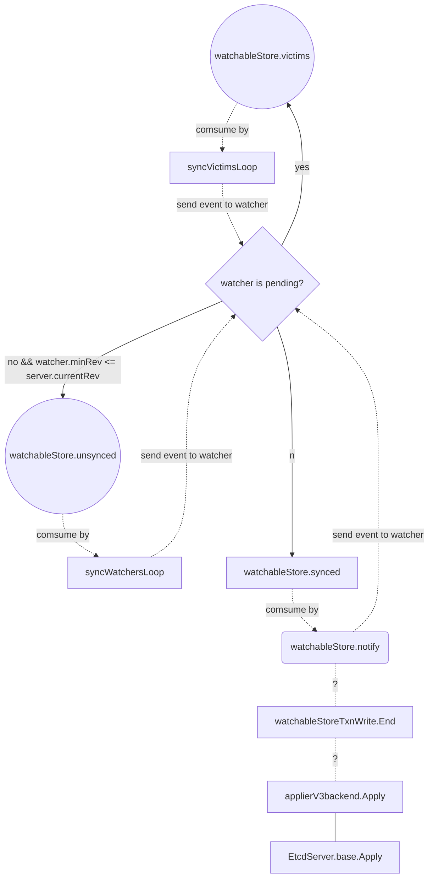

# 简介

k8s使用etcd作为底层配置存储，并利用etcd的watch持续监听etcd实现k8s向上层应用提供list-watch能力。本着对依赖组件不能仅仅是使用，而是需要有皮毛了解的理念，对etcd内部的watch机制进行初步的了解。

在学习过程中首先通过[官方文档](https://etcd.io/)和[大佬的文章](https://draveness.me/etcd-introduction/)对整体结构和对于的目标进行初步的了解，逐步研究github上的[源码](https://github.com/etcd-io/etcd)(毕竟不能别人说什么就是什么，还是要结合源码，也有利于加强理解，源码分支为当时的master，标签为v3.5.0-alpha.0-635-g97756e3)对文档中描述进行理解。对[大佬的文章](https://draveness.me/etcd-introduction/)学习过程发现watch机制中监听事件生成时机没有完全介绍，结合源码进一步探索。

# 原理概况

1. 服务端通过一个`watchableStore`管理所有的`watcher`，所有的`watcher`将会存在三种状态，`watchableStore.unsynced`,`watchableStore.synced`和`watchableStore.victims`,分别代表未同步`watcher`，已同步`watcher`和管道受阻塞`watcher`
2. `watcher`对应在GRPCClient连接GRPCServer时生成的监听器，`GRPCServer`在接收连接时会创建两个协程，一个协程(recvLoop)用于接收GRPCClient的请求，生成监听器并注册到`watchStore`中或处理中断等控制请求，另一个(sendLoop)用于向`GRPCClient`推送监听数据或控制请求结果。
3. `watchableStore`在服务启动时实例化，并通过协程`syncWatchers`对已注册未完成同步的`watchableStore.unsynced`中`watcher`推送事件，协程`syncVictimsLoop`对管道被阻塞`watchableStore.victims`中`watcher`进行定期处理。
4. 在当etcd接收到数据请求时，首先经过raft协议流程后，最后对底层存储进行写入后同样会调用`watchableStore.notify`函数向`watchableStore.synced`推送数据变更事件或将`watcher`转移到其他状态。

# 初步理解客户端与服务端的交互

下文主要介绍对watch机制中客户端与服务端的连接建立和交互流程，其他具体可以查看[大佬的文章](https://draveness.me/etcd-introduction/)的watch部分，已了解可以跳过该章节。

整个watch从客户端到服务端建立连接过程如下

1. 结合文章和源码，首先是server端可以通过rpc向客户端提供watch接口，位于("api/etcdserverpb/rpc.pb.go ")中的`_Watch_serviceDesc`,`_Watch_Watch_Handler`代码定义了对于的GRPC服务和接口，而在("server/etcdserver/api/v3rpc/grpc.go")中的`func Server(s *etcdserver.EtcdServer, tls *tls.Config, gopts ...grpc.ServerOption) *grpc.Server`中初始化和创建了`watchServer`对象并作为`Watch`接口的工作实例，所以具体的GRPC接口具体实现位于("server/etcdserver/api/v3rpc/watch.go")中的`func (wa *watchServer) Watch(stream pb.Watch_WatchServer) (err error)`。

2. 在GRPC流中`watchServer`通过构建`serverWatchStream`对象，作为监听对象，通过`serverWatchStream.SendLoop`协程消费`serverWatchStream.ch`管道中的事件，并向客户端推送数据，通过`serverWatchStream.recvLoop`协程接收收客户端请求以及通过底层`mvcc.WatchableKV.Watch`监听数据并生成事件，并通过`serverWatchStream.ch`管道向`serverWatchStream.SendLoop`传递给数据。
3. `mvcc.WatchableKV`的具体实现为("server/storage/mvcc/watchable_store.go")中的`watchableStore`对象，并在服务器启动时在("server/etcdserver/server.go")中的`func NewServer(cfg config.ServerConfig) (srv *EtcdServer, err error)`函数中创建，并存储于`EtcdServer.kv`字段，最终通过`serverWatchStream.Watch`监听数据实际是向`watchableStore`中添加了该监听流，由`watchableStore`进行具体的监听并向管道中添加监听事件

# 服务端监听事件的生成

在上节中介绍了客户端与服务端的交互方式，以及服务端内部监听的事件的传递和消费，那么etcd什么时候会产生对于的监听事件？本节结合代码和参考文档进行理解。

基于一般常识可以认为，事件生成时机主要有两种，第一种时连接刚刚建立时需要生成的事件，第二种时当数据发生变更时需要生成事件。在[大佬的文章](https://draveness.me/etcd-introduction/)中主要涉及第一种和对应的监听器状态变化，但对第二种没有提及，本节结合[源码](https://github.com/etcd-io/etcd)查找了对应的流程

从[大佬的文章](https://draveness.me/etcd-introduction/)并结合("etcd/server/etcdserver/server.go")中`NewServer`对("server/storage/mvcc/watchable_store.go")中的`New`创建`watchableStore`实例代码中可以了解到`watchableStore`在创建时会创建两个`syncWatchersLoop`和`syncVictimsLoop`协程，`syncWatchersLoop`定时(100ms)对未完成同步的`Watcher`(`Watcher`可以简单理解为对`ServerWatchStream.ch`的包装)，即进行数据推送。`syncVictimsLoop`则主要对推送数据时被阻塞的Watcher进行缓存的watcher进行重试(频率10ms)。相关代码位于("server/storage/mvcc/watchable_store.go")。

`watchableStore`有三个重要字段`watchableStore.unsynced`,`watchableStore.synced`和`watchableStore.victims`,分别代表未同步`watcher`，已同步`watcher`和受阻塞`watcher`。而查看`syncWatchersLoop`和`syncVictimsLoop`两个代码发现其主要负责的是对`watchableStore.unsynced`和`watchableStore.victims`的消费，并将`watcher`加入`watchableStore.synced`。那么带来的疑问是谁负责在`watcher`状态变化时将`watcher`重新加入`watchableStore.unsynced`?

关于对`watchableStore.synced`的后续监听事件生成，这个在[大佬的文章](https://draveness.me/etcd-introduction/)没有提及，再查看与`watchableStore.unsynced`相关的`add`和`delete`代码并没有发现单监听对象变化时将`watchableStore.synced`转移到`wathableStore.unsynced`的逻辑，但是("server/storage/mvcc/watchable_store.go")的`watchableStore.notify`代码中可以发现，调用该函数时会传入事件和事件的revission，再`notify`函数中首先会对`watchableStore.synced`这个`watcherGroup`进行过滤获得监听事件对应key的`watcher`，并对`watcher`发送事件，如果`watcher`为阻塞状态则将`watcher`加入`watchableStore.victims`中等待后续的定期处理。

而`watchableStore.notify`有很多模块调用，参考本节的主要问题，可以发现该函数是("server/storage/mvcc/watchable_store_txn.go")中`watchableStoreTxnWrite.End`函数的一部分，而`watchableStoreTxnWrite.End`又是("etcd/server/etcdserver/apply.go")代码中各种数据操作时常用的函数，例如`applierV3backend.Put`函数会对创建的`txn`进行`defer watchableStoreTxnWrite.End`。而`apply`模块则是etcd在完成raft协议流程后，向底层`backend`存储写入数据的主要操作。

整个事件数据流图如下：

# REF

* https://github.com/etcd-io/etcd
* https://etcd.io/
* https://draveness.me/etcd-introduction/
* https://juejin.cn/post/6844904050576752647