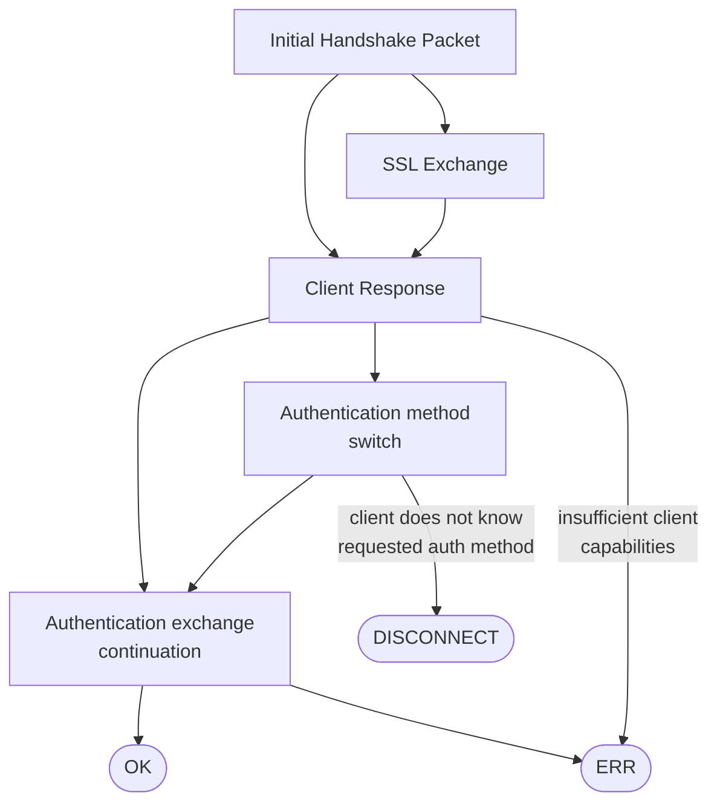
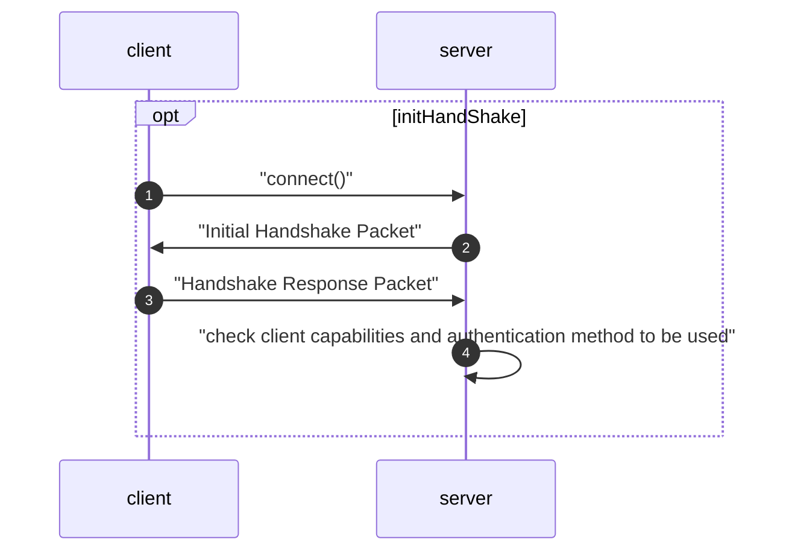
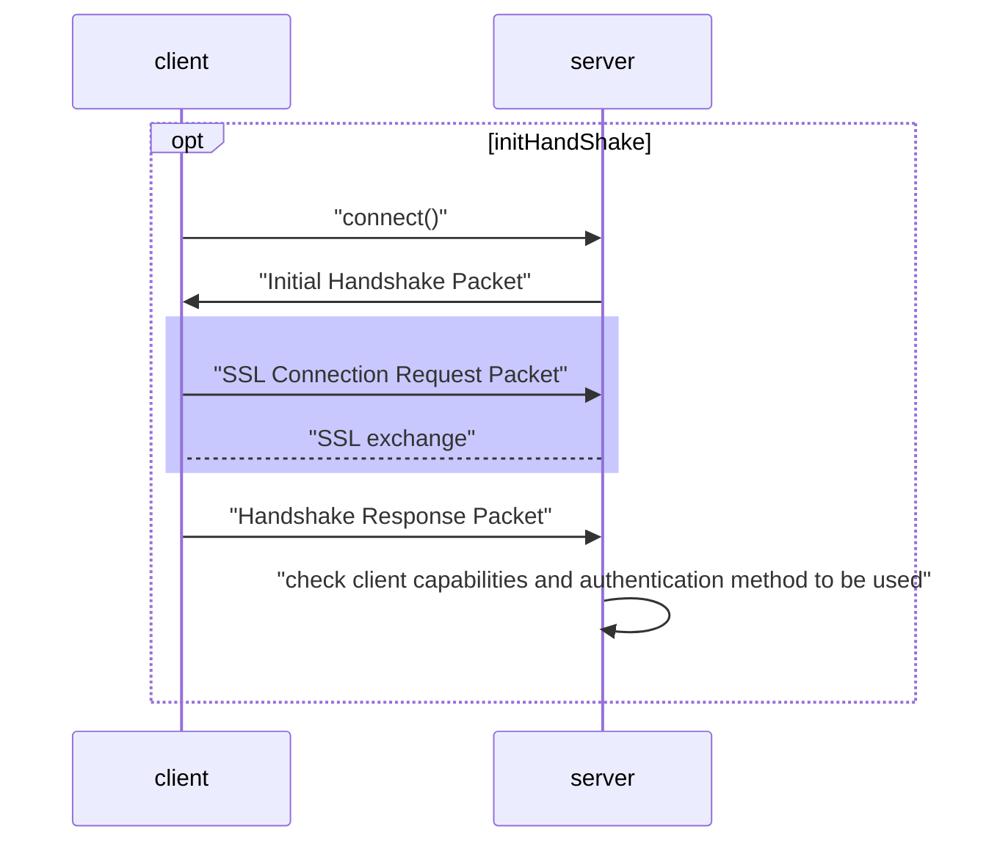
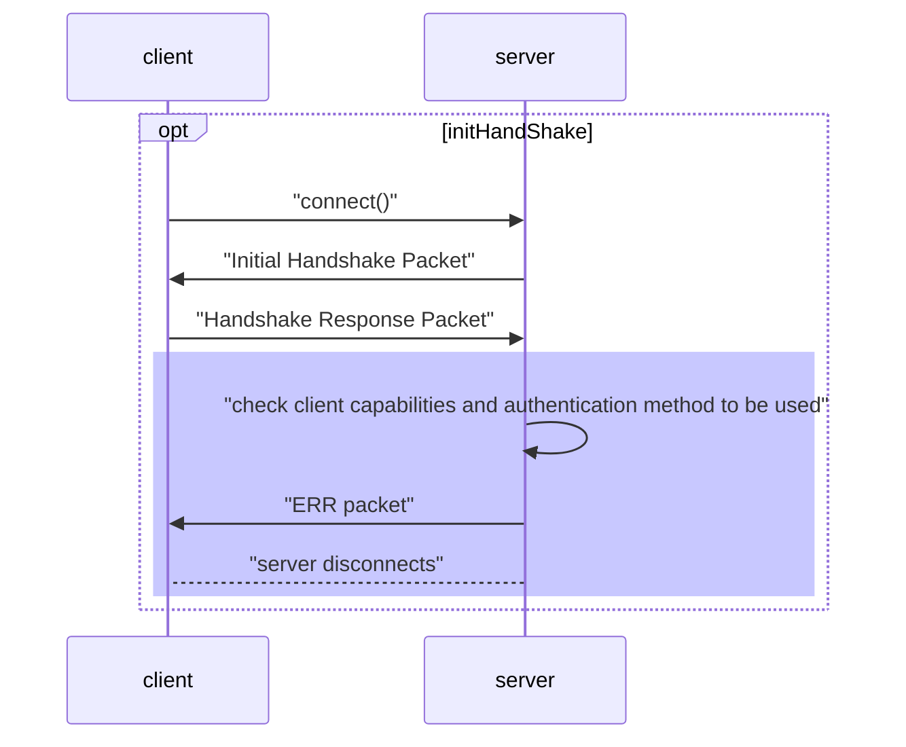
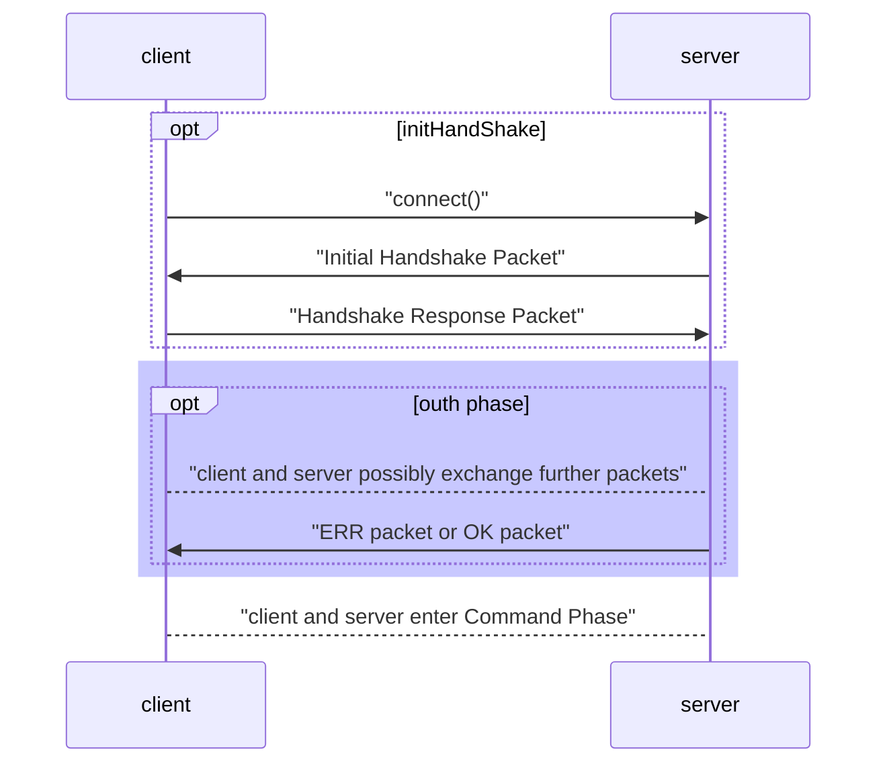
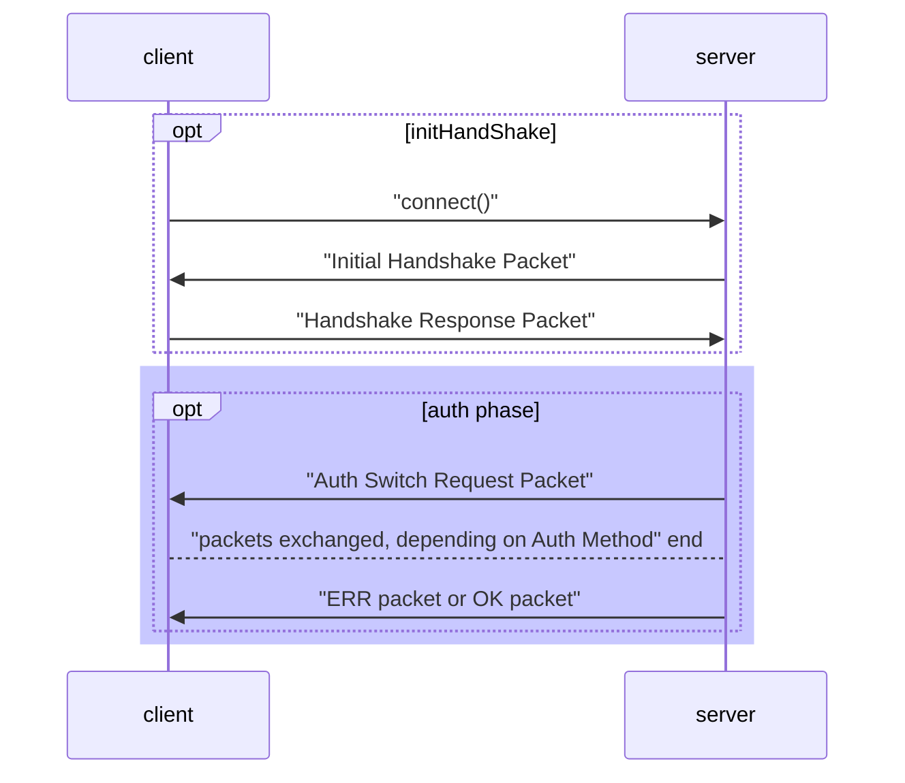
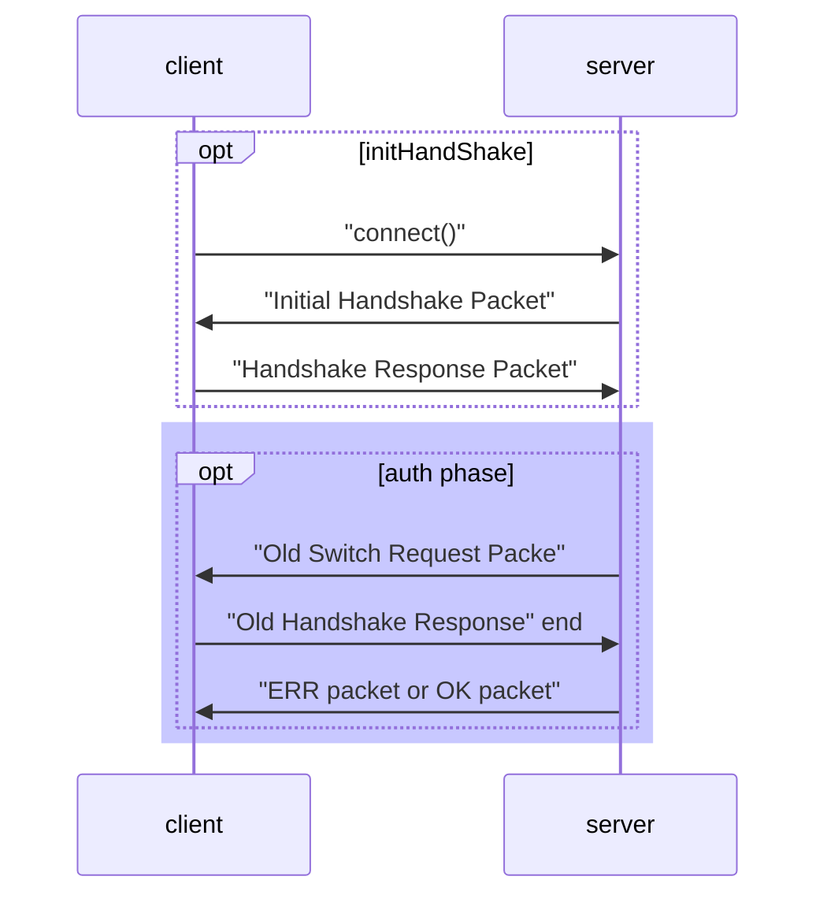

# 一、协议对象

### 数据包

数据载体，任何数据必须划分为大小2^24-1字节。数据包由以下部分组成

| Type                                                         | Name               | Description                                                  |
| :----------------------------------------------------------- | :----------------- | :----------------------------------------------------------- |
| [int<3>](https://dev.mysql.com/doc/internals/en/describing-packets.html#type-3) | *`payload_length`* | Length of the payload. The number of bytes in the packet beyond the initial 4 bytes that make up the packet header. |
| [int<1>](https://dev.mysql.com/doc/internals/en/describing-packets.html#type-1) | *`sequence_id`*    | Sequence ID                                                  |
| [string<var>](https://dev.mysql.com/doc/internals/en/describing-packets.html#type-string.var_len) | *`payload`*        | [len=[payload_length](https://dev.mysql.com/doc/internals/en/mysql-packet.html#cs-frame-payload-len)] payload of the packet |

一个数据包有效样例 [`COM_QUIT`](https://dev.mysql.com/doc/internals/en/com-quit.html#packet-COM_QUIT) 可以表示为`01 00 00 00 01`，其中`01 00 00`为int<3>类型的payload长度，`00`为Sequence ID，`01`为string<var>。Sequence ID在每次发包后自增，并在新命令开始时重置为0


## 二、通用响应包

### 2.1 OK_Packet

当命令执行成功后，服务端返回给客户端。在5.7.5之后也用于替换EOF，EOF被废弃。

| Type                                                         | Name                      | Description                                                  |
| :----------------------------------------------------------- | :------------------------ | :----------------------------------------------------------- |
| [int<1>](https://dev.mysql.com/doc/internals/en/describing-packets.html#type-1) | *`header`*                | `[00]` or `[fe]` the OK packet header                        |
| [int](https://dev.mysql.com/doc/internals/en/describing-packets.html#type-lenenc_int) | *`affected_rows`*         | affected rows                                                |
| [int](https://dev.mysql.com/doc/internals/en/describing-packets.html#type-lenenc_int) | *`last_insert_id`*        | last insert-id                                               |
| if capabilities & [`CLIENT_PROTOCOL_41`](https://dev.mysql.com/doc/internals/en/capability-flags.html#flag-CLIENT_PROTOCOL_41) { |                           |                                                              |
| [int<2>](https://dev.mysql.com/doc/internals/en/describing-packets.html#type-2) | *`status_flags`*          | [Status Flags](https://dev.mysql.com/doc/internals/en/status-flags.html) |
| [int<2>](https://dev.mysql.com/doc/internals/en/describing-packets.html#type-2) | *`warnings`*              | number of warnings                                           |
| } elseif capabilities & [`CLIENT_TRANSACTIONS`](https://dev.mysql.com/doc/internals/en/capability-flags.html#flag-CLIENT_TRANSACTIONS) { |                           |                                                              |
| [int<2>](https://dev.mysql.com/doc/internals/en/describing-packets.html#type-2) | *`status_flags`*          | [Status Flags](https://dev.mysql.com/doc/internals/en/status-flags.html) |
| }                                                            |                           |                                                              |
| if capabilities & [`CLIENT_SESSION_TRACK`](https://dev.mysql.com/doc/internals/en/capability-flags.html#flag-CLIENT_SESSION_TRACK) { |                           |                                                              |
| [string](https://dev.mysql.com/doc/internals/en/describing-packets.html#type-lenenc_str) | *`info`*                  | human readable status information                            |
| if [status_flags](https://dev.mysql.com/doc/internals/en/packet-OK_Packet.html#cs-packet-ok-status-flags) & [`SERVER_SESSION_STATE_CHANGED`](https://dev.mysql.com/doc/internals/en/status-flags.html#flag-SERVER_SESSION_STATE_CHANGED) { |                           |                                                              |
| [string](https://dev.mysql.com/doc/internals/en/describing-packets.html#type-lenenc_str) | *`session_state_changes`* | [session state info](https://dev.mysql.com/doc/internals/en/packet-OK_Packet.html#cs-sect-packet-ok-sessioninfo) |
| }                                                            |                           |                                                              |
| } else {                                                     |                           |                                                              |
| [ string](https://dev.mysql.com/doc/internals/en/describing-packets.html#type-string.EOF) | *`info`*                  | human readable status information                            |
| }                                                            |                           |                                                              |

### 2.2 ERR_Packet

在5.7.5版本后该报将会被废弃

##### Payload

| Type                                                         | Name                 | Description                     |
| :----------------------------------------------------------- | :------------------- | :------------------------------ |
| [int<1>](https://dev.mysql.com/doc/internals/en/describing-packets.html#type-1) | *`header`*           | `[ff]` header of the ERR packet |
| [int<2>](https://dev.mysql.com/doc/internals/en/describing-packets.html#type-2) | *`error_code`*       | error-code                      |
| `if capabilities & CLIENT_PROTOCOL_41 {`                     |                      |                                 |
| ` string[1]`                                                 | *`sql_state_marker`* | `#` marker of the SQL State     |
| ` string[5]`                                                 | *`sql_state`*        | SQL State                       |
| `}`                                                          |                      |                                 |
| [string](https://dev.mysql.com/doc/internals/en/describing-packets.html#type-string.EOF) | *`error_message`*    | human readable error message    |

##### Example

| `17 00 00 01 ff 48 04 23    48 59 30 30 30 4e 6f 20 74 61 62 6c 65 73 20 75    73 65 64` | `.....H.#HY000No tables used` |
| ------------------------------------------------------------ | ----------------------------- |
|                                                              |                               |

### 2.3 EOF_Packet

##### Payload

| Type                                                         | Name             | Description                                                  |
| :----------------------------------------------------------- | :--------------- | :----------------------------------------------------------- |
| [int<1>](https://dev.mysql.com/doc/internals/en/describing-packets.html#type-1) | *`header`*       | `[fe]` EOF header                                            |
| `if capabilities & CLIENT_PROTOCOL_41 {`                     |                  |                                                              |
| [ int<2>](https://dev.mysql.com/doc/internals/en/describing-packets.html#type-2) | *`warnings`*     | number of warnings                                           |
| [ int<2>](https://dev.mysql.com/doc/internals/en/describing-packets.html#type-2) | *`status_flags`* | [Status Flags](https://dev.mysql.com/doc/internals/en/status-flags.html) |
| `}`                                                          |                  |                                                              |

##### Example

A MySQL 4.1 EOF packet with: 0 warnings, AUTOCOMMIT enabled.

| `05 00 00 05 fe 00 00 02 00` | `..........` |
| ---------------------------- | ------------ |
|                              |              |


# 三、命令阶段

客户端通过packet发送命令为命令阶段，每个命令包含有sequence-id和对应的命令字节。

在服务器建立连接之后，客户端通过命令先服务端发送命令。

| Hex  | Constant Name                                                |
| :--- | :----------------------------------------------------------- |
| 00   | [`COM_SLEEP`](https://dev.mysql.com/doc/internals/en/com-sleep.html#packet-COM_SLEEP) |
| 01   | [`COM_QUIT`](https://dev.mysql.com/doc/internals/en/com-quit.html#packet-COM_QUIT) |
| 02   | [`COM_INIT_DB`](https://dev.mysql.com/doc/internals/en/com-init-db.html#packet-COM_INIT_DB) |
| 03   | [`COM_QUERY`](https://dev.mysql.com/doc/internals/en/com-query.html#packet-COM_QUERY) |
| 04   | [`COM_FIELD_LIST`](https://dev.mysql.com/doc/internals/en/com-field-list.html#packet-COM_FIELD_LIST) |
| 05   | [`COM_CREATE_DB`](https://dev.mysql.com/doc/internals/en/com-create-db.html#packet-COM_CREATE_DB) |
| 06   | [`COM_DROP_DB`](https://dev.mysql.com/doc/internals/en/com-drop-db.html#packet-COM_DROP_DB) |
| 07   | [`COM_REFRESH`](https://dev.mysql.com/doc/internals/en/com-refresh.html#packet-COM_REFRESH) |
| 08   | [`COM_SHUTDOWN`](https://dev.mysql.com/doc/internals/en/com-shutdown.html#packet-COM_SHUTDOWN) |
| 09   | [`COM_STATISTICS`](https://dev.mysql.com/doc/internals/en/com-statistics.html#packet-COM_STATISTICS) |
| 0a   | [`COM_PROCESS_INFO`](https://dev.mysql.com/doc/internals/en/com-process-info.html#packet-COM_PROCESS_INFO) |
| 0b   | [`COM_CONNECT`](https://dev.mysql.com/doc/internals/en/com-connect.html#packet-COM_CONNECT) |
| 0c   | [`COM_PROCESS_KILL`](https://dev.mysql.com/doc/internals/en/com-process-kill.html#packet-COM_PROCESS_KILL) |
| 0d   | [`COM_DEBUG`](https://dev.mysql.com/doc/internals/en/com-debug.html#packet-COM_DEBUG) |
| 0e   | [`COM_PING`](https://dev.mysql.com/doc/internals/en/com-ping.html#packet-COM_PING) |
| 0f   | [`COM_TIME`](https://dev.mysql.com/doc/internals/en/com-time.html#packet-COM_TIME) |
| 10   | [`COM_DELAYED_INSERT`](https://dev.mysql.com/doc/internals/en/com-delayed-insert.html#packet-COM_DELAYED_INSERT) |
| 11   | [`COM_CHANGE_USER`](https://dev.mysql.com/doc/internals/en/com-change-user.html#packet-COM_CHANGE_USER) |
| 12   | [`COM_BINLOG_DUMP`](https://dev.mysql.com/doc/internals/en/com-binlog-dump.html#packet-COM_BINLOG_DUMP) |
| 13   | [`COM_TABLE_DUMP`](https://dev.mysql.com/doc/internals/en/com-table-dump.html#packet-COM_TABLE_DUMP) |
| 14   | [`COM_CONNECT_OUT`](https://dev.mysql.com/doc/internals/en/com-connect-out.html#packet-COM_CONNECT_OUT) |
| 15   | [`COM_REGISTER_SLAVE`](https://dev.mysql.com/doc/internals/en/com-register-slave.html#packet-COM_REGISTER_SLAVE) |
| 16   | [`COM_STMT_PREPARE`](https://dev.mysql.com/doc/internals/en/com-stmt-prepare.html#packet-COM_STMT_PREPARE) |
| 17   | [`COM_STMT_EXECUTE`](https://dev.mysql.com/doc/internals/en/com-stmt-execute.html#packet-COM_STMT_EXECUTE) |
| 18   | [`COM_STMT_SEND_LONG_DATA`](https://dev.mysql.com/doc/internals/en/com-stmt-send-long-data.html#packet-COM_STMT_SEND_LONG_DATA) |
| 19   | [`COM_STMT_CLOSE`](https://dev.mysql.com/doc/internals/en/com-stmt-close.html#packet-COM_STMT_CLOSE) |
| 1a   | [`COM_STMT_RESET`](https://dev.mysql.com/doc/internals/en/com-stmt-reset.html#packet-COM_STMT_RESET) |
| 1b   | [`COM_SET_OPTION`](https://dev.mysql.com/doc/internals/en/com-set-option.html#packet-COM_SET_OPTION) |
| 1c   | [`COM_STMT_FETCH`](https://dev.mysql.com/doc/internals/en/com-stmt-fetch.html#packet-COM_STMT_FETCH) |
| 1d   | [`COM_DAEMON`](https://dev.mysql.com/doc/internals/en/com-daemon.html#packet-COM_DAEMON) |
| 1e   | [`COM_BINLOG_DUMP_GTID`](https://dev.mysql.com/doc/internals/en/com-binlog-dump-gtid.html#packet-COM_BINLOG_DUMP_GTID) |
| 1f   | [`COM_RESET_CONNECTION`](https://dev.mysql.com/doc/internals/en/com-reset-connection.html#packet-COM_RESET_CONNECTION) |


# 四、连接阶段

在连接阶段，服务端和客户端交换能力范围，必要时设置ssl通信通道，认证客户端

```
digraph connection_phase {
AUTH_CHALLENGE [ label = "Initial Handshake Packet" ];
AUTH_CHALLENGE  -> CLIENT_RESPONSE;
AUTH_CHALLENGE  -> SSL_HANDSHAKE;

SSL_HANDSHAKE [ label = "SSL Exchange" ];
SSL_HANDSHAKE     -> CLIENT_RESPONSE;

CLIENT_RESPONSE [ label = "Client Response" ];
CLIENT_RESPONSE -> AUTH_METHOD_SWITCH;
CLIENT_RESPONSE -> AUTHENTICATION_EXCHANGE;
CLIENT_RESPONSE -> CONNECTION_DENIED [ label = "insufficient client \n capabilities" ];

AUTH_METHOD_SWITCH [ label = "Authentication method \n switch" ];
AUTH_METHOD_SWITCH -> AUTHENTICATION_EXCHANGE -> COMMAND_PHASE;
AUTH_METHOD_SWITCH -> NOT_SUPPORTED [ label = "client does not know \n requested auth method" ];

AUTHENTICATION_EXCHANGE [ label = "Authentication exchange \n continuation" ];
AUTHENTICATION_EXCHANGE -> CONNECTION_DENIED;

COMMAND_PHASE     [ shape = "box", label = "OK" ];
CONNECTION_DENIED [ shape = "box", label = "ERR" ];
NOT_SUPPORTED     [ shape = "box", label = "DISCONNECT" ];
```




## Initial HandShake

在`intial handshake`阶段，由服务端发起 [`Initial Handshake Packet`](https://dev.mysql.com/doc/internals/en/connection-phase-packets.html#packet-Protocol::Handshake)开始，客户端可以使用 [`SSL Connection Request Packet`](https://dev.mysql.com/doc/internals/en/connection-phase-packets.html#packet-Protocol::SSLRequest)要求建立ssl安全连接，并在随后应答[`Handshake Response Packet`](https://dev.mysql.com/doc/internals/en/connection-phase-packets.html#packet-Protocol::HandshakeResponse)

### 一般handshake流程



### SSL handshake流程

SSL handshake流程比一般hanshake流程中额外增加了ssl连接请求包和ssl通道建立



在handshake流程中，server会告知server 版本号以及server可支持[能力](https://dev.mysql.com/doc/internals/en/capability-flags.html#packet-Protocol::CapabilityFlags)。client只能在[Handshake Response Packet](https://dev.mysql.com/doc/internals/en/connection-phase-packets.html#packet-Protocol::HandshakeResponse) 中含有和server呈交集的能力。因此在handshake阶段对一下信息达成协商：

* [use of status flags](https://dev.mysql.com/doc/internals/en/capability-flags.html)：client需要使用且server可以提供的能力flags
* [use of status flags](https://dev.mysql.com/doc/internals/en/capability-flags.html#flag-CLIENT_TRANSACTIONS)：错误码协议，也是flag中的一项
* [authentication methods](https://dev.mysql.com/doc/internals/en/determining-authentication-method.html)：数据库将用户的认证方法记录在`mysql.user`表中，在handshak阶段，客户端发送登录账号，服务器通过查找获得对应认证方法。
* ssl support：是否支持ssl和启动ssl连接
* compression：通信压缩

## Auth Phase

### auth fail



在`initial handshak phase`后服务端会对[`Handshake Response Packet`](https://dev.mysql.com/doc/internals/en/connection-phase-packets.html#packet-Protocol::HandshakeResponse)中声明里能力进行检查，识别其能力是否可以完成认证流程，若无法完成则返回[`ERR_Packet`](https://dev.mysql.com/doc/internals/en/packet-ERR_Packet.html) 。触发场景可能如下：

* 登录用户未使用[`Secure Password Authentication`](https://dev.mysql.com/doc/internals/en/secure-password-authentication.html#packet-Authentication::Native41) 和[`Old Password Authentication`](https://dev.mysql.com/doc/internals/en/old-password-authentication.html#packet-Authentication::Old)，但client不支持插件式认证([`CLIENT_PLUGIN_AUTH`](https://dev.mysql.com/doc/internals/en/capability-flags.html#flag-CLIENT_PLUGIN_AUTH) flag未设置)
* client不支持安全认证([`CLIENT_SECURE_CONNECTION`](https://dev.mysql.com/doc/internals/en/capability-flags.html#flag-CLIENT_SECURE_CONNECTION) flag未设置)，但对应用户认证方法不支持[`Old Password Authentication`](https://dev.mysql.com/doc/internals/en/old-password-authentication.html#packet-Authentication::Old).
* 服务端在[`Initial Handshake Packet`](https://dev.mysql.com/doc/internals/en/connection-phase-packets.html#packet-Protocol::Handshake)中用于生成认证信息的默认方法不是[`Secure Password Authentication`](https://dev.mysql.com/doc/internals/en/secure-password-authentication.html#packet-Authentication::Native41)，但client不支持插件式认证([`CLIENT_PLUGIN_AUTH`](https://dev.mysql.com/doc/internals/en/capability-flags.html#flag-CLIENT_PLUGIN_AUTH) flag未设置)

### auth phase fast path

假设client打算使用用户U登录，且用户U的认证方法为M。且再init handshake阶段client和server都使用的M方法来创建认证信息，此时可以使用auth phase fast path。在这种场景下，client和server已经在第一次交互中开始进行认证，后续基于同样的认证方法，可以继续交互认证数据直到连接被拒绝或接收。




在`client and server possibly exchange further packets`中client和server交互的包是以"0x01"开头的[`Extra Authentication Data`](https://dev.mysql.com/doc/internals/en/connection-phase-packets.html#packet-Protocol::AuthMoreData) 数据包。

在这个过init handshake阶段后任意时刻都有可能出现认证失败，此时和上图的区别在于server返回的是 [`ERR_Packet`](https://dev.mysql.com/doc/internals/en/packet-ERR_Packet.html)。

### Authentication Method Mismatch

client预期登录用户U，用户U的认证方法为M，但服务端默认使用的方法非M或client 的[`Initial Handshake Packet`](https://dev.mysql.com/doc/internals/en/connection-phase-packets.html#packet-Protocol::Handshake)中生成认证信息的方法非M 。此时可以认为认证方法不匹配，认证信息交互需要重新开始。

如果发生认证方法不匹配，server会通过向client发送[`Authentication Method Switch Request Packet`](https://dev.mysql.com/doc/internals/en/connection-phase-packets.html#packet-Protocol::AuthSwitchRequest) 来告知client应该使用的认证方法和使用该方法生成的第一个认证信息。client必须基于该方法来进行后续的信息交换，如果client无法识别该方法则应该停止连接。



若在步骤**4**后，client无法识别对应的认证方法，则进入连接中断流程

#### client端[`CLIENT_PLUGIN_AUTH`](https://dev.mysql.com/doc/internals/en/capability-flags.html#flag-CLIENT_PLUGIN_AUTH) 未设置时，切换场景

当client未设置[`CLIENT_PLUGIN_AUTH`](https://dev.mysql.com/doc/internals/en/capability-flags.html#flag-CLIENT_PLUGIN_AUTH)  flag时，只有当以下场景会触发认证方法切换：

* client登录用户用[`Old Password Authentication`](https://dev.mysql.com/doc/internals/en/old-password-authentication.html#packet-Authentication::Old)
* client支持安全认证([`CLIENT_SECURE_CONNECTION`](https://dev.mysql.com/doc/internals/en/capability-flags.html#flag-CLIENT_SECURE_CONNECTION) flag设置)
* server默认认证方式为[`Secure Password Authentication`](https://dev.mysql.com/doc/internals/en/secure-password-authentication.html#packet-Authentication::Native41)



### COM_CHANGE_USER_COMMAND

进入命令阶段后，client可以发送[`COM_CHANGE_USER`](https://dev.mysql.com/doc/internals/en/com-change-user.html#packet-COM_CHANGE_USER)命令来切换登录用户并发起新的握手。如果切换用户符合fast auth场景，server可能会直接返回 [`OK_Packet`](https://dev.mysql.com/doc/internals/en/packet-OK_Packet.html) or [`ERR_Packet`](https://dev.mysql.com/doc/internals/en/packet-ERR_Packet.html)，否则则通过返回 [`Authentication Method Switch Request Packet`](https://dev.mysql.com/doc/internals/en/connection-phase-packets.html#packet-Protocol::AuthSwitchRequest) 进行认证方法切换与后续的认证行为，认证切换与上文中auth阶段相同。

1. 不支持插件认证的client，当用户使用的是[`Secure Password Authentication`](https://dev.mysql.com/doc/internals/en/secure-password-authentication.html#packet-Authentication::Native41) (4.1 之后client)或 [`Old Password Authentication`](https://dev.mysql.com/doc/internals/en/old-password-authentication.html#packet-Authentication::Old)（4.1之前client)认证方法时，可以认为服务端和客户端已经进行了认证信息交换，client需要在切换用户命令包中附加经过加密的密码，服务端接收并认证后返回OK或ERR包

2. 4.1版本客户端也有可能不支持插件认证，且登录 用户使用[`Old Password Authentication`](https://dev.mysql.com/doc/internals/en/old-password-authentication.html#packet-Authentication::Old).认证方法。在这种情况下对比第1点中流程需要外进行认证方法切换。server会发送[`Old Authentication Method Switch Request Packet`](https://dev.mysql.com/doc/internals/en/connection-phase-packets.html#packet-Protocol::OldAuthSwitchRequest) ，client返回[`Old Handshake Response Packet`](https://dev.mysql.com/doc/internals/en/connection-phase-packets.html#packet-Protocol::HandshakeResponse320)应答。最终server认证后返回OK或ERR包

## 重要协议

- [Connection Phase Packets](https://dev.mysql.com/doc/internals/en/connection-phase-packets.html)
- [Capability Flags](https://dev.mysql.com/doc/internals/en/capability-flags.html)

   

# 五、命令阶段(待续)

在连接阶段之后，连接进入命令阶段，在命令阶段客户端可以通过命令协议向客户端发送请求。命令协议有[plain protocol](https://dev.mysql.com/doc/internals/en/text-protocol.html)、[Prepared Statements](https://dev.mysql.com/doc/internals/en/prepared-statements.html)、[Replication Protocol](https://dev.mysql.com/doc/internals/en/replication-protocol.html)

* [COM_QUERY](https://dev.mysql.com/doc/internals/en/com-query.html)：client向server发送的文本类型命令，该命令会被server立即执行。server通过[`COM_QUERY_Response`](https://dev.mysql.com/doc/internals/en/com-query-response.html#packet-COM_QUERY_Response)返回执行结果。
* [COM_QUERY_Response](https://dev.mysql.com/doc/internals/en/com-query-response.html#packet-COM_QUERY_Response)：获取表字段定义
* [COM_RESET_CONNECTION](https://dev.mysql.com/doc/internals/en/com-reset-connection.html)：重置连接，操作量级较轻。不会关闭且重连，重新认证。
* [COM_STMT_PREPARE](https://dev.mysql.com/doc/internals/en/com-stmt-prepare.html)：创建一个stmt，server通过[COM_STMT_PREPARE Response](https://dev.mysql.com/doc/internals/en/com-stmt-prepare-response.html) 包返回stmt ID
*  [COM_STMT_SEND_LONG_DATA](https://dev.mysql.com/doc/internals/en/com-stmt-send-long-data.html)：发送列数据
* [COM_STMT_EXECUTE](https://dev.mysql.com/doc/internals/en/com-stmt-execute.html)：通过stmt的id选定stmt，并使用对于stmt执行已经prepare的语句。通过 [Binary Protocol Value](https://dev.mysql.com/doc/internals/en/binary-protocol-value.html)发送stmt中占位符的值，server通过[COM_STMT_EXECUTE Response](https://dev.mysql.com/doc/internals/en/com-stmt-execute-response.html)返回执行结果
* [COM_STMT_CLOSE](https://dev.mysql.com/doc/internals/en/com-stmt-close.html)：解除stmt资源绑定
* [COM_STMT_RESET](https://dev.mysql.com/doc/internals/en/com-stmt-reset.html)：重置stmt，重置[COM_STMT_SEND_LONG_DATA](https://dev.mysql.com/doc/internals/en/com-stmt-send-long-data.html)发送的数据或[COM_STMT_EXECUTE](https://dev.mysql.com/doc/internals/en/com-stmt-execute.html)打开的游标


   


