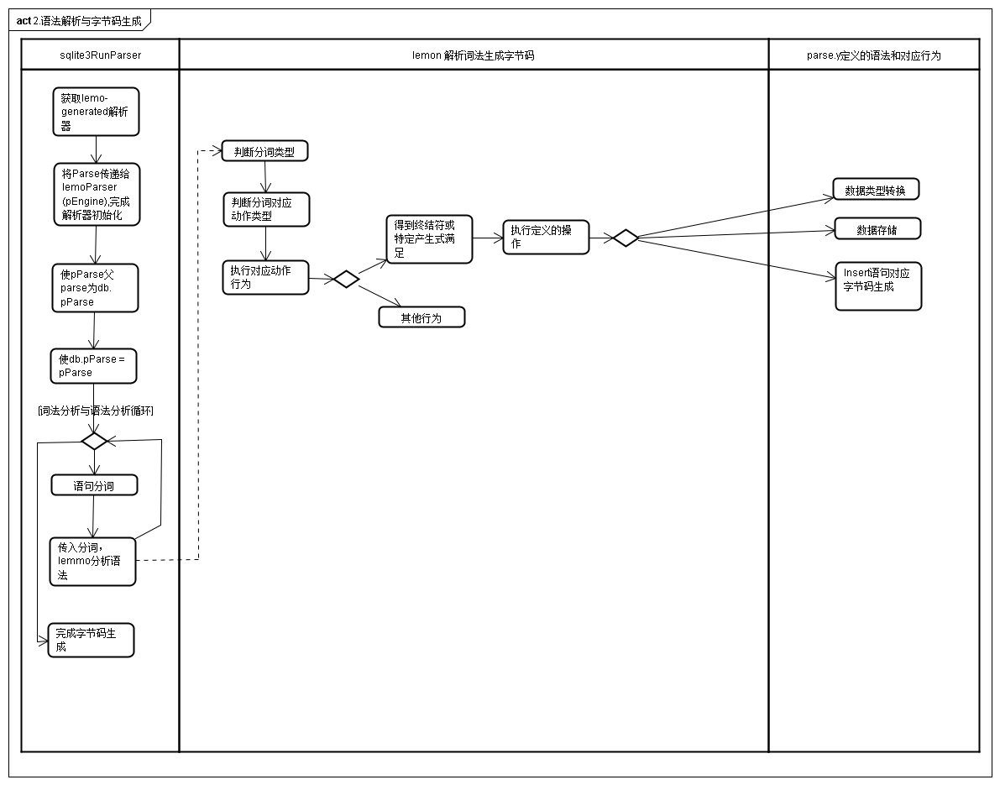

#概述
[sqlite3_preare_v2](https://www.sqlite.org/c3ref/prepare.html)和相关接口演示了一个编译器如何将sql文本转换为字节码<br/>
[sqlite3_stmt]()是实现单条sql语句的单个字节码程序的容器
[sqlite3_step](https://www.sqlite.org/c3ref/step.html)接口将一个字节码传递给虚拟机，并运行字节码程序直到结束或有结果可返回、发生错误、中断

## sql语句转换就绪陈述对象与执行
每个sql语句被认为是独立的计算程序，原始的sql文本作为源码。每条就绪的陈述对象都是编译好的对象码。所有的sql语句在运行前必须被转换为就绪陈述对象。
转换陈述对象流程：
1. 使用[sqlite3_prepare_v2](https://www.sqlite.org/c3ref/prepare.html)创建陈述对象
2. 绑定参数
3. 多次调用[sqlite3_step]()运行SQL语句
4. 使用[sqlite3_reset]()重设陈述对象，跳转到第二步。重复多次
5. 使用[sqlite3_finalize]()销毁对象

## 总体执行实例流程

sql通过Prepare程序将sqlite语句转换为一个stmt容器，该容器中包含了真正执行相关操作字节码和字节码执行过程中需要的环境资源(即虚拟机)，例如寄存器，和寄存器地址等。

## shell_exec执行流程

shell_exec为通过sqlite3工具，使用命令行操作来对sqlite数据库操作的主要函数。上图为该函数的简化活动图。总体上看和前面描述的sql语句执行流程是符合的。
首先shell_exec将用户的输入通过sqlite3_pepare进行语法分析形成字节码，每个sql语句可以生成若干个opcode组成的字节码。同时为其生成字节码需要的资源，并打包保存在vdbe中，通过图中可以看到一个stmt结果本质上就是一个vdbe虚拟机的指针。<br/>
在stmt生成完成后，通过sqlite3_step执行stmt中的字节码。这个过程时间上就是一个循环，每次执行一个字节码对应操作，并通过opcode反回判断该如何处理下一步。（例如select语句每次查询到一个结果都会从sqlite3_step中断，等待exec_prepare_stmt提取对应结果后，再次调用sqlite3_step继续查询下一行）<br/>

## sqlite3的语法解析和字节码生成

sqlite3_prepare对sql语句的词法分析和语法分析主要流程如上图所示，该图为图"1.命令行解析与执行"中对应的sql语句解析和字节码生成的扩展<br/>
途中的sParse包含了vdbe，数据连接，以及sql解析后的存储和其上下文相关资源。<br/>
这个过程(源码tokenize.c文件中的"sqlite3RunParser"函数)中首先会通过Parse生成lemo解析器。随后通过循环使用lemoParser解析sql语句。<br/>
spl的解析过程，首先经过词法分析器取出sql语句中的一个词(对应源码tokenize.c文件中的"sqlite3GetToken"函数)，随后将这个词传递给lemo语法分析器(对应sqlite3.c文件中的"sqlite3Parser"函数，该函数是由lemon语法分析器通过解析parse.y文件生成的解析器)，该语法分析器主要行为如上图泳道2所示，当语法分析器获取一个词后，会根据分词的类型采取不同的操作。如果该分词满足parse.y里定义的终结符，则会执行对应终结符定义的操作，并且如果该终结符可以使得一个产生式解析满足，则会执行对应产生式定义的操作。(此处的终结符、非终结符等定义来自上下文无关语法)

* [lemon使用说明](http://souptonuts.sourceforge.net/readme_lemon_tutorial.html)
* 以sql中的'INSERT INTO t0 VALUES (0,"test1")'sql语句为例。
    * 在parse.y中对应的产生式定义如下

         ```
        cmd ::= with insert_cmd(R) INTO xfullname(X) idlist_opt(F) select(S).
        {
          sqlite3Insert(pParse, X, S, F, R, U); // X 表名,S为子查询,F为属性名与值列表,U为Upsert
        }
        
        insert_cmd(A) ::= INSERT orconf(R).   {A = R;}
        onconf(A) ::= .                              {A = OE_Default;}
        ```


    * 在向lemonParser传递INTO分词后，"INSERT INTO"满足 "cmd ::= with insert_cmd(R) INTO xfullname(X) idlist_opt(F) DEFAULT VALUES."的产生式中的"insert_cmd(R)"部分非终结符的语法，那么此时就会根据insert_cmd(R)的产生式定义的操作。顺序如下

        ```
        1. A' = OE_Default // 对应 onconf(A) ::= .       {A =OE_Default;}
        2. A = A'        // 对应 insert_cmd(A) ::= INSERT orconf(R).   {A = R;}
        ```
    
    * 在传递每个分词后，下一个会继续传递下一个分词，知道整个语句的分词完全传递。
    * 当最后一个分词又括号")"传递进入语法分析器后，此时整个分析器中记录的语句满足一个"idlist_opt(f)"非终结符的语法定义，那么此时就会调用idlist_opt(F)，该过程和insert_cmd(R)类似，而此时右括号为最后的分词，因此整个语句结束，同时满足"INSERT"的产生式语法定义，因此此时会调用"sqlite3Insert(pParse, X, S, F, R, U);"函数，进行INSERT的字节码生成。
    * 调用sqlite3Insert时，同样会对已有的字节码进行优化操作，例如，本例子中没有select语句，那么sqlite3Insert函数会将对应的select代表的字节码已有字节码中去除
    * 本过程可以结合[lemon使用说明](http://souptonuts.sourceforge.net/readme_lemon_tutorial.html)和"上下文无关语法"的介绍进行理解


## INSERT语句字节码生成
这里通过介绍最简单的INSERT语句的字节码生成流程(即sqlite3Insert函数流程)来如何生成字节码和OPCODE<br>

```
sqlite> explain insert into t1 values(42， "test1");
addr  opcode         p1    p2    p3    p4             p5  comment
----  -------------  ----  ----  ----  -------------  --  -------------
0     Init           0     8     0                    0   Start at 8
1     OpenWrite      0     2     0     2              0   root=2 iDb=0; t1
2     Integer        42    2     0                    0   r[2]=42
3     String8        test1 3     0                    0   r[3]=test1
4     NewRowid       0     1     0                    0   r[1]=rowid
5     MakeRecord     2     2     4     DB             0   r[4]=mkrec(r[2..3])
6     Insert         0     4     1     t1             57  intkey=r[1] data=r[4]
7     Halt           0     0     0                    0
8     Transaction    0     1     1     0              1   usesStmtJournal=0
9     TableLock      0     2     1     t1             0   iDb=0 root=2 write=1
10    Goto           0     1     0                    0
```
上图为'INSERT INTO t1 VALUES (42,"test1")'语句的字节码生成过程(简化的过程)，和对应的字节码。
* 如图所示，sqlite3Insert中如果已有没有创建事务会通过sqllite3BeginWriteOperation函数生成Transaction操作码
* sqlite3OpenTableAndIndices生成OpenWrite生成码
* sqlite3DbMallocRawNN向vdebe虚拟机中的db中申若干存储，主要为一些寄存器的地址（可能理解有误）
* 调用sqlite3ExprCode将对应的value存放到寄存器中并保证其数据类型，即对应String8和Interger的操作码生成。
    * 在String8或Interger操作码生成时，传递给对应操作码的P2操作数为寄存器的地址该地址由sqlite3Insert向vdbe申请(目前个人理解这么寄存器的申请)
* 生成一个数据库行ID的操作码
* 生成MakeRecord操作码，并将传给String8和Interger的P2寄存器的存储首地址作为操作码的P1，p2为没条数据项的属性数据量，P4为结果输出保存的寄存器地址
* sqlite3CompleteInsertion生成提Insert操作码，其p2为MakeRecord的P4的值，即同一个寄存器的地址，用于读取生成的数据项

最终在sqlite3_step函数，调用sqlite3VdbeExec时，便会自上而下的执行生成的字节码。
    * 例如，Interger会将2写入p2代表的寄存器中，即对应r[2]
    * String8将test1存入R[3]中
    * MakeRecord会以P1代表的连续存储地址代表的存储为首地址，读取P2中值的个数个数据，即读取r[2],r[3]形成一条数据向，并保存到P4值存储的寄存器地址中，即r[4]
    * Insert会从P4值代表的寄存器地址中读取数据项，即从r[4]中读取数据，并完成insert操作
    * 最后遇到Halt操作码，表示执行结束，结束字节码的运行

### INSERT语法解释
```
cmd ::= with insert_cmd(R) INTO xfullname(X) idlist_opt(F) select(S).
{
  sqlite3Insert(pParse, X, S, F, R, U); 
}

X为表名
S为子查询
F为属性名与值列表
R为插入操作发生错误时的处理，sqlite3定义的有'REPLACE','ROLLBACK','ABORT','FALI','IGNORE'
U为出现冲突时的处理语句
```
* 语句
`INSERT INTO Students ('id','name') VALUES (0,'test1');`
对应到上式X为Student,X为空,F为"('id','name') VALUES (0,'test1')"形成的结构化变量列表，
R、U、S为空。因此Splite3Insert会将有"select(S)"生成的查询字节码删除，从而优化字节码流程<br/>
* 语句
`INSERT INTO Students SELECT FROM Student1;`
此时F,R,U为空，但S为查询Student1非空。因此Splite3Insert会将有Select代表的字节码进行优化和处理，从而使得将查询的语句合并到插入生成的字节码<br/>
* 语句 
`INSERT INTO Students ('id','name') VALUES (0,'test1') ON CONFICT DO NOTHING`
此时u表示当insert出现冲突时不做处理<br/>
* 语句 
`INSERT INTO OR ROLLBACK Students ('id','name') VALUES (0,'test1')`
R表示当出现错误时进行回滚
