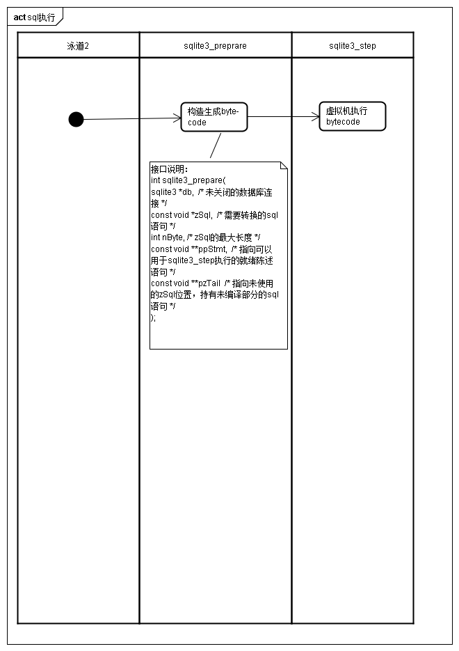

# bytecode engine

## 介绍

## 源码
https://www.sqlite.org/src/file/src/vdbe.c

## 指令格式
字节码程序由一个或多个指令组成。每个指令由1个opcode和五个操作数(P1,P2,P3,P4,P5)。
P1,P2,P3为32位有符号数字，常常指向寄存器。

* 操作b-tree游标的指令，P1通常为游标号.
* 跳转的指令，P2通常为跳转目的地。 
P5为16位无符号整型，常用于持有flags。P5标志的位有时会以微妙的方式影响操作码
byte-code engine从第0个指令开始执行，直到halt指令，或者超出指令地址空间。指令停止时会释放内存资源，关闭数据库游标。由于错误发生异常时会停止暂停的事务并回滚数据库

ResultRow操作码将会使得bytecode引擎暂停，相应的sqlite_step()调用返回SQLITE_ROW。在调用ResultRow 前，字节码程序会将查询的单行结果加载到一系列寄存器中。各种C语言API从这些寄存器中提取查询结果。
执行下一条指令的字节码引擎会在下一次调用sqlit3_step()的ResultRow之后恢复。

## 寄存器
每一个字节码程序带有一个固定数量的寄存器，每个寄存器会持有一个以下对象：
* NULL值
* 有符号64位整型
* IEEE 64位双精度浮点型数字
* 任意长度字符串
* 任意长度BLob
* RowSet操作码对象(RowSetAdd,RowSetRed,RowSetTest)
* frame对象(被subprogem使用，详情查看program操作码)
寄存器内容会在prepare statement 在reset或finalized时清理
内部内存对象存储存储单个寄存器的值

## B-Tree Cursor
* 每个prepare statement 可以有0个或多个打开的游标。
* 游标是虚拟机与数据库文件交互的唯一方式。虚拟机中的指令能够创建新哟波并从游标中读取数据。
* 所有游标会在prepare statement被reset或finalized是自动关闭

## Subroutines,Coroutines和SubPrograms
略

