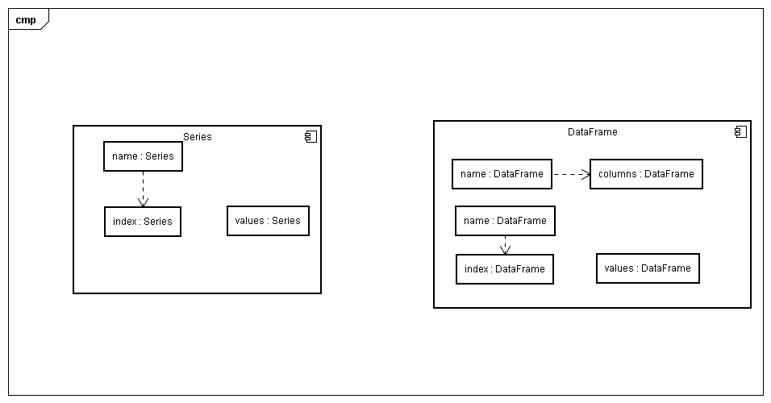

## 为什么需要DataFrame和Series
首先在概念上pandas的每种数据结构就像是低维数据的容器，DataFrasme是Series数据的容器，Series是标量的容器。使用这种方式可以在容器中以字典的形式插入或删除对象。
此外，通用 API 函数的默认操作要顾及时间序列与截面数据集的方向。多维数组存储二维或三维数据时，编写函数要注意数据集的方向，这对用户来说是一种负担。一般情况下，不同的轴在程序里其实没有什么区别。Pandas 里，轴的概念主要是为了给数据赋予更直观的语义，即用“更恰当”的方式表示数据集的方向。这样做可以让用户编写数据转换函数时，少费点脑子。

## 行索引
未只当index则默认行索引为行号，否则每行会与index参数数组一一对应

## 列索引
创建DataFrame时传入(有序)字典参数，字典KEY将自动变为数据框的列索引columns。

## 数据结构结构

## 对比numpy
以numpy为基础开发，具有numpy的优秀计算性能，额外增加了适合数据分析的成分。
series对比numpy的一维向量，增加了"行索引"的概念。
DataFrame增加了"列索引"的概念。
行索引和列索引使得数据操作更灵活

## 数据对齐
当对两个pandas数据对象进行操作时，能够将两个对象进行自动对齐，两个对象相同行索引和列索引的数据进行操作，如果不存在行或列则默认置空，也可以指定不匹配时的数据处理
注意如果对应数据是不同数据类型则有可能导致数据失败

## 思考与疑问
* 如果使用类似DataFrame和Series类似的思想，每种结构的数据类型都是底层数据的容器。那么也许可以将一个嵌套的队列以一种易于理解和使用的方式表现（例如json格式数据，python中的多层嵌套对象）
    * 例如一个json文本，用series作为容器，以每层的key为行索引，对应的values继续使用series进行组装。
    * 那么这里的疑问是是否有必要使用DataFrame作为容器，在什么情况下可能会这么使用？
    如果使用DataFrame的场景是在数据需要在两个方向上进行分析，那么如果三维或者多维该如何思考？
* 数据对齐是否可以用在spl处理的数据过程中处理聚合操作或者多条数据间对应字段的处理？
