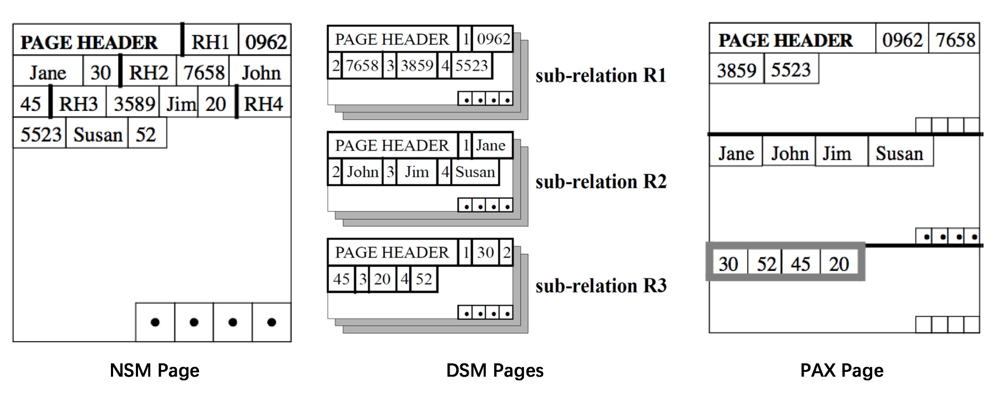
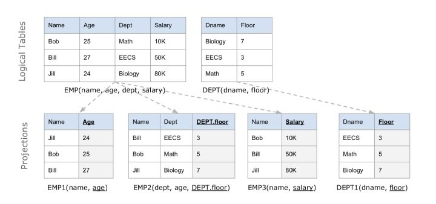
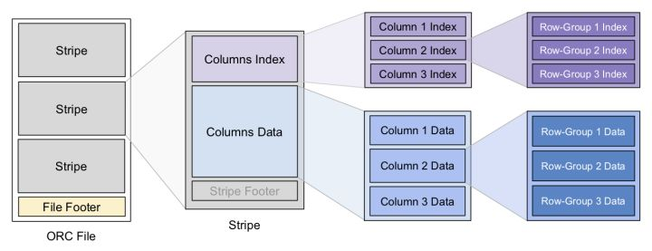
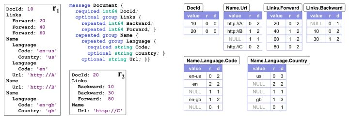

# 列式存储(OLAP)

## 存储方式

Column-based storage storesa table in a sequence of columns
一列数据在存储介质中以连续的存储形存在

## 数据压缩
表内存数字，保存数字到数据内容的映射

## 查询

## 优点
* 只有需要的列会被查询
* 投影高效(prejection)
* 列能作为索引

## 缺点
* 写一行数据，需要涉及多个块

## 优势场景
* 对列进行并发，最后融合
* 数据列张高效查询，无需维护索引，减少无关IO
* 列间数据类型相同，相关性更大，对列数据压缩的效率高，动态选择压缩算法

## 劣势场景
* 数据频繁更新
* 列属性较少
* 含有删除和更新的实时操作

## 数据库存储

### DSM分页模式

机械盘读写以块为单位，在操作系统中被抽象为块设备。可以帮助上层应用更好管理存储空间、增加读写效率等。该特性影响数据库存储格式设计：一个数据库page对应一个或几个五路扇区，让数据库的page和山区对齐，提高读写效率

#### NSM(N-ary Storage Model)
按行存储，将完整的行(即关系realtion)从Header开始一次存放，页最后有一个索引，索引存放了页内各行的起始偏移量，偏移量可以快速查找需要的行，无需逐个扫描。
但是缺点在于，如果每次查询只涉及小部分列，其余列仍要占用内存和CPU Cache，导致更多IO

#### DSM(Decomposition Storage Model)
按列分页，将relation拆分为多个sub-relation。页的尾部存放一个索引

#### PAX(Partition Attributes Cross)
结合NSM和DSM优点。
PAX将一个页划分为多个minipage，minipage内按列存储，而一个页的各个minipage能组合成完整的若干relation

对比DSM，存储是上page进一步划分minipage，并且最终可以组合形成realtion

## 列数据的编码与压缩
数据压缩可以节省空间，页可以减少IO提高读取性能。
编码可以对手数据压缩节约空间，有时候也是组织数据的手段，有很多编码本身兼具了索引的功能

### 扩展(c-store数据编码方式)
以下介绍的是 C-Store 中的数据编码方式，具有一定的代表性。根据 1) 数据本身是否按顺序排列（self-order） 2) 数据有多少不同的取值（distinct values），分成以下 4 种情况讨论：

* 有序且 distinct 值不多 
	- 使用一系列的三元组 [公式] 对列数据编码，表示数值 v 从第 f 行出现，一共有 n 个（即 f 到 f+n−1 行）。例如：数值 4 出现在 12-18 行，则编码为 (4,12,7)。
* 无序且 distinct 值不多
	- 对于每个取值 v 构造一个二进制串 b，表示 v 所在位置的 bitmap。例如：如果一列的数据是 0,0,1,1,2,1,0,2,1，则编码为 (0, 110000100)、(1, 001101001) 和 (2,000010010)。由于 bitmap 是稀疏的，可以对其再进行行程编码。
* 有序且 distinct 值多
	- 对于这种情况，把每个数值表示为前一个数值加上一个变化量（delta），当然第一个数值除外。例如，对于一列数据 1,4,7,7,8,12，可以表示为序列 1,3,3,0,1,4。显然编码后的数据更容易被 dense pack，且压缩比更高。
* 无序且 distinct 值多 
	- 对于这种情况没有很好的编码方式。

## 分布式文件系统与列式存储案例
分布式文件系统，具有多副本、高可用、容量大、低成本的优势。
问题是
1. 读写经过网络，吞吐量追平甚至超过硬盘，但延迟大于硬盘，且受网络环境影响
2. 可进行大吞吐量的顺序读写，但随即访问性能差，大多不支持随机写入
为了将分布式系统性能发挥到及至，通常采用按块读取，流式读取，追加写入等

### C-Store数据模型
C-Store 是关系型数据库，它的逻辑表和其他数据库中的并没有什么不同。但是在 C-Store 内部，逻辑表被纵向拆分成 projections，每个 projection 可以包含一个或多个列，甚至可以包含来自其他逻辑表的列（构成索引）。当然，每个列至少会存在于一个 projections 上。

Projection 内是以列式存储的：里面的每个列分别用一个数据结构存放。为了避免列太长引起问题，也支持每个 projection 以 sort key 的值做横向切分。

Projection 是有冗余性的，常常 1 个列会出现在多个 projection 中，但是它们的顺序也就是 sort key 并不相同，因此 C-Store 在查询时可以选用最优的一组 projections，使得查询执行的代价最小。C-Store 的 projection 冗余性还用来实现 K-safe 高可用。

c-store的Projection可以看作一种物化的查询结果，即查询结果在执行前已经被于谦处理好。

### Apache ORC

#### 数据结构及索引

为分区构造索引是常见的优化方案，orc的数据结构分为3个层级，每个层级上都有索引信息加速查询
* File Level
	* 即一个 ORC 文件，Footer 中保存了数据的 meta 信息，还有文件数据的索引信息，例如各列数据的最大最小值（范围）、NULL 值分布、布隆过滤器等，这些信息可用来快速确定该文件是否包含要查询的数据。每个 ORC 文件中包含多个 Stripe。
* Stripe Level 
	*对应原表的一个范围分区，里面包含该分区内各列的值。每个 Stripe 也有自己的一个索引放在 footer 里，和 file-level 索引类似。
* Row-Group Level 
	* 一列中的每 10000 行数据构成一个 row-group，每个 row-group 拥有自己的 row-level 索引，信息同上。
ORC 里的 Stripe 就像传统数据库的页，它是 ORC 文件批量读写的基本单位。

ORC 在 Stripe 的读写上还有一点优化，那就是把分区粒度小于 Stripe 的结构（如 Column 和 Row-Group）的索引统一抽取出来放到 Stripe 的头部。这是因为在批处理计算中一般是把整个 Stripe 读入批量处理的，将这些索引抽取出来可以减少在批处理场景下需要的 IO

#### ACID支持
支持有限的ACID。受限与分布式文件系统的特点，文件不能随机写
类似于 LSM-Tree 中的 MVCC 那样，writer 并不是直接修改数据，而是为每个事务生成一个 delta 文件，文件中的修改被叠加在原始数据之上。当 delta 文件越来越多时，通过 minor compaction 把连续多个 delta 文件合成一个；当 delta 变得很大时，再执行 major compaction 将 delta 和原始数据合并。这种保持基线数据不变、分层叠加 delta 数据的优化方式在列式存储系统中十分常见，是一种通用的解决思路。ORC 文件虽然支持事务，但是主要是对批量写入的事务比较友好，不适合频繁且细小的写入事务的原因

### Dremel/Apache Parquet

#### 嵌套数据模型
Google 内部大量使用 ***Protobuf*** 作为跨平台、跨语言的数据序列化格式，相比 JSON 要更紧凑并具有更强的表达能力。
Protobuf 不仅允许用户定义必须（required）和可选（optinal）字段，还允许用户定义 repeated 字段，意味着该字段可以出现 0～N 次，类似变长数组。
Dremel格式的设计目的就是按列存储protobuf数据。

序列化之后的列多出了 R、D 两列，分别代表 Repetition Level 和 Definition Level，通过这两个值就能确保唯一地反序列化出原本的数据。

- ***Repetition Level*** 
	表示当前值在哪一个级别上重复。对于非 repeated 字段只要填上 trivial 值 0 即可；否则，只要这个字段可能出现重复（无论本身是 repeated 还是外层结构是 repeated），应当为 R 填上当前值在哪一层上 repeat。

	举个例子说明：对于 Name.Language.Code 我们一共有三条非 NULL 的记录。

	1. 第一个是 en-us，出现在第一个 Name 的第一个 Lanuage 的第一个 Code 里面。在此之前，这三个元素是没有重复过的，都是第一次出现。所以其 R=0
	2. 第二个是 en，出现在下一个 Language 里面。也就是说 Language 是重复的元素。Name.Language.Code 中Language 排第二个，所以其 R=2
	3. 第三个是 en-gb，出现在下一个 Name 中，Name 是重复元素，排第一个，所以其 R=1

注意到 en-gb 是属于第3个 Name 的而非第2个Name，为了表达这个事实，我们在 en 和 en-gb中间放了一个 R=1 的 NULL。

- ***Definition Level***
 	是为了说明 NULL 被定义在哪一层，也就宣告那一层的 repeat 到此为止。对于非 NULL 字段只要填上 trivial 值，即数据本身所在的 level 即可。

	同样举个例子，对于 Name.Language.Country 列

	1. us 非 NULL 值填上 Country 字段的 level 即 D=3
	2. NULL 在 R1 内部，表示当前 Name 之内、后续所有 Language 都不含有 Country 字段。所以D为2。
	3. NULL 在 R1 内部，表示当前 Document 之内、后续所有 Name 都不含有 Country 字段。所以D为1。
	4. gb 非 NULL 值填上 Country 字段的 level 即 D=3
	5. NULL 在 R2 内部，表示后续所有 Document 都不含有 Country 字段。所以D为0。

可以证明，结合 R、D 两个数值一定能唯一构建出原始数据。为了高效编解码，Dremel 在执行时首先构建出状态机，之后利用状态机处理列数据。不仅如此，状态机还会结合查询需求和数据的 structure 直接跳过无关的数据。

#### 状态机
待完善

#### 疑问
* R和D仅处理重复，那么每一个col如何与其他col结合，最终组合为一个数据对象(列结果如何聚集)？

### apache arrow

#### 特征
* O(1)的随机访问速度
* 高效的Cache
* SIMD指令的优化
	* 单指令多数据流，一种采用一个控制器控制多个处理器，同时对一组数据中的每一个分别执行相同的操作，从而实现空间上的并行性技术。
	* 在微处理器中，单指令流多数据流技术则是一个控制器控制多个平行的处理微元

## 技术特征
* 跳过无关数据
* 编码既是压缩，也是索引
* 假设数据不可变
* 数据分片

## References
1. https://zhuanlan.zhihu.com/p/35622907
2. https://blog.csdn.net/dc_726/article/details/41143175
3. https://www.jianshu.com/p/3d3950c9fb06
