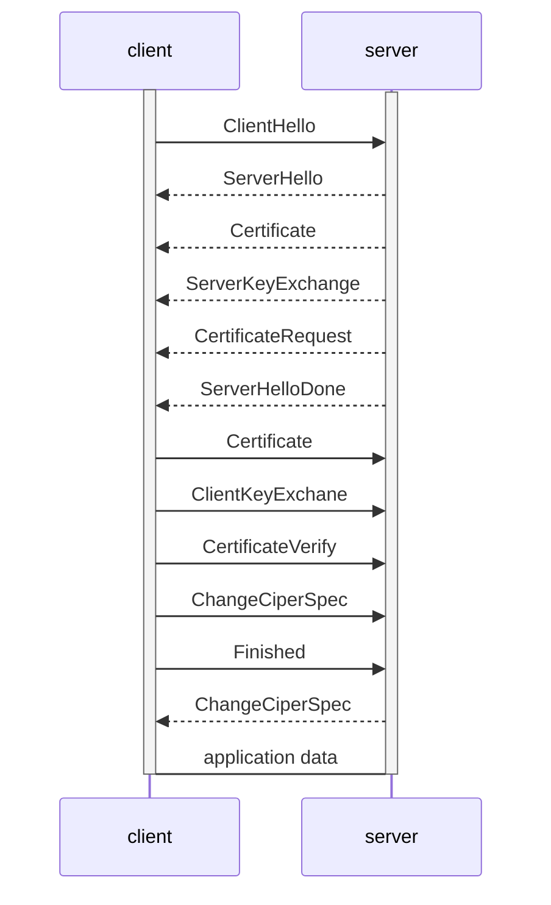

# 零

简化部分说法，便于理解，便于后续回忆。学习备忘，防丢失。

[建议学习原文](https://introspelliam.github.io/2018/03/20/crypto/%E6%B7%B1%E5%BA%A6%E8%A7%A3%E8%AF%BBSSL-TLS%E5%AE%9E%E7%8E%B0/)

# 一、什么是SSL/TLS

SSL全称是Secure Sockets Layer，安全套接字层，它是由网景公司(Netscape)设计的主要用于Web的安全传输协议，目的是为网络通信提供机密性、认证性及数据完整性保障。如今，SSL已经成为互联网保密通信的工业标准。

SSL最初的几个版本(SSL 1.0、SSL2.0、SSL 3.0)由网景公司设计和维护，从3.1版本开始，SSL协议由因特网工程任务小组(IETF)正式接管，并更名为TLS(Transport Layer Security)，发展至今已有TLS 1.0、TLS1.1、TLS1.2这几个版本。

如TLS名字所说，SSL/TLS协议仅保障传输层安全。同时，由于协议自身特性(数字证书机制)，SSL/TLS不能被用于保护多跳(multi-hop)端到端通信，而只能保护点到点通信。

SSL/TLS协议能够提供的安全目标主要包括如下几个：

> 认证性——借助数字证书认证服务器端和客户端身份，防止身份伪造
>
> 机密性——借助加密防止第三方窃听
>
> 完整性——借助消息认证码(MAC)保障数据完整性，防止消息篡改
>
> 重放保护——通过使用隐式序列号防止重放攻击

为了实现这些安全目标，SSL/TLS协议被设计为一个两阶段协议，分为握手阶段和应用阶段：

握手阶段也称协商阶段，在这一阶段，客户端和服务器端会认证对方身份(依赖于PKI体系，利用数字证书进行身份认证)，并协商通信中使用的安全参数、密码套件以及MasterSecret。后续通信使用的所有密钥都是通过MasterSecret生成。

在握手阶段完成后，进入应用阶段。在应用阶段通信双方使用握手阶段协商好的密钥进行安全通信。

SSL/TLS协议有一个高度模块化的架构，分为很多子协议，如下图所示：

[](https://introspelliam.github.io/images/2018-03-20/wKiom1VSr0jhhvpTAABYsKaYnzU344.jpg)

Handshake协议：包括协商安全参数和密码套件、服务器身份认证(客户端身份认证可选)、密钥交换;

ChangeCipherSpec 协议：一条消息表明握手协议已经完成。用于修改加解密参数。每隔一段时间改变加解密规范，增强传输过程安全。

Alert 协议：对握手协议中一些异常的错误提醒，分为fatal和warning两个级别，fatal类型的错误会直接中断SSL链接，而warning级别的错误SSL链接仍可继续，只是会给出错误警告;

Record 协议：包括对消息的分段、压缩、消息认证和完整性保护、加密等。

# 二、tls1.0协议流程

一个典型的TLS1.0流程如下图所示，但在实际的实现中，不同的密钥交换算法会使得对应的消息序列存在不同。



1. ClientHello：握手第一条消息，告知对端client支持的密码套件种类，最高SSL/TLS版本、压缩算法和一个随机数。

   1. 这个随机数由4个字节的当前GMT UNIX时间以及28个随机选择的字节组成，共32字节。该随机数会在密钥生成过程中被使用。

   2. 还可能包含client支持的tls扩展。

      ```mermaid
      classDiagram
      class ClientHello{
      client_version;
      random;
      cipher_suites<2..2^16-1>;
      compression_methods<1..2^8-1>;
      }
      
      ```

      

2. ServerHello：server接收ClientHellow后返回ServerHello。server从ClientHello中选择支持的密码套件、SSL/TLS版本、压缩算法作为后续ssl的连接建立，并使用ServerHello通知client。同时返回一个4+28节随机数。

   ```mermaid
   classDiagram
   class ServerHello{
   Server_version;
   random;
   cipher_suite;
   compression_method;
   }
   
   ```

   

3. Certificate：用于发送证书，一般为server端传输，仅在进行双向认证时进行client端证书传输。并附带协商一致的密钥交换算法对应密钥。一个普通的x.509证书内容如下

   ```mermaid
   classDiagram
   class Certificate{
   Version;
   SerialNumber;
   Signatrue Alorithm;
   IssuerName;
   PeriodOfValidate;
   Subject Name;
   SubjectPublicKey;
   Extentions;
   Signatrue;
   }
   
   ```

   

4. ServerKeyExchange：当RSA_EXPORT(仅当服务器的公钥大于512bit时)、DHE_DSS、DHE_DSS_EXPORT、DHE_RSA、DHE_RSA_EXPORT、DH_anon等密钥交换算法被使用时，用于server向client发送这些密钥交换算法需要的额外参数，以在后续步骤中协商preMasterSecrect。消息中附带参数需要被签名。

   ```mermaid
   classDiagram
   class Certificate{
   paramas;
   signed_params;
   }
   ```

   

5. CertificateRequest：在要求客户端身份认证时，server向client发送该消息。消息中包含证书类型和可接受的ca列表

6. ServerHelloDone：表明server部分的密钥交换信息已发送完毕。等待client继续完成。

7. ClientKeyExchange：根据密钥交换算法决定消息内容，用于进行密钥交换

8. CertificateVerify：用于证明客户端拥有之前提交的客户端证书私钥

9. Finished：表明握手阶段结束。同时也是第一条用协商的算法和密钥保护的信息。Finished消息还会包含一个verify_data域用于对之前交换的信息进行校验。该消息不能在ChangeCipherSpec前发送

10. ChangeCipherSpec：用于修改加解密参数。每隔一段时间改变加解密规范，增强传输过程安全。


# 三、发展历史

## SSL 2.0

SSL 2.0于1995年4月被发布。SSL 2.0中主要存在的问题如下：

* MAC不能覆盖填充长度域，攻击者可能利用这点破坏消息完整性;

* 缺乏握手认证，攻击者可以篡改密码套件列表，诱骗通信双方使用较弱的密码套件;

* 使用较弱的或有问题的密码算法(如MD5，RC4等)，或者使用不安全的分组模式(如CBC模式);

* 对于不同的密码学基元使用相同的密钥，违背基本安全常识。

由于以上安全问题，RFC 6176已经明确提出避免使用SSL 2.0，但是现实生活中还有少量客户端和服务器支持SSL 2.0.

## SSL 3.0

SSL 3.0引入了一些新的特性和机制解决了很多之前版本存在的漏洞。此外，SSL 3.0中引入了ChangeCipherSpec子协议。SSL 3.0向后兼容SSL 2.0，相对于SSL 2.0，它的主要改变包括以下几点：

* 支持更多的密码套件(支持更多的密码算法如DSS，SHA-1)
* 在握手阶段支持密钥协商(DH和FORTEZZA)
* 支持密码学参数的重协商
* 增加了消息压缩选项
* MAC能够覆盖填充长度域了，同时MAC可以使用MD5或者SHA-1
* 不同的密码学基元使用不同的key
* Alert子协议能对任何错误给出两种提示：Warning和Fatal
* 中止链接的时候会用一个close_notify警告通知通信双方
* 支持证书链，而非单个证书
* 通过Finished消息认证所有发送和接收的消息
* 加密了的PreMasterSecret包含当前使用的协议版本，防止协议回滚

## TLS 1.0

实际上，TLS 1.0是SSL 3.1，在IETF接手后改名为TLS。

* 不再支持使用FORTEZZA的密码套件

* MAC被替换成HMAC

* ChangeCipherSpec消息必须在Finished消息前发送，在TLS 1.0中，如果消息序列不符合这个要求，会产生FATAL警告并终止链接

  